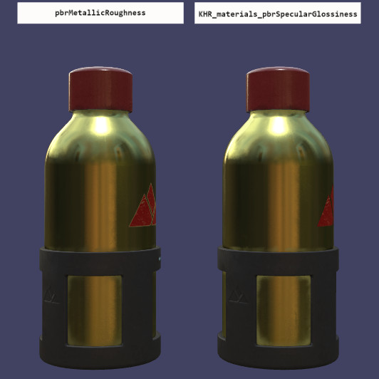

# SpecGlossVsMetalRough

## Tags

[testing](../../Models-testing.md), [extension](../../Models-extension.md)

## Extensions

### Required

- KHR_materials_pbrSpecularGlossiness

### Used

- KHR_materials_pbrSpecularGlossiness
- KHR_materials_pbrSpecularGlossiness

## Summary

Tests if the KHR_materials_pbrSpecularGlossiness extension is supported properly.

## Operations

- [Display](https://github.khronos.org/glTF-Sample-Viewer-Release/?model=https://raw.GithubUserContent.com/KhronosGroup/glTF-Sample-Assets/main/./Models/SpecGlossVsMetalRough/glTF-Binary/SpecGlossVsMetalRough.glb) in SampleViewer
- [Download GLB](https://raw.GithubUserContent.com/KhronosGroup/glTF-Sample-Assets/main/./Models/SpecGlossVsMetalRough/glTF-Binary/SpecGlossVsMetalRough.glb)
- [Model Directory](./)

## Screenshot

## Description

This is a modification of the WaterBottle sample model, to compare the metal/rough PBR workflow side-by-side with the spec/gloss PBR workflow.

No fallback to metal/rough is provided for the spec/gloss side, so unlike most other samples, `KHR_materials_pbrSpecularGlossiness` extension support is explicitly required by this model. The model is expected to fail to load on viewers that do not support the extension, as such support is not required by the core glTF specification. This model marks the extension under `extensionsRequired`, meaning any viewer that doesn't support the extension should reject the model completely. So, a complete failure to load the model, possibly with a message about lack of support for the extension, is not considered a test failure for core glTF 2.0.

However, if the model loads into a viewer, and the two water bottles don't look almost exactly the same, then that does constitute a test failure.

The labels floating above the water bottles should also have the same visual appearance (other than the text of the label being different). One should not be shiny or more reflective than the other.

## License Information

Based on the [Water Bottle](../WaterBottle/) sample model.

  
To the extent possible under law, Microsoft has waived all copyright and related or neighboring rights to this asset.

## Legal

&copy; 2017, Microsoft. [CC BY 4.0 International](https://creativecommons.org/licenses/by/4.0/legalcode)

- Microsoft for Everything

### Assembled by modelmetadata
