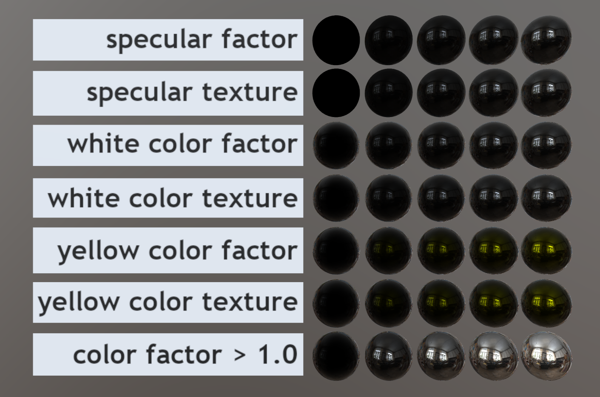
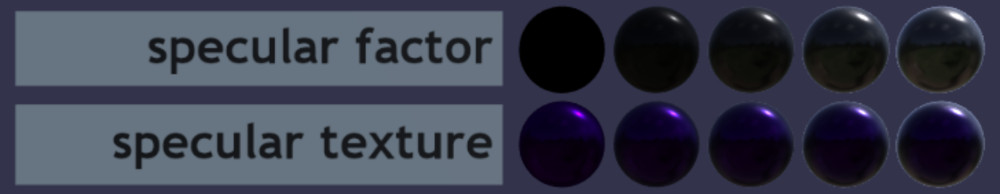

# Specular Test

## Tags

[core](../../Models-core.md), [testing](../../Models-testing.md), [extension](../../Models-extension.md)

## Extensions Used

- KHR_materials_specular

## Summary

Tests if the KHR_materials_specular extension is supported correctly.

## Operations

- [Display](https://github.khronos.org/glTF-Sample-Viewer-Release/?model=https://raw.GithubUserContent.com/KhronosGroup/glTF-Sample-Assets/main/./Models/SpecularTest/glTF-Binary/SpecularTest.glb) in SampleViewer
- [Download GLB](https://raw.GithubUserContent.com/KhronosGroup/glTF-Sample-Assets/main/./Models/SpecularTest/glTF-Binary/SpecularTest.glb)
- [Model Directory](./)

## Screenshot

Rendered by the [Khronos glTF Sample Viewer](https://github.khronos.org/glTF-Sample-Viewer-Release/), using IBL ["Artist Workshop" by HDRI Haven](https://hdrihaven.com/hdri/?h=artist_workshop).

## Description

This model tests the [`KHR_materials_specular`](https://github.com/KhronosGroup/glTF/tree/master/extensions/2.0/Khronos/KHR_materials_specular) extension, which replaces the older `KHR_materials_pbrSpecularGlossiness` extension. The latter was a separate PBR workflow, an alternate to the core glTF metallic/roughness workflow. This newer `KHR_materials_specular` extension enables control over dielectric specular values from within the metal/rough workflow. The two extensions are mutually exclusive per material.

The first row tests the `specularFactor` parameter. This parameter influences the specular response at both normal incidence (`f0`) and at grazing incidence (`f90`). The leftmost sphere on this row should appear perfectly black.

The second row `specularTexture` controls the same parameter as the first row, using a texture. It should be identical to the first row.

The third and fourth rows use a factor and a texture, respectively, to control the specular color (via `specularColorFactor` and `specularColorTexture`). These rows provide a range of grayscale values, and should influence only the normal incidence (`f0`), not grazing incidence (`f90`). The centers of the spheres should darken on the left side of the row, but not the edges.

The fifth and sixth rows repeat the experiment from the third and fourth, using a yellow color at a range of brightnesses in place of the grayscale ramp. The specular response at the edges of the spheres should remain white throughout.

The final row tests what happens when `specularColorFactor` is allowed to be greater than 1.0. The specification allows this such that the material's IOR setting does not clamp the specular response, however energy conservation is still observed and the implementation notes indicate where to properly clamp the resulting value. The last sphere on this row should look like a mirror ball.

## Common Problems

If you see purple coloring in the second row, it indicates a problem. An older version of this specification (before ratification) did not separate `specularColorTexture` into its own field, and some older versions of available engines may still be using this draft interpretation. The purple color is present in this model's `specularTexture` input on the RGB channels, which should not be used given the final specification (where color is permitted to be stored in a separate texture).

## Legal

&copy; 2021, Analytical Graphics, Inc.. [CC BY 4.0 International](https://creativecommons.org/licenses/by/4.0/legalcode)

- Ed Mackey for Everything

### Assembled by modelmetadata
