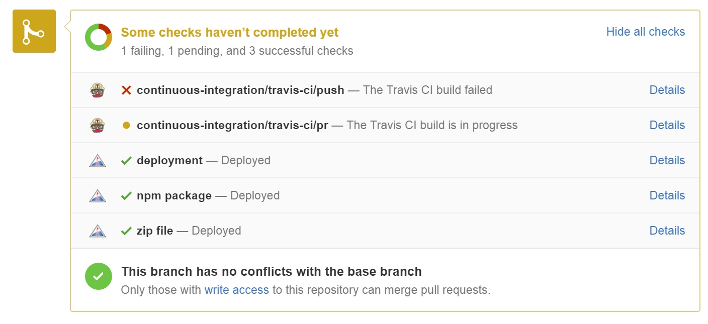
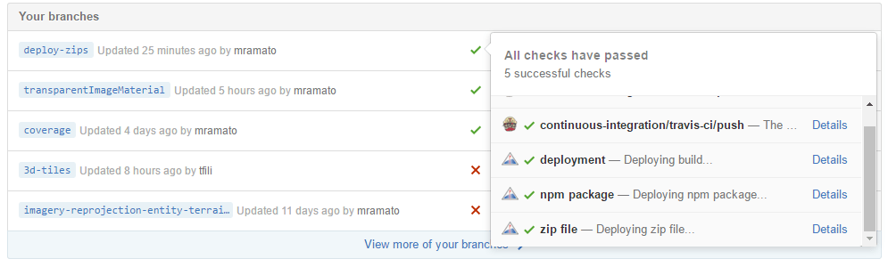

# Build Guide

- [Build Guide](#build-guide)
  - [Quickstart](#quickstart)
  - [Get the Code](#get-the-code)
  - [Build the Code](#build-the-code)
    - [Development Server](#development-server)
    - [Build Output](#build-output)
  - [Build Scripts](#build-scripts)
  - [Travis and Continuous Integration](#travis-and-continuous-integration)
    - [Configure a Different S3 Bucket](#configure-a-different-s3-bucket)
    - [Configure S3 Credentials](#configure-s3-credentials)
    - [Configure Statuses](#configure-statuses)

## Quickstart

1. [Clone the repository](#get-the-code)

2. [Build](#build-the-code)

   ```bash
    npm install
    npm run build
   ```

3. Start the server

   ```bash
   npm start
   ```

4. Navigate to : [`http://localhost:8080/`](http://localhost:8080)

---

## Get the Code

- Setup Git if it isn't already ([link](https://help.github.com/articles/set-up-git/#platform-all)).
  - New to git or need a refresher? Now's a good time to learn! [Easy tutorials here.](https://guides.github.com/)
  - Make sure your SSH keys are configured ([linux](https://help.github.com/articles/generating-ssh-keys#platform-linux) | [mac](https://help.github.com/articles/generating-ssh-keys#platform-mac) | [windows](https://help.github.com/articles/generating-ssh-keys#platform-windows)).
  - Double-check your settings for name and email: `git config --get-regexp user.*`.
  - Recommended Git settings:
    - `git config --global pull.rebase preserve` - when pulling remote changes, rebase your local changes on top of the remote changes, to avoid unnecessary merge commits.
    - `git config --global fetch.prune true` - when fetching remote changes, remove any remote branches that no longer exist on the remote.
- Have [commit access](https://github.com/CesiumGS/cesium/blob/main/Documentation/Contributors/CommittersGuide/README.md) to CesiumJS?
  - No
    - Fork [cesium](https://github.com/CesiumGS/cesium).
    - Use the [GitHub website](https://github.com/CesiumGS/cesium/branches/all) to delete all branches in your fork except `main`.
    - Clone your fork, e.g., `git clone git@github.com:yourusername/cesium.git`.
    - Make changes in a branch, e.g., `git checkout -b my-feature`.
  - Yes
    - Clone the cesium repo, e.g., `git clone git@github.com:CesiumGS/cesium.git`
    - Make changes in a branch, e.g., `git checkout -b my-feature`.

## Build the Code

Prerequisites:

- Install [Node.js](http://nodejs.org/) on your system. Building Cesium requires Node 14.x or newer.

Cesium uses [npm modules](https://docs.npmjs.com/getting-started/what-is-npm) for development, so after syncing, you need to run `npm install` from the Cesium root directory:

```bash
npm install
```

Once all modules have been installed, run `npm run build` to actually build the code:

```bash
npm run build
```

Alternatively, if you want to edit source files and see the changes reflected for testing, use `npm run build-watch`.

```bash
npm run build-watch
```

Cesium ships with a simple HTTP server for testing, run `npm start` after building to use it:

```bash
npm start
```

Then browse to [http://localhost:8080/](http://localhost:8080/). The landing page includes apps and tools commonly used during development, including:

- **Hello World** : an example for how to create a 3D globe. [Tutorial here](https://cesium.com/learn/cesiumjs-learn/cesiumjs-quickstart/)
- **Sandcastle** : an app for viewing and creating [code examples](https://sandcastle.cesium.com?src=Hello%20World.html&label=Showcases), complete with a live preview
- **Test Suites** : tests using [Jasmine](https://jasmine.github.io/). [Testing guide here.](https://github.com/CesiumGS/cesium/blob/main/Documentation/Contributors/TestingGuide/README.md#testing-guide)
- **Documentation** : reference documentation built from source. [Documentation guide here.](https://github.com/CesiumGS/cesium/blob/main/Documentation/Contributors/DocumentationGuide/README.md#documentation-guide)

### Development Server

By default, the server only allows connections from your local machine. To allow connections from other machines, pass
the `--public` option to npm. Note the extra `--` is intentional and required by npm.

```bash
npm start -- --public
```

The development server has a few other options as well, which you can see by passing the `--help` parameter:

```bash
npm start -- --help
```

### Build Output

Cesium can be used a few different ways. Cesium can be either a set of platform-generic ESM modules generic to browser, or bundled targeting the browser or NodeJS environment.

- [ESM (ECMAScript modules)](https://nodejs.org/api/esm.html) - Standard for packaging JS code which are supported by most browsers and NodeJS. Modules use `import` and `export` statements. Unprocessed, individual modules are available in the `Source` directory, accessible by importing `Source/Cesium.js`; A single pre-processed bundle by importing `Build/Cesium/index.js`.
- [IIFE (immediately-invoked function expression)](https://developer.mozilla.org/en-US/docs/Glossary/IIFE) - A pre-processed bundle and optimized for the browser, which defines a `Cesium` global variable upon loading `Build/Cesium/Cesium.js`.
- [CJS (CommonJS)](https://nodejs.org/api/modules.html) - A pre-processed, bundled module packaged for running in NodeJS accessible by requiring `index.cjs`.

Read the complete list of build scripts and options below for more details.

While you can use the editor of your choice to develop Cesium, certain files, such as `glsl` and new tests, require that
the `build` task be executed in order for the changes to take effect. You can use the `build-watch` script to have this
happen automatically.

## Build Scripts

Cesium uses [gulp](http://gulpjs.com/) for build tasks, but they are all abstracted away by [npm run scripts](https://docs.npmjs.com/cli/run-script).

Specify the target(s) at the command line:

```bash
npm run [target-name]
```

Here's the full set of scripts and what they do.

- **Build scripts** -- build and package the source code and documentation
  - `build` - A fast, developer-oriented build that pre-processes ESM modules, suitable for running tests and most examples. Run this when a GLSL shader is changed since the .glsl file is converted to a .js file with a string for the GLSL source. The build output, including an external sourcemap, will default to `Build/CesiumUnminified`.
    - `--minify` - [Minifies](<http://en.wikipedia.org/wiki/Minification_(programming)>) the output for optimized loading. Specifying this option will output to `Build/Cesium`.
    - `--removePragmas` - Optimizes the output by removing debugging code that validates function input and throws `DeveloperError`s. The removed sections are marked with `//>>includeStart('debug', pragmas.debug);` blocks in the code.
    - `--node` - Bundles an `index.cjs` module targeted for use in NodeJS
  - `build-watch` - A never-ending task that watches your file system for changes to Cesium and builds the source code as needed. All `build` options are also available for this task.
  - `build-apps` - Builds the example applications (such as Cesium Viewer) to produce self-contained, minified, deployable versions in the `Build` directory.
  - `build-doc` - Generates HTML documentation in `Build/Documentation` using [JSDoc 3](https://github.com/jsdoc3/jsdoc). See the [Documentation Guide](../DocumentationGuide/README.md) for more details.
  - `build-ts` - Generates a TypeScript definitions file for the Cesium library
  - `build-third-party` - Generates `ThirdParty.json`, a file which lists the latest licensing information of installed third party modules
  - `release` - A full release build that creates a shippable product, including generating documentation.
  - `make-zip` - Builds a zip file containing all release files. This includes the source ESM modules, bundled ESM and IIFE format `Cesium.js`, plus the bundled minified versions of ESM and IIFE, the generated documentation, the test suite, and the example applications (in both built and source form).
- **Utility scripts** -- code coverage, static code analysis, and other utilities
  - `clean` - Removes all generated build artifacts
  - `cloc` - Runs [CLOC](https://github.com/AlDanial/cloc) to count the lines of code on the Source and Specs directories. This requires [Perl](http://www.perl.org/) to execute.
  - `coverage` - Runs coverage and opens the default browser with the results
  - `eslint` - Runs [ESLint](http://eslint.org/), a static code analysis tool, on the entire source tree
  - `prettier` - Formats the code base using [Prettier](https://prettier.io/)
  - `prettier-check` - Verifies prettier formatting, but does not write the output
- **Testing scripts** -- build and run the unit tests
  - `test` - Runs all tests with [Karma](http://karma-runner.github.io/0.13/index.html) using the default browser specified in the Karma config file.
  - `test-all` - Runs all tests with Karma using all browsers installed on the current system
  - `test-non-webgl` - Runs only non-WebGL tests
  - `test-webgl` - Runs only WebGL tests
  - `test-webgl-stub` - Runs all tests using the WebGL stub, which WebGL calls a noop and ignores related test expectations
  - `test-webgl-validation` - Runs all tests with Karma and enables low-level WebGL validation
  - `test-release` - Runs all tests on the minified release version of built Cesium
- **Deployment scripts**
  - `deploy-s3` - Deploys the built CesiumJS files, the npm package, and the zip file to Amazon S3. This requires having credentials set up for the S3 bucket to which you are deploying
  - `deploy-status` - Sets the deployment statuses in GitHub, for use with Travis
  - `deploy-set-version` - Sets the version of `package.json`, for use with Travis

## Travis and Continuous Integration

Cesium uses [Travis](https://travis-ci.com/) for continuous integration. The Travis configuration and all the steps of the build process are defined in `travis.yml`. The blog post [Cesium Continuous Integration](http://cesium.com/blog/2016/04/07/Cesium-Continuous-Integration/) contains an in-depth explanation of the travis build process.

Travis triggers a build whenever someone opens a pull request or pushes code to the Cesium repository. After the build has completed, at the bottom on the pull request, the status of the build is shown and you can access the build by clicking the "Details" link.



You can also access the build of any branch of CesiumJS by going to the [Cesium Branches](https://github.com/CesiumGS/cesium/branches/all) page, and clicking the icon next to the branch name.



Additional set up is required for deployment if you do not have commit access to Cesium.

### Configure a Different S3 Bucket

It is possible to configure your `travis.yml` and `gulpfile.cjs` to deploy to a different S3 Bucket ([an Amazon Webservices storage unit](http://docs.aws.amazon.com/AmazonS3/latest/dev/UsingBucket.html)). If you are using the cesium-dev bucket and have valid credentials, skip to [Configure S3 Credentials](#configure-s3-credentials)

- In `travis.yml`, edit the following line:

```bash
- npm run deploy-s3 -- -b cesium-dev -d cesium/$TRAVIS_BRANCH --confirm -c 'no-cache'
```

- Edit `cesium-dev` to be the name of the S3 bucket you would like to deploy to
- In `gulpfile.cjs`, edit the following line:

```javascript
const travisDeployUrl =
  "http://cesium-dev.s3-website-us-east-1.amazonaws.com/cesium/";
```

- Edit the URL to match the URL of the S3 bucket specified in `travis.yml`

### Configure S3 Credentials

To configure Travis for deployment for a fork of Cesium, you must have valid credentials to the S3 bucket.

- Go to [travis-ci.com](https://travis-ci.com/) and select your fork of Cesium
- Go to "More Options">"Settings"
- Under the "Environment Variables" section, add two environment variables, `AWS_ACCESS_KEY_ID` and `AWS_SECRET_ACCESS_KEY`, with your access key and secret key


### Configure Statuses

To configure the additional commit statuses on GitHub for your fork of Cesium, you need to generate a personal access token for Travis to use.

- In GitHub, go to "Settings" and "Personal access tokens"
- Click "Generate new token" and confirm your password when prompted
- Give a brief description of the token such as "Travis Statuses" and select "repo:status" and click "Generate token"
  - `repo:status` gives the token access to only commit statuses


- Copy the token to your clipboard
- Go to [travis-ci.com](https://travis-ci.com/) and select your fork of Cesium
- Go to "More Options">"Settings"
- Under the "Environment Variables" section, add the environment variable `TOKEN` and paste your token for the value
