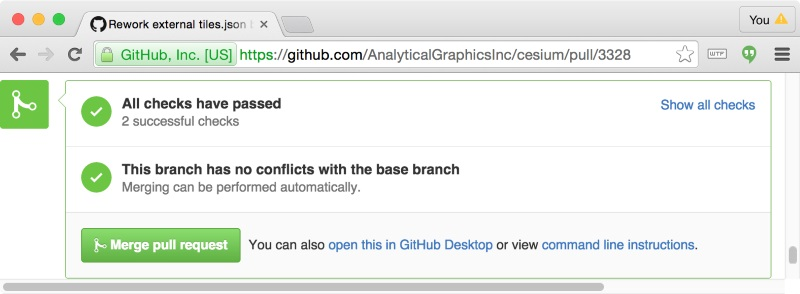

All code in CesiumJS is publicly peer reviewed. We review code to share knowledge, foster shared ownership, and improve code quality and consistency.

This guide describes best practices for code reviewers.

- [General](#general)
- [Reviewing](#reviewing)
- [Changes to the Public CesiumJS API](#changes-to-the-public-cesium-api)
- [Testing](#testing)
- [Merging](#merging)
- [Useful Git Commit Management](#useful-git-commit-management)
- [Resources](#resources)

## General

- It is ultimately the responsibility of the pull request opener to get their changes merged. They should champion their code being merged and should bump the PR or `@mention` a specific developer if it is not getting the necessary attention.
- GitHub has great [tools for code reviews in pull requests](https://help.github.com/articles/using-pull-requests/#reviewing-proposed-changes) that you should become familiar with.
- We need a CLA for any contribution. If we don't have a CLA for the contributor who opened the pull request (or, more precisely, any contributor to the branch), the Cesium Concierge will ask for one. If you receive no updates, politely ask for one before reviewing the pull request ([example](https://github.com/CesiumGS/cesium/pull/2918#issuecomment-127805425)).
- Most pull requests require additional work, minor or major, before being merged. Sometime pull requests are submitted incomplete for early feedback. Include a [task list](https://github.com/blog/1375%0A-task-lists-in-gfm-issues-pulls-comments) covering the steps that must be completed before merging.
- Anyone is encouraged to review any pull request that interests them. However, someone familiar with the changed code should ultimately merge it.
- It's OK to provide a few comments without taking responsibility for the final merge, for example commenting on the state of the public API or a Sandcastle example. However, be explicit that you will not be reviewing again. This sometimes happens when a reviewer wants to take a quick look at the public API or code examples but not all the implementation details.

## Reviewing

- See the forest through the trees. Don't just review code one line at a time. Consider the big picture and its implications.
- _Comments are about code_, not the contributor who wrote the code. Don't be offended by a reviewer's comments and don't aim to offend when commenting. We all want the same thing: to improve CesiumJS.
- Provide motivation when it isn't obvious. Suggest why a change should be made.
- Point contributors to a relevant part of the [Coding Guide](../CodingGuide/README.md) when useful.
- _Be concise_. Make every word tell.
- _Be responsive_. The contributor should expect prompt feedback from reviewers, and reviewers should expect the same. If not, politely ask for it. We all want pull requests to get into master. Strive to respond to mentions and requests within 24 hours.
- _Limit the scope_. As a reviewer, it is easy to want to increase the scope, e.g., "why don't we do this everywhere?". These are often fair questions but can be better served by submitting a separate issue to allow more incremental pull requests.
- Bring others into the conversation sparingly. If someone has expertise with a particular language feature or problem domain under review, invite them to comment with an `@mention`.
- If an experienced contributor makes a occasional whitespace or trivial mistake, just fix it to save on noise and speedup the review.

## Changes to the Public CesiumJS API

- If new identifiers were added to the public CesiumJS API:
  - Verify there is new reference doc. See the [Documentation Guide](../CodingGuide/README.md).
  - Verify that [CHANGES.md](../../../CHANGES.md) was updated.
  - Does the change warrant a new Sandcastle example?
  - Does it warrant a blog post or tweet so users know what to look forward to in the next release?
- Verify that deprecated and breaking changes to the public API were handled correctly. See the [Deprecation Guide](../DeprecationGuide/README.md).

## Testing

- Don't just review the code; test it by running the unit tests and relevant Sandcastle examples. See the [Testing Guide](../TestingGuide/README.md).
- For some changes, it is useful to profile CesiumJS or step through the code in the debugger.
- Read the new reference doc. Build the reference doc if the changes are significant.

## Merging

- When a reviewer hits merge, the ideal is that they have enough knowledge of the new code that they could support it in the future. In practice, this isn't always realistic but we strive for it.
- CesiumJS uses Travis CI for continuous integration. Travis automatically builds CesiumJS, runs ESLint, and generates the documentation for each branch pushed to GitHub. Before merging a pull request, verify that all Travis checks pass, indicated by the green check-mark and green "Merge pull request" button:



- Delete the branch after merging the pull request.
- Verify that the corresponding issue (if any) was closed.

## Useful Git Commit Management

Sometimes it is useful to clean up the pull request. Here are some scenarios and how to tackle them.
The tips below will use the following keywords:

- **origin** will refer to the user fork, ie. `git@github.com/username/cesium.git`.
- **upstream** will refer to the CesiumGS repo, ie. `git@github.com/CesiumGS/cesium.git`.
- **mybranch** will refer to your local branch name.
- **target** will refer to the target branch the PR is to be merged into (and also the source for `mybranch`).

If you are new to git, it may be useful to create a backup of your branch in case something goes wrong.
To do that, use:

```
git branch # This should show that you are currently on "mybranch", otherwise use "git checkout mybranch"
git checkout -b mybranch-backup # This should change your current branch to "mybranch-backup", which should be identical to "mybranch"
# if you wish to be even more conservative, you can push this to remote
git push origin mybranch-backup

# Now switch back to your working "mybranch"
git checkout mybranch
```

### You want to squash all the commits in your pull request into a single commit

```
git fetch --all # Ensures remote data is up to date
git merge origin/target # Merge the remote origin target with the local branch
git reset origin/target # This will reset your branch the same as origin/target, with your changes unstaged.
git add # Stage local changes, use `-u` for staging all tracked changes, `-p` to add interactively.
git commit -m "My single commit message"
git push -f origin mybranch # Requires force push as it is changing existing history on remote
```

### You want to merge the latest upstream target branch into mybranch

There are 2 ways to do this, **merge** (recommended) and **rebase** (pretty).

The rule of thumb here is if you are working on a longer term feature branch that may have conflicts with the target branch, then it is best to **merge**.

If you are working on a a shorter pull request (like a bug fix) with a few commits that probably will not result in a conflict, then it is best to **rebase**.

When in doubt, merge.

Futher Reading: [Merge vs Rebase](https://www.derekgourlay.com/blog/git-when-to-merge-vs-when-to-rebase/).

#### Merge

With merge, your commits will become interleaved with other target branch commits based on timestamp.

```
git fetch --all # Fetch updates from all remotes
git merge upstream/target
git push origin mybranch # Does not require force push as it does not change history
```

#### Rebase

With rebase, your commits will be added on top of the target branch and will look sequential.

```
git fetch --all # Fetch updates from all remotes
git rebase -i upstream/target
git push -f origin mybranch # Requires force push as it is changing existing history on remote
```

### You want to checkout a pull-request for review

#### Using hub

GitHub's [hub](https://hub.github.com) makes checking-out PR's simple. For example, run:

`hub checkout https://github.com/CesiumGS/cesium/pull/3941`

This will create a new branch with the contents of the pull request. Also, you can easily add remote
forks with:

`hub fetch boomer_jones,pjcozzi`

which will automatically add these repos as remotes and fetch them. See the hub [open-source maintainer section](https://hub.github.com/#maintainer)
for more info.

#### Using Github CLI

[GitHub CLI](https://cli.github.com/) allows you to checkout a PR using either its ID number, its URL, or its branch name. For instance,

`gh pr checkout 3941`

will checkout pull request [#3941](https://github.com/CesiumGS/cesium/pull/3941).

More details can be found [here](https://cli.github.com/manual/gh_pr_checkout).

#### Using git

You can also use regular git commands to checkout a PR. First, fetch the pull request using its ID number and create a new branch for it.

`git fetch origin pull/ID/head:BRANCHNAME`

Then, you can switch to the newly created branch.

`git checkout BRANCHNAME`

## Resources

- [Practice Conspicuous Code Review](http://producingoss.com/en/producingoss.html#code-review) in [Producing Open Source Software](http://producingoss.com/).
