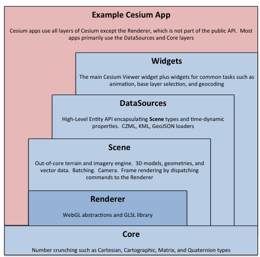

# Coding Guide

CesiumJS is one of the largest JavaScript codebases in the world. Since its start, we have maintained a high standard for code quality, which has made the codebase easier to work with for both new and experienced contributors. We hope you find the codebase to be clean and consistent.

In addition to describing typical coding conventions, this guide also covers best practices for design, maintainability, and performance. It is the cumulative advice of many developers after years of production development, research, and experimentation.

This guide applies to CesiumJS and all parts of the Cesium ecosystem written in JavaScript.

:art: The color palette icon indicates a design tip.

:house: The house icon indicates a maintainability tip. The whole guide is, of course, about writing maintainable code.

:speedboat: The speedboat indicates a performance tip.

To some extent, this guide can be summarized as _make new code similar to existing code_.

- [Coding Guide](#coding-guide)
  - [Naming](#naming)
  - [Formatting](#formatting)
  - [Linting](#linting)
  - [Units](#units)
  - [Basic Code Construction](#basic-code-construction)
  - [Functions](#functions)
    - [`options` Parameters](#options-parameters)
    - [Default Parameter Values](#default-parameter-values)
    - [Throwing Exceptions](#throwing-exceptions)
    - [`result` Parameters and Scratch Variables](#result-parameters-and-scratch-variables)
  - [Classes](#classes)
    - [Constructor Functions](#constructor-functions)
    - [`from` Constructors](#from-constructors)
    - [`to` Functions](#to-functions)
    - [Use Prototype Functions for Fundamental Classes Sparingly](#use-prototype-functions-for-fundamental-classes-sparingly)
    - [Static Constants](#static-constants)
    - [Private Functions](#private-functions)
    - [Property Getter/Setters](#property-gettersetters)
    - [Shadowed Property](#shadowed-property)
    - [Put the Constructor Function at the Top of the File](#put-the-constructor-function-at-the-top-of-the-file)
  - [Design](#design)
    - [Deprecation and Breaking Changes](#deprecation-and-breaking-changes)
  - [Third-Party Libraries](#third-party-libraries)
  - [Widgets](#widgets)
    - [Knockout subscriptions](#knockout-subscriptions)
  - [GLSL](#glsl)
    - [Naming](#naming-1)
    - [Formatting](#formatting-1)
    - [Performance](#performance)
  - [Resources](#resources)

## Naming

- Directory names are `PascalCase`, e.g., `Source/Scene`.
- Constructor functions are `PascalCase`, e.g., `Cartesian3`.
- Functions are `camelCase`, e.g., `defaultValue()`, `Cartesian3.equalsEpsilon()`.
- Files end in `.js` and have the same name as the JavaScript identifier, e.g., `Cartesian3.js` and `defaultValue.js`.
- Variables, including class properties, are `camelCase`, e.g.,

```javascript
this.minimumPixelSize = 1.0; // Class property

const bufferViews = gltf.bufferViews; // Local variable
```

- Private (by convention) members start with an underscore, e.g.,

```javascript
this._canvas = canvas;
```

- Constants are in uppercase with underscores, e.g.,

```javascript
Cartesian3.UNIT_X = Object.freeze(new Cartesian3(1.0, 0.0, 0.0));
```

- Avoid abbreviations in public identifiers unless the full name is prohibitively cumbersome and has a widely accepted abbreviation, e.g.,

```javascript
Cartesian3.maximumComponent(); // Not Cartesian3.maxComponent()

Ellipsoid.WGS84; // Not Ellipsoid.WORLD_GEODETIC_SYSTEM_1984
```

- Prefer short and descriptive names for local variables, e.g., if a function has only one length variable,

```javascript
const primitivesLength = primitives.length;
```

is better written as

```javascript
const length = primitives.length;
```

- When accessing an outer-scope's `this` in a closure, name the variable `that`, e.g.,

```javascript
const that = this;
this._showTouch = createCommand(function () {
  that._touch = true;
});
```

A few more naming conventions are introduced below along with their design pattern, e.g., [`options` parameters](#options-parameters), [`result` parameters and scratch variables](#result-parameters-and-scratch-variables), and [`from` constructors](#from-constructors).

## Formatting

- We use [prettier](https://prettier.io/) to automatically re-format all JS code at commit time, so all of the work is done for you. Code is automatically reformatted when you commit.
- For HTML code, keep the existing style. Use double quotes.
- Text files, end with a newline to minimize the noise in diffs.

## Linting

For syntax and style guidelines, we use the ESLint recommended settings (the list of rules can be found [here](http://eslint.org/docs/rules/)) as a base and extend it with additional rules via a shared config Node module, [eslint-config-cesium](https://www.npmjs.com/package/eslint-config-cesium). This package is maintained as a part of the Cesium repository and is also used throughout the Cesium ecosystem. For a list of which rules are enabled, look in [index.js](https://github.com/CesiumGS/cesium/blob/main/Tools/eslint-config-cesium/index.js), [browser.js](https://github.com/CesiumGS/eslint-config-cesium/blob/main/browser.js), and [node.js](https://github.com/CesiumGS/eslint-config-cesium/blob/main/node.js).

**General rules:**

- [block-scoped-var](http://eslint.org/docs/rules/block-scoped-var)
- [no-alert](http://eslint.org/docs/rules/no-alert)
- [no-floating-decimal](http://eslint.org/docs/rules/no-floating-decimal)
- [no-implicit-globals](http://eslint.org/docs/rules/no-implicit-globals)
- [no-loop-func](http://eslint.org/docs/rules/no-loop-func)
- [no-use-before-define](http://eslint.org/docs/rules/no-use-before-define) to prevent using variables and functions before they are defined.
- [no-else-return](http://eslint.org/docs/rules/no-else-return)
- [no-undef-init](http://eslint.org/docs/rules/no-undef-init)
- [no-sequences](http://eslint.org/docs/rules/no-sequences)
- [no-unused-expressions](http://eslint.org/docs/rules/no-unused-expressions)
- [no-trailing-spaces](http://eslint.org/docs/rules/no-trailing-spaces)
- [no-lonely-if](http://eslint.org/docs/rules/no-lonely-if)
- [quotes](http://eslint.org/docs/rules/quotes) to enforce using single-quotes
- [no-sequences](http://eslint.org/docs/rules/no-sequences)
- [no-unused-expressions](http://eslint.org/docs/rules/no-unused-expressions)

**Node-specific rules:**

- [global-require](http://eslint.org/docs/rules/global-require)
- [no-buffer-constructor](http://eslint.org/docs/rules/no-buffer-constructor)
- [no-new-require](http://eslint.org/docs/rules/no-new-require)

**[Disabling Rules with Inline Comments](http://eslint.org/docs/user-guide/configuring#disabling-rules-with-inline-comments)**

- When disabling linting for one line, use `//eslint-disable-next-line`:

```js
function exit(warningMessage) {
  //eslint-disable-next-line no-alert
  window.alert("Cannot exit: " + warningMessage);
}
```

- When disabling linting for blocks of code, place `eslint-disable` comments on new lines and as close to the associated code as possible:

```js
/*eslint-disable no-empty*/
try {
  lineNumber = parseInt(stack.substring(lineStart + 1, lineEnd1), 10);
} catch (ex) {}
/*eslint-enable no-empty*/
```

## Units

- Cesium uses SI units:
  - meters for distances,
  - radians for angles, and
  - seconds for time durations.
- If a function has a parameter with a non-standard unit, such as degrees, put the unit in the function name, e.g.,

```javascript
Cartesian3.fromDegrees = function (
  longitude,
  latitude,
  height,
  ellipsoid,
  result
) {
  /* ... */
};
```

## Basic Code Construction

- Cesium uses JavaScript's [strict mode](https://developer.mozilla.org/en-US/docs/Web/JavaScript/Reference/Strict_mode) so each module (file) contains

```javascript
"use strict";

```

- :speedboat: To avoid type coercion (implicit type conversion), test for equality with `===` and `!==`, e.g.,

```javascript
const i = 1;

if (i === 1) {
  // ...
}

if (i !== 1) {
  // ...
}
```

- To aid the human reader, append `.0` to whole numbers intended to be floating-point values, e.g., unless `f` is an integer,

```javascript
const f = 1;
```

is better written as

```javascript
const f = 1.0;
```

- Declare variables where they are first used. For example,

```javascript
let i;
let m;
const models = [
  /* ... */
];
const length = models.length;
for (i = 0; i < length; ++i) {
  m = models[i];
  // Use m
}
```

is better written as

```javascript
const models = [
  /* ... */
];
const length = models.length;
for (let i = 0; i < length; ++i) {
  const m = models[i];
  // Use m
}
```

- `let` and `const` variables have block-level scope. Do not rely on variable hoisting, i.e., using a variable before it is declared, e.g.,

```javascript
console.log(i); // i is undefined here.  Never use a variable before it is declared.
let i = 0.0;
```

- A `const` variables is preferred when a value is not updated. This ensures immutability.

- :speedboat: Avoid redundant nested property access. This

```javascript
scene.environmentState.isSkyAtmosphereVisible = true;
scene.environmentState.isSunVisible = true;
scene.environmentState.isMoonVisible = false;
```

is better written as

```javascript
const environmentState = scene.environmentState;
environmentState.isSkyAtmosphereVisible = true;
environmentState.isSunVisible = true;
environmentState.isMoonVisible = false;
```

- Do not create a local variable that is used only once unless it significantly improves readability, e.g.,

```javascript
function radiiEquals(left, right) {
  const leftRadius = left.radius;
  const rightRadius = right.radius;
  return leftRadius === rightRadius;
}
```

is better written as

```javascript
function radiiEquals(left, right) {
  return left.radius === right.radius;
}
```

- Use `undefined` instead of `null`.
- Test if a variable is defined using Cesium's `defined` function, e.g.,

```javascript
const v = undefined;
if (defined(v)) {
  // False
}

const u = {};
if (defined(u)) {
  // True
}
```

- Use `Object.freeze` function to create enums, e.g.,

```javascript

    const ModelAnimationState = {
        STOPPED : 0,
        ANIMATING : 1
    };

    return Object.freeze(ModelAnimationState);
});
```

- Use descriptive comments for non-obvious code, e.g.,

```javascript
byteOffset += sizeOfUint32; // Add 4 to byteOffset
```

is better written as

```javascript
byteOffset += sizeOfUint32; // Skip length field
```

- `TODO` comments need to be removed or addressed before the code is merged into main. Used sparingly, `PERFORMANCE_IDEA`, can be handy later when profiling.
- Remove commented out code before merging into main.
- Modern language features may provide handy shortcuts and cleaner syntax, but they should be used with consideration for their performance implications, especially in code that is invoked per-frame.

## Functions

- :art: Functions should be **cohesive**; they should only do one task.
- Statements in a function should be at a similar level of abstraction. If a code block is much lower level than the rest of the statements, it is a good candidate to move to a helper function, e.g.,

```javascript
Cesium3DTileset.prototype.update = function (frameState) {
  const tiles = this._processingQueue;
  const length = tiles.length;

  for (let i = length - 1; i >= 0; --i) {
    tiles[i].process(this, frameState);
  }

  selectTiles(this, frameState);
  updateTiles(this, frameState);
};
```

is better written as

```javascript
Cesium3DTileset.prototype.update = function (frameState) {
  processTiles(this, frameState);
  selectTiles(this, frameState);
  updateTiles(this, frameState);
};

function processTiles(tileset, frameState) {
  const tiles = tileset._processingQueue;
  const length = tiles.length;

  for (let i = length - 1; i >= 0; --i) {
    tiles[i].process(tileset, frameState);
  }
}
```

- Do not use an unnecessary `else` block at the end of a function, e.g.,

```javascript
function getTransform(node) {
  if (defined(node.matrix)) {
    return Matrix4.fromArray(node.matrix);
  } else {
    return Matrix4.fromTranslationQuaternionRotationScale(
      node.translation,
      node.rotation,
      node.scale
    );
  }
}
```

is better written as

```javascript
function getTransform(node) {
  if (defined(node.matrix)) {
    return Matrix4.fromArray(node.matrix);
  }

  return Matrix4.fromTranslationQuaternionRotationScale(
    node.translation,
    node.rotation,
    node.scale
  );
}
```

- :speedboat: Smaller functions are more likely to be optimized by JavaScript engines. Consider this for code that is likely to be a hot spot.

### `options` Parameters

:art: Many Cesium functions take an `options` parameter to support optional parameters, self-documenting code, and forward compatibility. For example, consider:

```javascript
const sphere = new SphereGeometry(10.0, 32, 16, VertexFormat.POSITION_ONLY);
```

It is not clear what the numeric values represent, and the caller needs to know the order of parameters. If this took an `options` parameter, it would look like this:

```javascript
const sphere = new SphereGeometry({
  radius: 10.0,
  stackPartitions: 32,
  slicePartitions: 16,
  vertexFormat: VertexFormat.POSITION_ONLY,
});
```

- :speedboat: Using `{ /* ... */ }` creates an object literal, which is a memory allocation. Avoid designing functions that use an `options` parameter if the function is likely to be a hot spot; otherwise, callers will have to use a scratch variable (see [below](#result-parameters-and-scratch-variables)) for performance. Constructor functions for non-math classes are good candidates for `options` parameters since Cesium avoids constructing objects in hot spots. For example,

```javascript
const p = new Cartesian3({
  x: 1.0,
  y: 2.0,
  z: 3.0,
});
```

is a bad design for the `Cartesian3` constructor function since its performance is not as good as that of

```javascript
const p = new Cartesian3(1.0, 2.0, 3.0);
```

### Default Parameter Values

If a _sensible_ default exists for a function parameter or class property, don't require the user to provide it. Use Cesium's `defaultValue` to assign a default value. For example, `height` defaults to zero in `Cartesian3.fromRadians`:

```javascript
Cartesian3.fromRadians = function (longitude, latitude, height) {
  height = defaultValue(height, 0.0);
  // ...
};
```

- :speedboat: Don't use `defaultValue` if it could cause an unnecessary function call or memory allocation, e.g.,

```javascript
this._mapProjection = defaultValue(
  options.mapProjection,
  new GeographicProjection()
);
```

is better written as

```javascript
this._mapProjection = defined(options.mapProjection)
  ? options.mapProjection
  : new GeographicProjection();
```

- If an `options` parameter is optional, use `defaultValue.EMPTY_OBJECT`, e.g.,

```javascript
function DebugModelMatrixPrimitive(options) {
  options = defaultValue(options, defaultValue.EMPTY_OBJECT);
  this.length = defaultValue(options.length, 10000000.0);
  this.width = defaultValue(options.width, 2.0);
  // ...
}
```

Some common sensible defaults are

- `height`: `0.0`
- `ellipsoid`: `Ellipsoid.WGS84`
- `show`: `true`

### Throwing Exceptions

Use the functions of Cesium's [Check](https://github.com/CesiumGS/cesium/blob/main/Source/Core/Check.js) class to throw a `DeveloperError` when the user has a coding error. The most common errors are parameters that are missing, have the wrong type or are out of rangers of the wrong type or are out of range.

- For example, to check that a parameter is defined and is an object:

```javascript
Cartesian3.maximumComponent = function (cartesian) {
  //>>includeStart('debug', pragmas.debug);
  Check.typeOf.object("cartesian", cartesian);
  //>>includeEnd('debug');

  return Math.max(cartesian.x, cartesian.y, cartesian.z);
};
```

- For more complicated parameter checks, manually check the parameter and then throw a `DeveloperError`. Example:

```javascript
Cartesian3.unpackArray = function (array, result) {
  //>>includeStart('debug', pragmas.debug);
  Check.defined("array", array);
  Check.typeOf.number.greaterThanOrEquals("array.length", array.length, 3);
  if (array.length % 3 !== 0) {
    throw new DeveloperError("array length must be a multiple of 3.");
  }
  //>>includeEnd('debug');

  // ...
};
```

- To check for `DeveloperError`, surround code in `includeStart`/`includeEnd` comments, as shown above, so developer error checks can be optimized out of release builds. Do not include required side effects inside `includeStart`/`includeEnd`, e.g.,

```javascript
Cartesian3.maximumComponent = function (cartesian) {
  //>>includeStart('debug', pragmas.debug);
  const c = cartesian;
  Check.typeOf.object("cartesian", cartesian);
  //>>includeEnd('debug');

  // Works in debug. Fails in release since c is optimized out!
  return Math.max(c.x, c.y, c.z);
};
```

- Throw Cesium's `RuntimeError` for an error that will not be known until runtime. Unlike developer errors, runtime error checks are not optimized out of release builds.

```javascript
if (typeof WebGLRenderingContext === "undefined") {
  throw new RuntimeError("The browser does not support WebGL.");
}
```

- :art: Exceptions are exceptional. Avoid throwing exceptions, e.g., if a polyline is only provided one position, instead of two or more, instead of throwing an exception just don't render it.

### `result` Parameters and Scratch Variables

:speedboat: In JavaScript, user-defined classes such as `Cartesian3` are reference types and are therefore allocated on the heap. Frequently allocating these types causes a significant performance problem because it creates GC pressure, which causes the Garbage Collector to run longer and more frequently.

Cesium uses required `result` parameters to avoid implicit memory allocation. For example,

```javascript
const sum = Cartesian3.add(v0, v1);
```

would have to implicitly allocate a new `Cartesian3` object for the returned sum. Instead, `Cartesian3.add` requires a `result` parameter:

```javascript
const result = new Cartesian3();
const sum = Cartesian3.add(v0, v1, result); // Result and sum reference the same object
```

This makes allocations explicit to the caller, which allows the caller to, for example, reuse the result object in a file-scoped scratch variable:

```javascript
const scratchDistance = new Cartesian3();

Cartesian3.distance = function (left, right) {
  Cartesian3.subtract(left, right, scratchDistance);
  return Cartesian3.magnitude(scratchDistance);
};
```

The code is not as clean, but the performance improvement is often dramatic.

As described below, `from` constructors also use optional `result` parameters.

Because result parameters aren't always required or returned, don't strictly rely on the result parameter you passed in to be modified. For example:

```js
Cartesian3.add(v0, v1, result);
Cartesian3.add(result, v2, result);
```

is better written as

```js
result = Cartesian3.add(v0, v1, result);
result = Cartesian3.add(result, v2, result);
```

## Classes

- :art: Classes should be **cohesive**. A class should represent one abstraction.
- :art: Classes should be **loosely coupled**. Two classes should not be entangled and rely on each other's implementation details; they should communicate through well-defined interfaces.

### Constructor Functions

- Create a class by creating a constructor function:

```javascript
function Cartesian3(x, y, z) {
  this.x = defaultValue(x, 0.0);
  this.y = defaultValue(y, 0.0);
  this.z = defaultValue(z, 0.0);
}
```

- Create an instance of a class (an _object_) by calling the constructor function with `new`:

```javascript
const p = new Cartesian3(1.0, 2.0, 3.0);
```

- :speedboat: Assign to all the property members of a class in the constructor function. This allows JavaScript engines to use a hidden class and avoid entering dictionary mode. Assign `undefined` if no initial value makes sense. Do not add properties to an object, e.g.,

```javascript
const p = new Cartesian3(1.0, 2.0, 3.0);
p.w = 4.0; // Adds the w property to p, slows down property access since the object enters dictionary mode
```

- :speedboat: For the same reason, do not change the type of a property, e.g., assign a string to a number, e.g.,

```javascript
const p = new Cartesian3(1.0, 2.0, 3.0);
p.x = "Cesium"; // Changes x to a string, slows down property access
```

- In a constructor function, consider properties as write once; do not write to them or read them multiple times. Create a local variable if they need to be read. For example:

  Instead of

  ```javascript
  this._x = 2;
  this._xSquared = this._x * this._x;
  ```

  prefer

  ```javascript
  const x = 2;
  this._x = x;
  this._xSquared = x * x;
  ```

### `from` Constructors

:art: Constructor functions should take the basic components of the class as parameters. For example, `Cartesian3` takes `x`, `y`, and `z`.

It is often convenient to construct objects from other parameters. Since JavaScript doesn't have function overloading, Cesium uses static
functions prefixed with `from` to construct objects in this way. For example:

```javascript
const p = Cartesian3.fromRadians(-2.007, 0.645); // Construct a Cartesian3 object using longitude and latitude
```

These are implemented with an optional `result` parameter, which allows callers to pass in a scratch variable:

```javascript
Cartesian3.fromRadians = function (longitude, latitude, height, result) {
  // Compute x, y, z using longitude, latitude, height

  if (!defined(result)) {
    result = new Cartesian3();
  }

  result.x = x;
  result.y = y;
  result.z = z;
  return result;
};
```

Since calling a `from` constructor should not require an existing object, the function is assigned to `Cartesian3.fromRadians`, not `Cartesian3.prototype.fromRadians`.

### `to` Functions

Functions that start with `to` return a new type of object, e.g.,

```javascript
Cartesian3.prototype.toString = function () {
  return "(${this.x}, ${this.y}, ${this.z})";
};
```

### Use Prototype Functions for Fundamental Classes Sparingly

:art: Fundamental math classes such as `Cartesian3`, `Quaternion`, `Matrix4`, and `JulianDate` use prototype functions sparingly. For example, `Cartesian3` does not have a prototype `add` function like this:

```javascript
const v2 = v0.add(v1, result);
```

Instead, this is written as

```javascript
const v2 = Cartesian3.add(v0, v1, result);
```

The only exceptions are

- `clone`
- `equals`
- `equalsEpsilon`
- `toString`

These prototype functions generally delegate to the non-prototype (static) version, e.g.,

```javascript
Cartesian3.equals = function (left, right) {
  return (
    left === right ||
    (defined(left) &&
      defined(right) &&
      left.x === right.x &&
      left.y === right.y &&
      left.z === right.z)
  );
};

Cartesian3.prototype.equals = function (right) {
  return Cartesian3.equals(this, right);
};
```

The prototype versions have the benefit of being able to be used polymorphically.

### Static Constants

To create a static constant related to a class, use `Object.freeze`:

```javascript
Cartesian3.ZERO = Object.freeze(new Cartesian3(0.0, 0.0, 0.0));
```

### Private Functions

Like private properties, private functions start with an `_`. In practice, these are rarely used. Instead, for better encapsulation, a file-scoped function that takes `this` as the first parameter is used. For example,

```javascript
Cesium3DTileset.prototype.update = function(frameState) {
    this._processTiles(frameState);
    // ...
};

Cesium3DTileset.prototype._processTiles(tileset, frameState) {
    const tiles = this._processingQueue;
    const length = tiles.length;

    for (let i = length - 1; i >= 0; --i) {
        tiles[i].process(tileset, frameState);
    }
}
```

is better written as

```javascript
Cesium3DTileset.prototype.update = function (frameState) {
  processTiles(this, frameState);
  // ...
};

function processTiles(tileset, frameState) {
  const tiles = tileset._processingQueue;
  const length = tiles.length;

  for (let i = length - 1; i >= 0; --i) {
    tiles[i].process(tileset, frameState);
  }
}
```

### Property Getter/Setters

Public properties that can be read or written without extra processing can simply be assigned in the constructor function, e.g.,

```javascript
function Model(options) {
  this.show = defaultValue(options.show, true);
}
```

Read-only properties can be created with a private property and a getter using `Object.defineProperties` function, e.g.,

```javascript
function Cesium3DTileset(options) {
  this._url = options.url;
}

Object.defineProperties(Cesium3DTileset.prototype, {
  url: {
    get: function () {
      return this._url;
    },
  },
});
```

Getters can perform any needed computation to return the property, but the performance expectation is that they execute quickly.

Setters can also perform computation before assigning to a private property, set a flag to delay computation, or both, for example:

```javascript
Object.defineProperties(UniformState.prototype, {
  viewport: {
    get: function () {
      return this._viewport;
    },
    set: function (viewport) {
      if (!BoundingRectangle.equals(viewport, this._viewport)) {
        BoundingRectangle.clone(viewport, this._viewport);

        const v = this._viewport;
        const vc = this._viewportCartesian4;
        vc.x = v.x;
        vc.y = v.y;
        vc.z = v.width;
        vc.w = v.height;

        this._viewportDirty = true;
      }
    },
  },
});
```

- :speedboat: Calling the getter/setter function is slower than direct property access so functions internal to a class can use the private property directly when appropriate.

### Shadowed Property

When the overhead of getter/setter functions is prohibitive or reference-type semantics are desired, e.g., the ability to pass a property as a `result` parameter so its properties can be modified, consider combining a public property with a private shadowed property, e.g.,

```javascript
function Model(options) {
  this.modelMatrix = Matrix4.clone(
    defaultValue(options.modelMatrix, Matrix4.IDENTITY)
  );
  this._modelMatrix = Matrix4.clone(this.modelMatrix);
}

Model.prototype.update = function (frameState) {
  if (!Matrix4.equals(this._modelMatrix, this.modelMatrix)) {
    // clone() is a deep copy. Not this._modelMatrix = this._modelMatrix
    Matrix4.clone(this.modelMatrix, this._modelMatrix);

    // Do slow operations that need to happen when the model matrix changes
  }
};
```

### Put the Constructor Function at the Top of the File

It is convenient for the constructor function to be at the top of the file even if it requires that helper functions rely on **hoisting**, for example, `Cesium3DTileset.js`,

```javascript
function loadTileset(tileset, tilesJson, done) {
  // ...
}

function Cesium3DTileset(options) {
  // ...
  loadTileset(this, options.url, function (data) {
    // ...
  });
}
```

is better written as

```javascript
function Cesium3DTileset(options) {
  // ...
  loadTileset(this, options.url, function (data) {
    // ...
  });
}

function loadTileset(tileset, tilesJson, done) {
  // ...
}
```

even though it relies on implicitly hoisting the `loadTileset` function to the top of the file.

## Design

- :house: Make a class or function part of the Cesium API only if it will likely be useful to end users; avoid making an implementation detail part of the public API. When something is public, it makes the Cesium API bigger and harder to learn, is harder to change later, and requires more documentation work.
- :art: Put new classes and functions in the right part of the Cesium stack (directory). From the bottom up:
  - `Source/Core` - Number crunching. Pure math such as [`Cartesian3`](https://github.com/CesiumGS/cesium/blob/main/Source/Core/Cartesian3.js). Pure geometry such as [`CylinderGeometry`](https://github.com/CesiumGS/cesium/blob/main/Source/Core/CylinderGeometry.js). Fundamental algorithms such as [`mergeSort`](https://github.com/CesiumGS/cesium/blob/main/Source/Core/mergeSort.js). Request helper functions such as [`loadArrayBuffer`](https://github.com/CesiumGS/cesium/blob/main/Source/Core/loadArrayBuffer.js).
  - `Source/Renderer` - WebGL abstractions such as [`ShaderProgram`](https://github.com/CesiumGS/cesium/blob/main/Source/Renderer/ShaderProgram.js) and WebGL-specific utilities such as [`ShaderCache`](https://github.com/CesiumGS/cesium/blob/main/Source/Renderer/ShaderCache.js). Identifiers in this directory are not part of the public Cesium API.
  - `Source/Scene` - The graphics engine, including primitives such as [Model](https://github.com/CesiumGS/cesium/blob/main/Source/Scene/Model.js). Code in this directory often depends on `Renderer`.
  - `Source/DataSources` - Entity API, such as [`Entity`](https://github.com/CesiumGS/cesium/blob/main/Source/DataSources/Entity.js), and data sources such as [`CzmlDataSource`](https://github.com/CesiumGS/cesium/blob/main/Source/DataSources/CzmlDataSource.js).
  - `Source/Widgets` - Widgets such as the main Cesium [`Viewer`](https://github.com/CesiumGS/cesium/blob/main/Source/Widgets/Viewer/Viewer.js).

It is usually obvious what directory a file belongs in. When it isn't, the decision is usually between `Core` and another directory. Put the file in `Core` if it is pure number crunching or a utility that is expected to be generally useful to Cesium, e.g., [`Matrix4`](https://github.com/CesiumGS/cesium/blob/main/Source/Core/Matrix4.js) belongs in `Core` since many parts of the Cesium stack use 4x4 matrices; on the other hand, [`BoundingSphereState`](https://github.com/CesiumGS/cesium/blob/main/Source/DataSources/BoundingSphereState.js) is in `DataSources` because it is specific to data sources.



Modules (files) should only reference modules in the same level or a lower level of the stack. For example, a module in `Scene` can use modules in `Scene`, `Renderer`, and `Core`, but not in `DataSources` or `Widgets`.

- WebGL resources need to be explicitly deleted so classes that contain them (and classes that contain these classes, and so on) have `destroy` and `isDestroyed` functions, e.g.,

```javascript
const primitive = new Primitive(/* ... */);
expect(content.isDestroyed()).toEqual(false);
primitive.destroy();
expect(content.isDestroyed()).toEqual(true);
```

A `destroy` function is implemented with Cesium's `destroyObject` function, e.g.,

```javascript
SkyBox.prototype.destroy = function () {
  this._vertexArray = this._vertexArray && this._vertexArray.destroy();
  return destroyObject(this);
};
```

- Only `destroy` objects that you create; external objects given to a class should be destroyed by their owner, not the class.

### Deprecation and Breaking Changes

From release to release, we strive to keep the public Cesium API stable but also maintain mobility for speedy development and to take the API in the right direction. As such, we sparingly deprecate and then remove or replace parts of the public API.

A `@private` API is considered a Cesium implementation detail and can be broken immediately without deprecation.

An `@experimental` API is subject to breaking changes in future Cesium releases without deprecation. It allows for new experimental features, for instance implementing draft formats.

A public identifier (class, function, property) should be deprecated before being removed. To do so:

- Decide on which future version the deprecated API should be removed. This is on a case-by-case basis depending on how badly it impacts users and Cesium development. Most deprecated APIs will removed in 1-3 releases. This can be discussed in the pull request if needed.
- Use [`deprecationWarning`](https://github.com/CesiumGS/cesium/blob/main/Source/Core/deprecationWarning.js) to warn users that the API is deprecated and what proactive changes they can take, e.g.,

```javascript
function Foo() {
  deprecationWarning(
    "Foo",
    "Foo was deprecated in CesiumJS 1.01.  It will be removed in 1.03.  Use newFoo instead."
  );
  // ...
}
```

- Add the [`@deprecated`](http://usejsdoc.org/tags-deprecated.html) doc tag.
- Remove all use of the deprecated API inside Cesium except for unit tests that specifically test the deprecated API.
- Mention the deprecation in the `Deprecated` section of [`CHANGES.md`](https://github.com/CesiumGS/cesium/blob/main/CHANGES.md). Include what Cesium version it will be removed in.
- Create an [issue](https://github.com/CesiumGS/cesium/issues) to remove the API with the appropriate `remove in [version]` label.
- Upon removal of the API, add a mention of it in the `Breaking Changes` section of [`CHANGES.md`](https://github.com/CesiumGS/cesium/blob/main/CHANGES.md).

## Third-Party Libraries

:house: Cesium uses third-party libraries sparingly. If you want to add a new one, please start a thread on the [Cesium community forum](https://community.cesium.com/) ([example discussion](https://community.cesium.com/t/do-we-like-using-third-party-libraries/745)). The library should

- Have a compatible license such as MIT, BSD, or Apache 2.0.
- Provide capabilities that Cesium truly needs and that the team doesn't have the time and/or expertise to develop.
- Be lightweight, tested, maintained, and reasonably widely used.
- Not pollute the global namespace.
- Provide enough value to justify adding a third-party library whose integration needs to be maintained and has the potential to slightly count against Cesium when some users evaluate it (generally, fewer third-parties is better).

When adding or updating a third-party library:

- Ensure [LICENSE.md](../../../LICENSE.md) is updated with the library's name and full copyright notice.
- If a library is shipped as part of the CesiumJS release, it should be included in the generated [`ThirdParty.json`](../../../ThirdParty.json).
  1. Update [`ThirdParty.extra.json`](../../../ThirdParty.extra.json) with the package `name`. If it is an npm module included in [`package.json`](../../../package.json), use the exact package name.
  2. If the library is _not_ an npm module included in `package.json`, provide the `license`, `version`, and `url` fields. Otherwise, this information can be detected using `package.json`.
  3. If there is a special case regarding the license, such as choosing to use a single license from a list of multiple available ones, providing the `license` field will override information detected using `package.json`. The `notes` field should also be provided in the case explaining the exception.
  4. Run `npm run build-third-party` and commit the resulting `ThirdParty.json`

## Widgets

Cesium includes a handful of standard widgets that are used in the Viewer, including animation and timeline controls, a base layer picker, and a geocoder. These widgets are all built using [Knockout](http://knockoutjs.com/)) for automatic UI refreshing. Knockout uses a Model View ViewModel (MVVM) design pattern. You can learn more about this design pattern in [Understanding MVVM - A Guide For JavaScript Developers](https://addyosmani.com/blog/understanding-mvvm-a-guide-for-javascript-developers/)

To learn about using the Knockout library, see the [Get started](http://knockoutjs.com/) section of their home page. They also have a great [interactive tutorial](http://learn.knockoutjs.com/) with step by step instructions.

Cesium also uses the [Knockout-ES5](http://blog.stevensanderson.com/2013/05/20/knockout-es5-a-plugin-to-simplify-your-syntax/) plugin to simplify knockout syntax. This lets us use knockout observables the same way we use other variables. Call `knockout.track` to create the observables. Here is an example from [BaseLayerPickerViewModel](https://github.com/CesiumGS/cesium/blob/main/Source/Widgets/BaseLayerPicker/BaseLayerPickerViewModel.js#L73) that makes observables for `tooltip`, `showInstructions` and `_touch` properties.

```javascript
knockout.track(this, ["tooltip", "showInstructions", "_touch"]);
```

### Knockout subscriptions

Use a knockout subscription only when you are unable to accomplish what you need to do with a standard binding. For [example](https://github.com/CesiumGS/cesium/blob/main/Source/Widgets/Viewer/Viewer.js#L588), the `Viewer` subscribes to `FullscreenButtonViewModel.isFullscreenEnabled` because it needs to change the width of the timeline widget when that value changes. This cannot be done with binding because the value from `FullscreenButtonViewModel` is affecting a value not contained within that widget.

Cesium includes a [`subscribeAndEvaluate`](https://github.com/CesiumGS/cesium/blob/main/Source/Widgets/subscribeAndEvaluate.js) helper function for subscribing to knockout observable.

When using a subscription, always be sure to [dispose the subscription](https://github.com/CesiumGS/cesium/blob/main/Source/Widgets/Viewer/Viewer.js#L1413) when the viewmodel is no longer using it. Otherwise the listener will continue to be notified for the lifetime of the observable.

```javascript
fullscreenSubscription = subscribeAndEvaluate(fullscreenButton.viewModel, 'isFullscreenEnabled', function(isFullscreenEnabled) { ... });
// ...then later...
fullscreenSubscription.dispose();
```

## GLSL

### Naming

- GLSL files end with `.glsl` and are in the [Shaders](https://github.com/CesiumGS/cesium/tree/main/Source/Shaders) directory.
- Files for vertex shaders have a `VS` suffix; fragment shaders have an `FS` suffix. For example: `BillboardCollectionVS.glsl` and `BillboardCollectionFS.glsl`.
- Generally, identifiers, such as functions and variables, use `camelCase`.
- Cesium built-in identifiers start with `czm_`, for example, [`czm_material`](https://github.com/CesiumGS/cesium/blob/main/Source/Shaders/Builtin/Structs/material.glsl). Files have the same name without the `czm_` prefix, e.g., `material.glsl`.
- Use `czm_textureCube` when sampling a cube map instead of `texture`. This is to preserve backwards compatibility with WebGL 1.
- Varyings start with `v_`, e.g.,

```javascript
in vec2 v_textureCoordinates;
```

- Uniforms start with `u_`, e.g.,

```javascript
uniform sampler2D u_atlas;
```

- An `EC` suffix indicates the point or vector is in eye coordinates, e.g.,

```glsl
varying vec3 v_positionEC;
// ...
v_positionEC = (czm_modelViewRelativeToEye * p).xyz;
```

- When [GPU RTE](https://help.agi.com/AGIComponents/html/BlogPrecisionsPrecisions.htm) is used, `High` and `Low` suffixes define the high and low bits, respectively, e.g.,

```glsl
attribute vec3 position3DHigh;
attribute vec3 position3DLow;
```

- 2D texture coordinates are `s` and `t`, not `u` and `v`, e.g.,

```glsl
attribute vec2 st;
```

### Formatting

- Use the same formatting as JavaScript, except put `{` on a new line, e.g.,

```glsl
struct czm_ray
{
    vec3 origin;
    vec3 direction;
};
```

### Performance

- :speedboat: Compute expensive values as infrequently as possible, e.g., prefer computing a value in JavaScript and passing it in a uniform instead of redundantly computing the same value per-vertex. Likewise, prefer to compute a value per-vertex and pass a varying, instead of computing per-fragment when possible.
- :speedboat: Use `discard` sparingly since it disables early-z GPU optimizations.

## Resources

See Section 4.1 to 4.3 of [Getting Serious with JavaScript](http://webglinsights.github.io/downloads/WebGL-Insights-Chapter-4.pdf) by Cesium contributors Matthew Amato and Kevin Ring in _WebGL Insights_ for deeper coverage of modules and performance.

Watch [From Console to Chrome](https://www.youtube.com/watch?v=XAqIpGU8ZZk) by Lilli Thompson for even deeper performance coverage.
