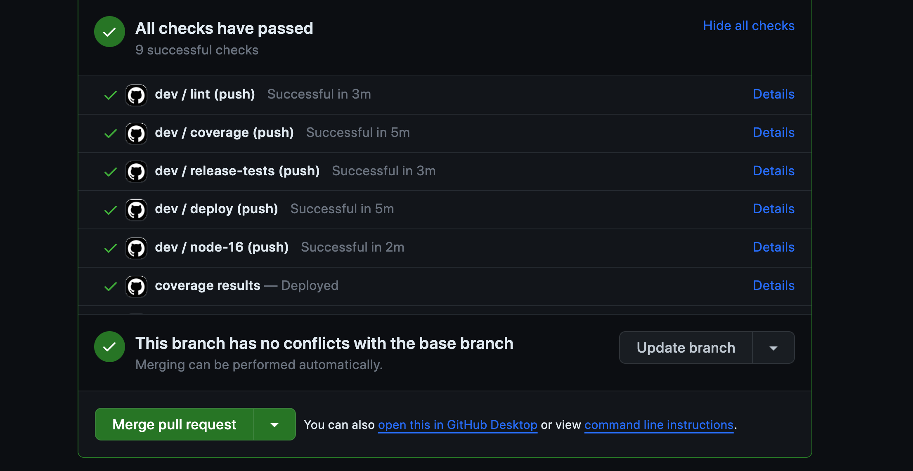
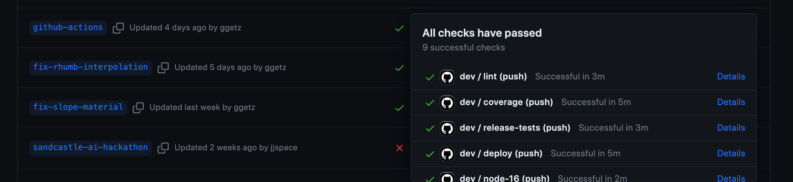
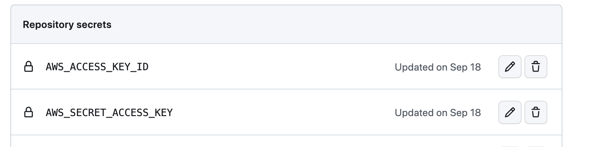

# Continuous Integration

- [Background](#background)
- [Actions and workflows](#actions-and-workflows)
- [Continuous deployment](#continuous-deployment)
- [Configuration](#configuration)
  - [Configure a different S3 bucket](#configure-a-different-s3-bucket)
  - [Configure S3 credentials](#configure-s3-credentials)

## Background

CesiumJS uses [GitHub Actions](https://docs.github.com/en/actions) for continuous integration (CI).

- [**CI for CesiumJS: A Deep Dive into Our GitHub Actions Workflow** (2024)](https://cesium.com/blog/2024/08/12/ci-for-cesiumjs-github-actions-workflow/)
- [**Cesium Continuous Integration** (2016)](https://cesium.com/blog/2016/04/07/cesium-continuous-integration/)

## Actions and workflows

Reusable actions are defined in `/.github/actions/` and workflows in `.github/workflows/`.

A workflow is triggered whenever someone pushes code to the CesiumJS repository, or an external contributor opens a pull request. After the build has completed, at the bottom of the pull request page the status of the build is shown. In the dropdown menu, individual checks are displayed. Logs and deployed artifacts can be accessed by clicking the "Details" link.



The workflow checks for any CesiumJS branch are accessible under the [Branches](https://github.com/CesiumGS/cesium/branches/all) page by clicking the icon next to the branch name.



## Continuous deployment

Automated deployments make recent code changes available for testing and review without needing to fetch and build locally. We deploy each of the following on a per-branch basis.

| Artifact         | Link (`main` branch)                                                                                                                                                       |
| ---------------- | -------------------------------------------------------------------------------------------------------------------------------------------------------------------------- |
| Sandcastle       | [`https://ci-builds.cesium.com/cesium/main/Apps/Sandcastle/index.html`](https://ci-builds.cesium.com/cesium/main/Apps/Sandcastle/index.html)                               |
| Documentation    | [`https://ci-builds.cesium.com/cesium/main/Build/Documentation/index.html`](https://ci-builds.cesium.com/cesium/main/Build/Documentation/index.html)                       |
| Coverage results | [`https://ci-builds.cesium.com/cesium/main/Build/Coverage/index.html`](https://ci-builds.cesium.com/cesium/main/Build/Coverage/index.html)                                 |
| Release zip      | [`https://ci-builds.cesium.com/cesium/main/<github-ref-name>.<github-run-number>.zip`](https://ci-builds.cesium.com/cesium/main/<github-ref-name>.<github-run-number>.zip) |
| npm package      | [`https://ci-builds.cesium.com/cesium/main/<github-ref-name>.<github-run-number>.tgz`](https://ci-builds.cesium.com/cesium/main/<github-ref-name>.<github-run-number>.tgz) |

## Configuration

Additional set up is required for deployment if you do not have commit access to CesiumJS.

### Configure a different S3 bucket

It is possible to configure your development branch of CesiumJS to deploy build artifacts to a different [AWS S3 Bucket](http://docs.aws.amazon.com/AmazonS3/latest/dev/UsingBucket.html). If you are using the cesium-public-builds bucket and have valid credentials, skip to [Configure S3 Credentials](#configure-s3-credentials)

- In `.gtihub/workflows/dev.yml`, in the following lines, replace "cesium-public-builds" with the name of your S3 bucket.

```sh
aws s3 sync ./Build/Coverage s3://cesium-public-builds/cesium/$BRANCH/Build/Coverage --delete --color on
```

```sh
aws s3 sync Build/unzipped/ s3://cesium-public-builds/cesium/$BRANCH/Build/ --cache-control "no-cache" --delete
```

- In `gulpfile.js`, edit the following line:

```javascript
const devDeployUrl = "https://ci-builds.cesium.com/cesium/";
```

- Edit the URL to match the URL hosting the S3 bucket specified in the previous step.

### Configure S3 credentials

To configure CI for deployment for a fork of CesiumJS, you must have valid credentials to an S3 bucket.

- Go to your fork of CesiumJS
- Click the **Setting** tab
- In the left sidebar, under the **Security** section, click **Secrets and Variables** > **Actions**
- Under **Repository secrets** add two environment variables, `AWS_ACCESS_KEY_ID` and `AWS_SECRET_ACCESS_KEY`, with your access key and secret key


