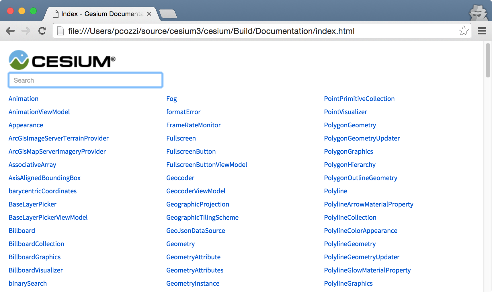
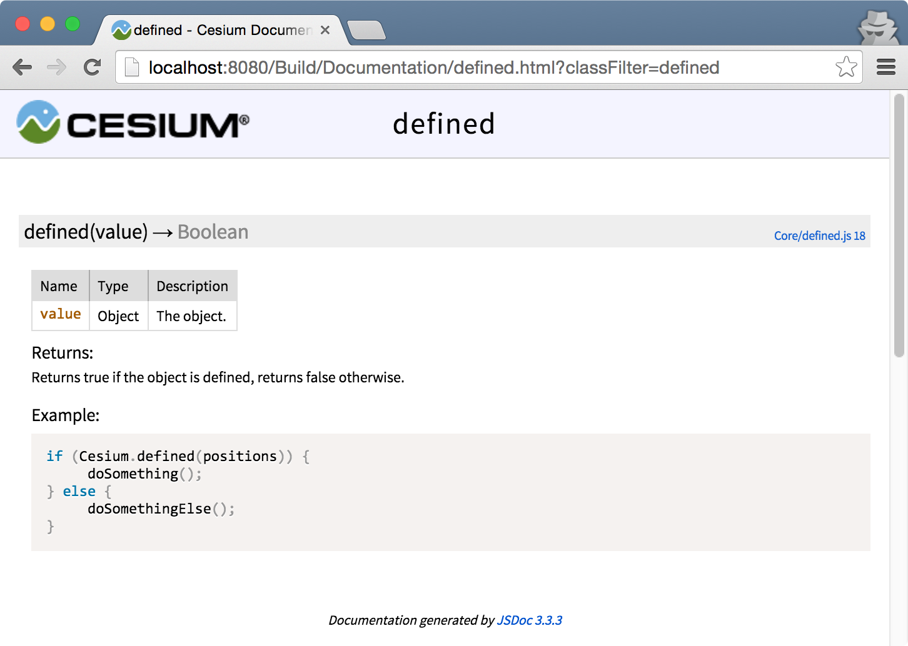
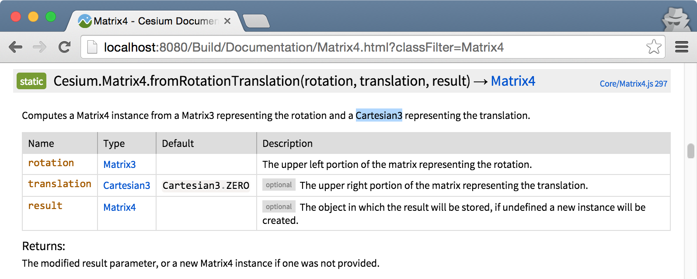
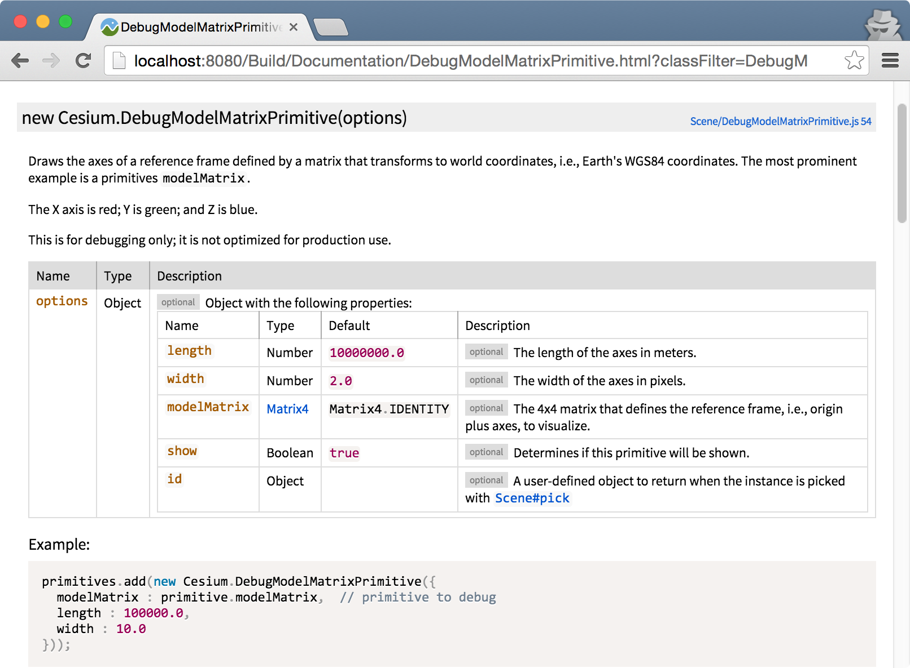
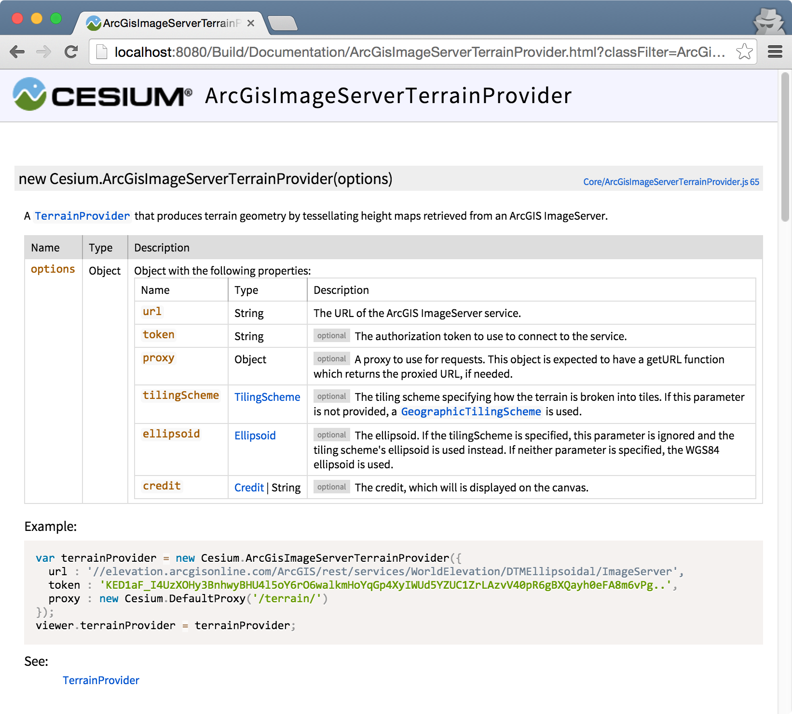

# Documentation Guide

The reference documentation is one of the most popular sections of the Cesium website, and a critical resource for developers.  

This guide describes best practices for writing reference doc.

Always include reference doc for new identifiers (classes, functions, properties, constants) in the public Cesium API.

Generally, just follow the patterns that are already in comparable parts of the code, e.g., if you are documenting a new utility function in `Core`, look at a function in `Core` such as [`binarySearch`](https://github.com/AnalyticalGraphicsInc/cesium/blob/master/Source/Core/binarySearch.js); likewise if you are documenting a new class in `Scene`, look at a similar class such as [`Model`](https://github.com/AnalyticalGraphicsInc/cesium/blob/master/Source/Scene/Model.js).

## Building the Doc

The reference doc is written in comments in the JavaScript code using [JSDoc3](http://usejsdoc.org/index.html).  At the command line, build the doc from the root Cesium directory by running:
```
npm run generateDocumentation
```
This creates a `Build/Documentation` directory with the built HTML files.  Open `index.html` to see the top-level contents:



There is also a link to the doc from the Cesium's main `index.html` when running:
```
npm start
```

## Basics

Consider one of the simplest functions in Cesium, `defined`:
```javascript
/**
 * @exports defined
 *
 * @param {Object} value The object.
 * @returns {Boolean} Returns true if the object is defined, returns false otherwise.
 *
 * @example
 * if (Cesium.defined(positions)) {
 *      doSomething();
 * } else {
 *      doSomethingElse();
 * }
 */
var defined = function(value) {
    return value !== undefined;
};
```

The doc for `defined` is in the comment starting with `/**`.  JSDoc tags begin with `@`.

`@exports` describes the name of the function.

`@param` describes the function's parameters and `@returns` describes the function's return value.

`@example` describes a code sample.

The above reference doc is built into:



This guide describes best practices for writing doc.  For complete details on the JSDoc tags, see their [documentation](http://usejsdoc.org/index.html).

## Parameters

* Document all function parameters.
* Use `[]` for optional parameters and include the default value, e.g.,
```
* @param {Number} [startingIndex=0] The index into the array at which to start packing the elements.

```
* If the default value is undefined, omit it, e.g.,
```
* @param {Cartesian3} [result] The object onto which to store the result.
```

As a complete example,
```javascript
/**
 * Computes a Matrix4 instance from a Matrix3 representing the rotation
 * and a Cartesian3 representing the translation.
 *
 * @param {Matrix3} rotation The upper left portion of the matrix representing the rotation.
 * @param {Cartesian3} [translation=Cartesian3.ZERO] The upper right portion of the matrix representing the translation.
 * @param {Matrix4} [result] The object in which the result will be stored, if undefined a new instance will be created.
 * @returns {Matrix4} The modified result parameter, or a new Matrix4 instance if one was not provided.
 */
Matrix4.fromRotationTranslation = function(rotation, translation, result) {
    // ..
```
generates


The Cesium classes in the `Type` column are links to their doc.

## `options` Parameters

_TODO: link to Code Guide section._

Each property of an `options` parameter should be documented with a separate `@param` tag, e.g.,
```
 * @param {Object} [options] Object with the following properties:
 * @param {Number} [options.length=10000000.0] The length of the axes in meters.
 * @param {Number} [options.width=2.0] The width of the axes in pixels.
 * @param {Matrix4} [options.modelMatrix=Matrix4.IDENTITY] The 4x4 matrix that defines the reference frame, i.e., origin plus axes, to visualize.
 * @param {Boolean} [options.show=true] Determines if this primitive will be shown.
 * @param {Object} [options.id] A user-defined object to return when the instance is picked with {@link Scene#pick}
```
generates



* If all properties are optional, mark the options object optional.

## Exceptions

* Document exceptions after the `@param`/`@returns` section using `@exception`, e.g.,
```javascript
/**
 * ...
 *
 * @exception {DeveloperError} aspectRatio must be greater than zero.
 */
Matrix4.computePerspectiveFieldOfView = function(fovY, aspectRatio, near, far, result) {
    //>>includeStart('debug', pragmas.debug);
    if (aspectRatio <= 0.0) {
        throw new DeveloperError('aspectRatio must be greater than zero.');
    }
    // ...
```
* Do not document exceptions for miss parameters; it is implicit in the `@param` tag because the parameter is not optional, e.g.,
```javascript
/**
 * Computes a Matrix4 instance from a column-major order array.
 *
 * @param {Number[]} values The column-major order array.
 * @param {Matrix4} [result] The object in which the result will be stored, if undefined a new instance will be created.
 * @returns {Matrix4} The modified result parameter, or a new Matrix4 instance if one was not provided.
 */
Matrix4.fromColumnMajorArray = function(values, result) {
    //>>includeStart('debug', pragmas.debug);
    if (!defined(values)) {
        throw new DeveloperError('values is required.');
    }
    //>>includeEnd('debug');

    return Matrix4.clone(values, result);
};
```

## References

* Use `@see` sparingly to link to related classes, functions, and online resources., e.g.,
```javascript
/**
 * A {@link TerrainProvider} that produces terrain geometry by tessellating height maps
 * retrieved from an ArcGIS ImageServer.
 *
 * ...
 *
 * @see TerrainProvider
 */
var ArcGisImageServerTerrainProvider = function(options) {
    // ...
```

generates



* Use `#` to reference an instance member (e.g., one that is assigned to the prototype); use `.` to access a static member, e.g.,
```
@see Class
@see Class#instanceMember
@see Class.staticMember
```
* Use `{@link className}` to link to another documented type.  This is not required for `@param` tags when the type is provided.
* Use `<code> </code>` tags when referring to parameters or other variable names and values within a description.
* Use `{@link URL|title}` to link to external sites.

## Examples

Developers almost always jump to a example before reading the doc.  Provide concise but instructive code examples with enough context whenever possible.

Useful examples:
```javascript
/**
 * ...
 *
 * @example
 * var n = Cesium.Math.lerp(0.0, 2.0, 0.5); // returns 1.0
 */
CesiumMath.lerp = function(p, q, time) {
    // ...
```

```javascript
/**
 * ...
 *
 * @example
 * // Apply non-uniform scale to node LOD3sp
 * var node = model.getNode('LOD3sp');
 * node.matrix = Cesium.Matrix4.fromScale(new Cesium.Cartesian3(5.0, 1.0, 1.0), node.matrix);
 */
Model.prototype.getNode = function(name) {
    // ...
```

Unnecessary example:
```javascript
/**
 * ..
 *
 * @example
 * var f = Cesium.Math.EPSILON1;
 */
CesiumMath.EPSILON1 = 0.1;
```

Use the Cesium namespace (`Cesium.`) in examples.

## Constants

_TODO: @type_
_TODO: @constant_
_TODO: @function_

---

_TODO: Sandcastle links_

**TODO**

* [ ] Resize images and convert to jpg
* [ ] Remove the [old guide](https://github.com/AnalyticalGraphicsInc/cesium/wiki/Documentation-Best-Practices) on the wiki