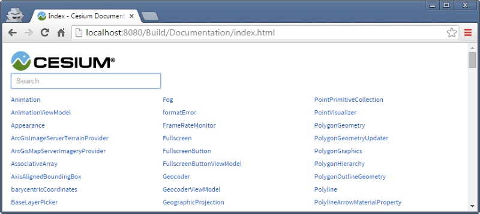
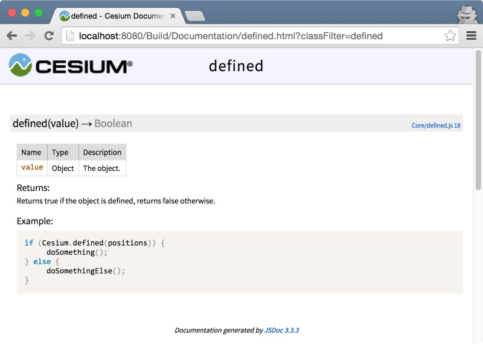

# Documentation Guide

CesiumJS's reference documentation is one of the most popular sections of the CesiumJS website, and a critical resource for developers.

This guide describes best practices for writing reference doc.

Always include doc for new identifiers (classes, functions, properties, constants) in the public CesiumJS API.

Generally, just follow the patterns that are already in comparable parts of the code, e.g., if you are documenting a new utility function in `Core`, look at a function in `Core` such as [`binarySearch`](https://github.com/CesiumGS/cesium/blob/main/Source/Core/binarySearch.js); likewise, if you are documenting a new class in `Scene`, look at a similar class such as [`Model`](https://github.com/CesiumGS/cesium/blob/main/Source/Scene/Model.js).

- [Building the Doc](#building-the-doc)
- [Basics](#basics)
- [Parameters](#parameters)
- [`options` Parameters](#options-parameters)
- [Exceptions](#exceptions)
- [Examples](#examples)
- [References](#references)
- [Classes](#classes)
- [Properties and Constants](#properties-and-constants)
- [Functions and Callbacks](#functions-and-callbacks)
  - [Overloaded Functions](#overloaded-functions)
- [Private](#private)
- [Layout Reference](#layout-reference)
  - [Constructor Function](#constructor-function)
  - [Member Function](#member-function)
  - [Property](#property)
  - [Property Getter/Setter](#property-gettersetter)
  - [Standalone Function](#standalone-function)
- [TypeScript type definitions](#typescript)

## Building the Doc

The reference doc is written in JavaScript code comments using [JSDoc3](http://usejsdoc.org/index.html) tags. At the command line, build the doc from the root CesiumJS directory by running the following:

```
npm run generateDocumentation
```

This creates a `Build/Documentation` directory with the built HTML files.

> Alternatively, you can build documentation in watch mode `npm run generateDocumentation-watch` and have it generated automatically when source files change.

There is a link to the doc from CesiumJS's main `index.html` when running

```
npm start
```



## Basics

Consider one of the simplest functions in CesiumJS, `defined`:

```javascript
/**
 * @function
 *
 * @param {*} value The object.
 * @returns {Boolean} Returns true if the object is defined, returns false otherwise.
 *
 * @example
 * if (Cesium.defined(positions)) {
 *      doSomething();
 * } else {
 *      doSomethingElse();
 * }
 */
function defined(value) {
  return value !== undefined;
}
```

- The doc for `defined` is in the comment starting with `/**`. JSDoc tags begin with `@`.
- `@function` tells JSDoc that this is a function.
- `@param` describes the function's parameters, and `@returns` describes the function's return value.
- `@example` describes a code sample.

The above reference doc is built into the following:



This guide describes best practices for writing doc. For complete details on JSDoc tags, see their [documentation](http://usejsdoc.org/index.html).

## Parameters

- Document all function parameters.
- Use `[]` for optional parameters and include the default value, e.g.,

```
* @param {Number} [startingIndex=0] The index into the array at which to start packing the elements.

```

- Omit the default value if it is `undefined`, e.g.,

```
* @param {Cartesian3} [result] The object on which to store the result.
```

- If a parameter can be more than one type, use `|` to separate the types, e.g.,

```
* @param {GeometryInstance[]|GeometryInstance} [options.geometryInstances] The geometry instances - or a single geometry instance - to render.
```

As a complete example,

```javascript
/**
 * Computes a Matrix4 instance from a Matrix3 representing the rotation
 * and a Cartesian3 representing the translation.
 *
 * @param {Matrix3} rotation The upper left portion of the matrix representing the rotation.
 * @param {Cartesian3} [translation=Cartesian3.ZERO] The upper right portion of the matrix representing the translation.
 * @param {Matrix4} [result] The object in which the result will be stored, if undefined a new instance will be created.
 * @returns {Matrix4} The modified result parameter, or a new Matrix4 instance if one was not provided.
 */
Matrix4.fromRotationTranslation = function(rotation, translation, result) {
    // ..
```

generates


The CesiumJS classes in the `Type` column are links to their doc.

## `options` Parameters

Each property of an `options` parameter (see the [Coding Guide](https://github.com/CesiumGS/cesium/true/main/Documentation/Contributors/CodingGuide/README.md#options-parameters)) should be documented with a separate `@param` tag, e.g.,

```
 * @param {Object} [options] Object with the following properties:
 * @param {Number} [options.length=10000000.0] The length of the axes in meters.
 * @param {Number} [options.width=2.0] The width of the axes in pixels.
 * @param {Matrix4} [options.modelMatrix=Matrix4.IDENTITY] The 4x4 matrix that defines the reference frame, i.e., origin plus axes, to visualize.
 * @param {Boolean} [options.show=true] Determines if this primitive will be shown.
 * @param {Object} [options.id] A user-defined object to return when the instance is picked with {@link Scene#pick}
```

generates


If all `options` properties are optional, also mark the `options` object optional.

## Exceptions

- Document exceptions after the `@param`/`@returns` section using `@exception`, e.g.,

```javascript
/**
 * ...
 *
 * @exception {DeveloperError} aspectRatio must be greater than zero.
 */
Matrix4.computePerspectiveFieldOfView = function(fovY, aspectRatio, near, far, result) {
    //>>includeStart('debug', pragmas.debug);
    if (aspectRatio <= 0.0) {
        throw new DeveloperError('aspectRatio must be greater than zero.');
    }
    // ...
```

- Do not document exceptions for missing parameters; it is implicit in the `@param` tag because the parameter is not optional, e.g.,

```javascript
/**
 * Computes a Matrix4 instance from a column-major order array.
 *
 * @param {Number[]} values The column-major order array.
 * @param {Matrix4} [result] The object in which the result will be stored. If undefined a new instance will be created.
 * @returns {Matrix4} The modified result parameter, or a new Matrix4 instance if one was not provided.
 */
Matrix4.fromColumnMajorArray = function (values, result) {
  //>>includeStart('debug', pragmas.debug);
  if (!defined(values)) {
    throw new DeveloperError("values is required.");
  }
  //>>includeEnd('debug');

  return Matrix4.clone(values, result);
};
```

## Examples

Developers almost always jump to an example before reading the doc. Provide concise but instructive code examples with enough context whenever possible.

Useful examples:

```javascript
/**
 * ...
 *
 * @example
 * const n = Cesium.Math.lerp(0.0, 2.0, 0.5); // returns 1.0
 */
CesiumMath.lerp = function(p, q, time) {
    // ...
```

```javascript
/**
 * ...
 *
 * @example
 * // Apply non-uniform scale to node LOD3sp
 * const node = model.getNode('LOD3sp');
 * node.matrix = Cesium.Matrix4.fromScale(new Cesium.Cartesian3(5.0, 1.0, 1.0), node.matrix);
 */
Model.prototype.getNode = function(name) {
    // ...
```

Unnecessary example:

```javascript
/**
 * ..
 *
 * @example
 * const f = Cesium.Math.EPSILON1;
 */
CesiumMath.EPSILON1 = 0.1;
```

- Use the Cesium namespace (`Cesium.`) in examples.
- Limit code in `@example` tags to 80 lines so it does not overflow.

## References

- Use `@see` sparingly to link to related classes, functions, and online resources., e.g.,

```javascript
/**
 * Provides terrain or other geometry for the surface of an ellipsoid.  The surface geometry is
 * organized into a pyramid of tiles according to a {@link TilingScheme}.  This type describes an
 * interface and is not intended to be instantiated directly.
 *
 * @alias TerrainProvider
 * @constructor
 *
 * @see EllipsoidTerrainProvider
 * @see CesiumTerrainProvider
 */
function TerrainProvider() {
  /* ... */
}
```

- Use `#` to reference an instance member (e.g., one that is assigned to the prototype); use `.` to access a static member, e.g.,

```
@see Class
@see Class#instanceMember
@see Class.staticMember
```

- Use `{@link className}` to link to another documented type. This is not required for `@param` tags when the type is provided.
- Use `<code> </code>` tags when referring to parameters or other variable names and values within a description.
- Use `{@link URL|title}` to link to external sites.

## Classes

Define a class with `@alias` and `@constructor` tags on the constructor function, e.g.,

```javascript
/**
 * A 3D Cartesian point.
 *
 * @alias Cartesian3
 * @constructor
 *
 * ...
 */
function Cartesian3(x, y, z) {
   // ...
```

## Properties and Constants

- Use `@type` and `@default` (whenever possible, except when the default is `undefined`) to document properties, e.g.,

```javascript
function Cartesian3(x, y) {
    /**
     * The X component.
     *
     * @type {Number}
     * @default 0.0
     */
    this.x = defaultValue(x, 0.0);

    // ...
```

- Use `@memberOf` when documenting property getter/setters, e.g.,

```javascript
Object.defineProperties(Entity.prototype, {
    /**
     * Gets or sets whether this entity should be displayed. When set to true,
     * the entity is only displayed if the parent entity's show property is also true.
     *
     * @memberof Entity.prototype
     * @type {Boolean}
     */
    show : {
        get : function() {
           // ...
        },
        set : function(value) {
           // ...
        }
    },
    // ...
```

- Use `@readonly` to indicate read-only properties, e.g.,

```javascript
Object.defineProperties(Entity.prototype, {
    /**
     * Gets the unique ID associated with this object.
     *
     * @memberof Entity.prototype
     * @type {String}
     * @readonly
     */
    id : {
        get : function() {
            return this._id;
        }
    },
    // ...
```

- The description for readonly properties should start with "Gets", and the description for read/write properties should start with "Gets or sets."
- Document constants with `@constant`, e.g.,

```javascript
/**
 * An immutable Cartesian3 instance initialized to (0.0, 0.0, 0.0).
 *
 * @type {Cartesian3}
 * @constant
 */
Cartesian3.ZERO = Object.freeze(new Cartesian3(0.0, 0.0, 0.0));
```

## Functions and Callbacks

- Use `@function` when JSDoc can't infer that an identifier is a function because the JavaScript `function` keyword isn't used, e.g.,

```javascript
/**
 * Creates a Cartesian4 from four consecutive elements in an array.
 * @function
 *
 * @param {Number[]} array The array whose four consecutive elements correspond to the x, y, z, and w components, respectively.
 * @param {Number} [startingIndex=0] The offset into the array of the first element, which corresponds to the x component.
 * @param {Cartesian4} [result] The object on which to store the result.
 * @returns {Cartesian4}  The modified result parameter or a new Cartesian4 instance if one was not provided.
 *
 * @example
 * // Create a Cartesian4 with (1.0, 2.0, 3.0, 4.0)
 * const v = [1.0, 2.0, 3.0, 4.0];
 * const p = Cesium.Cartesian4.fromArray(v);
 *
 * // Create a Cartesian4 with (1.0, 2.0, 3.0, 4.0) using an offset into an array
 * const v2 = [0.0, 0.0, 1.0, 2.0, 3.0, 4.0];
 * const p2 = Cesium.Cartesian4.fromArray(v2, 2);
 */
Cartesian4.fromArray = Cartesian4.unpack;
```

- Use `@callback` to document a function signature, e.g.,

```javascript
/**
 * Sort the items in the queue in-place.
 *
 * @param {Queue.Comparator} compareFunction A function that defines the sort order.
 */
Queue.prototype.sort = function (compareFunction) {
  if (this._offset > 0) {
    //compact array
    this._array = this._array.slice(this._offset);
    this._offset = 0;
  }

  this._array.sort(compareFunction);
};

/**
 * A function used to compare two items while sorting a queue.
 * @callback Queue.Comparator
 *
 * @param {*} a An item in the array.
 * @param {*} b An item in the array.
 * @returns {Number} Returns a negative value if <code>a</code> is less than <code>b</code>,
 *          a positive value if <code>a</code> is greater than <code>b</code>, or
 *          0 if <code>a</code> is equal to <code>b</code>.
 *
 * @example
 * function compareNumbers(a, b) {
 *     return a - b;
 * }
 */
```

### Overloaded Functions

JSDoc supports declarating functions with more than one call signature. For example, suppose you wish to document a function `range` that returns a "Range" object, and can be invoked with either separate `start` and `end` arguments (`range(1,2)`), or an options-object (`range({start: 1, end: 2, inclusive: true})`).

When documenting an overloaded function, you must write two block comments with **no whitespace** between them, resulting in the exact string `*//**` in the middle. The block for each overload must include a `@variation` tag with a different integer value. The value of the `variation` tag will not appear in the documentation, but will be used internally by JSDoc to distinguish between overloads.

```javascript
/**
 * Get a Range from the provided start and end values.
 * @variation 0
 *
 * @param {number} start
 * @param {number} end
 * @returns {Range}
 *//**
 * Get a Range based on the provided options
 * @param {Object} options
 * @param {number} options.start
 * @param {number} options.end
 * @param {boolean} [options.inclusive=false]
```

Normally, each overload would get its own entry in the documentation. This may not always be desirable, so blocks with a `@variation` tag value greater than 1 will be discarded when generating the documentation (but will still be considered when [generating TypeScript typings](#typescript)).

## Private

Documentation is not generated for private members that start with `_`. It is often useful to still write doc comments for them for maintainability (see the [Coding Guide](https://github.com/CesiumGS/cesium/tree/main/Documentation/Contributors/CodingGuide/README.md#design)).

If a member or function doesn't start with `_`, but is intended to be private, use the `@private` tag at the bottom of the documentation, e.g.,

```javascript
/**
 * A tween is an animation that interpolates the properties of two objects using an {@link EasingFunction}.  Create
 * one using {@link Scene#tweens} and {@link TweenCollection#add} and related add functions.
 *
 * @alias Tween
 * @constructor
 *
 * @private
 */
function Tween(/* ... */) {
  /* ... */
}
```

If no documentation comments are provided, the identifier will not be documented. In this case, `@private` is not strictly needed, but we use it anyway so it is clear that documentation was not forgotten, e.g.,

```javascript
/**
 * @private
 */
function appendForwardSlash(url) {
  /* ... */
}
```

Documentation for private elements can be generated by running the following:

```
npm run generateDocumentation -- --private
```

## Layout Reference

There's a general flow to each documentation block that makes it easy to read. Tags are always in the same order with the same spacing.

### Constructor Function

```
DESCRIPTION.

@alias NAME
@constructor

@param {TYPE} NAME DESCRIPTION.
@param {TYPE|OTHER_TYPE} NAME DESCRIPTION WITH LONG
       WRAPPING LINES.

@exception {TYPE} DESCRIPTION.

@see TYPE
@see TYPE#INSTANCE_MEMBER
@see TYPE.STATIC_MEMBER

@example

[@private]
```

### Member Function

```
DESCRIPTION.

@param {TYPE} NAME DESCRIPTION.
@param {TYPE|OTHER_TYPE} NAME DESCRIPTION WITH LONG
       WRAPPING LINES.
@returns {TYPE} DESCRIPTION.

@exception {TYPE} DESCRIPTION.

@see TYPE
@see TYPE#INSTANCE_MEMBER
@see TYPE.STATIC_MEMBER

@example

[@private]
```

### Property

```
DESCRIPTION.

@type {TYPE}
[@constant]
[@default DEFAULT_VALUE]
[@readonly]

@exception {TYPE} DESCRIPTION.

@see TYPE
@see TYPE#INSTANCE_MEMBER
@see TYPE.STATIC_MEMBER

@example

[@private]
```

### Property Getter/Setter

```
DESCRIPTION.

@memberof CLASS_NAME.prototype
@type {TYPE}
[@default DEFAULT_VALUE]
[@readonly]

@exception {TYPE} DESCRIPTION.

@see TYPE
@see TYPE#INSTANCE_MEMBER
@see TYPE.STATIC_MEMBER

@example

[@private]
```

### Standalone Function

```
DESCRIPTION.

@function

@param {TYPE} NAME DESCRIPTION.
@param {TYPE|OTHER_TYPE} NAME DESCRIPTION WITH LONG
       WRAPPING LINES.
@returns {TYPE} DESCRIPTION.

@exception {TYPE} DESCRIPTION.

@see TYPE
@see TYPE#INSTANCE_MEMBER
@see TYPE.STATIC_MEMBER

@example

[@private]
```

# TypeScript

We also use JSDoc to build official TypeScript type definitions. Normally this behavior is transparent to the developer and happens as part of CI, however incorrect or non-standard JSDoc can lead to failures. If CI is failing because of the `build-ts` step, you can debug it locally by running:

```
npm run build-ts
```

In most cases, the TypeScript compiler will provide a very obvious error and line number which will help you track down the offending, most likely incorrect, JSDoc.
