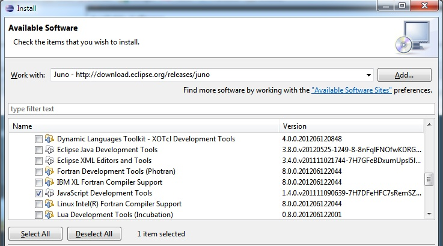
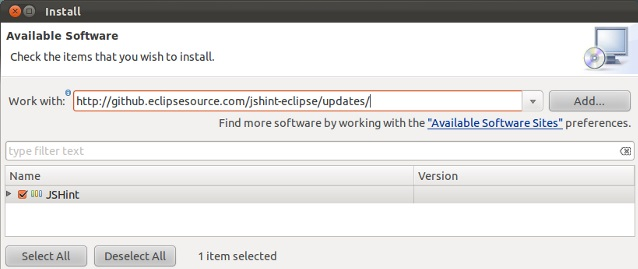
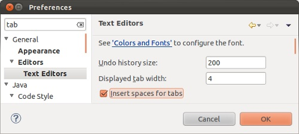
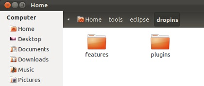
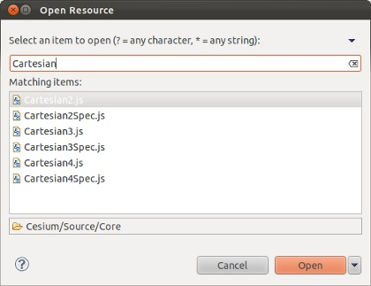

# Eclipse Guide

While primarily known as a Java IDE, Eclipse can be configured to work well for web development too.  These instructions are written for Eclipse Neon but the process is the same for any recent version.

* Install [Java](http://www.java.com/en/download/manual.jsp) if it isn't already.
* Download the [Eclipse IDE for Java Developers](http://www.eclipse.org/downloads/eclipse-packages/).  Extract to a directory of your choice and run.  Create a workspace anywhere you like.

* Install additional Eclipse components: JavaScript Development Tools and Eclipse Web Developer Tools.
   * Help - Install New Software.  Work with: select *Neon* from the list.
   * Expand *Programming Languages*, check *JavaScript Development Tools*.
   * Expand *Web, XML, Java EE and OSGi Enterprise Development*, check *Eclipse Web Developer Tools*.
   * Next, Next, Accept, Finish, _wait_, No (we have more to install).

* Install the [JSHint](http://www.jshint.com/) plugin:
   * Help - Install New Software.  Work with: `http://github.eclipsesource.com/jshint-eclipse/updates/`.
   * Check *JSHint*.  Next, Next, Accept, Finish, _wait_, OK, _wait_, Restart.

* Run Eclipse. Close the Welcome page.

* Window - Preferences:
   * General - Editors - Text Editors.  Check Insert spaces for tabs.  Apply.
   * Web - CSS Files - Editor.  Switch the radio button to "Indent using spaces".  Change Indentation size to 4.  Apply.
   * Web - HTML Files - Editor.  Switch the radio button to "Indent using spaces".  Change Indentation size to 4.  OK.

* Import Cesium into your workspace:  File - Import, General - Existing Projects into Workspace, Next.  Fill in the path to the root Cesium directory, Finish.

* Click the "Open Perspective" button in the upper right and select JavaScript.  You can then right-click on the Java perspective and close it.

* Window - Show View - Console.

Also consider the [Optional Eclipse Configuration](#optionaleclipseconfiguration) options below.

## Optional Eclipse Configuration

These steps are optional depending on your preference.

### GLSL Plugin

If you edit WebGL shader files (.glsl) with Eclipse, install GLShaders for GLSL syntax highlighting.  First exit Eclipse, then download [GLShaders](http://sourceforge.net/projects/glshaders/) and extract into Eclipse's dropins directory.

### Git

Most of us use Git from the command-line, but there is also Eclipse integration:

* Window - Preferences: Team - Git - Configuration
   * Verify Location in User Settings tab is set to .gitconfig in the default repository directory.
   * Verify Location in Systems Settings tab is set to {Installed/Git/Location}/etc/gitconfig.

* Right click on Cesium in the Script Explorer.  Team - Share project.  Select Git, Next.  Check Use or create repository in parent directory of project.  Finish.

## Eclipse Tips

* Use Ctrl-Shift-R to search and open files in the workspace.

* Use Ctrl-Shift-F to auto format selected code.
