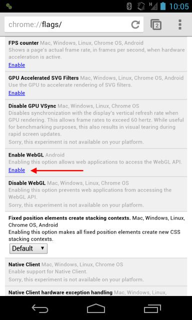

# Mobile Guide

## Supported mobile platforms

Cesium currently runs on a variety of Android phones and tablets in [Google Chrome](https://play.google.com/store/apps/details?id=com.android.chrome), [Opera Beta](https://play.google.com/store/apps/details?id=com.opera.browser.beta), and [Mozilla Firefox](https://play.google.com/store/apps/details?id=org.mozilla.firefox). In Firefox and Opera Beta, WebGL support is enabled out of the box. In Chrome, it must be explicitly enabled by visiting [chrome://flags](chrome://flags). We hope and expect that WebGL will be enabled by default in the future.

Cesium runs on Android 4.0+ devices with a variety of GPUs. Devices on this list are at least able to run Cesium Viewer and rotate and zoom the base globe in at least one of the two browsers mentioned above. Other features may or may not work correctly.

- NVIDIA Tegra 2 devices, including the Motorola Xoom.
- NVIDIA Tegra 3 devices, including the ASUS Transformer Prime TF201 and Google Nexus 7.
- Qualcomm Adreno 205, including the HTC ThunderBolt.
- Qualcomm Adreno 225 devices, including the HTC One (and variants such as HTC EVO 4G LTE).
- Qualcomm Adreno 320 devices, including the Google Nexus 4.

To learn what GPU your mobile device has, visit [chrome://gpu](chrome://gpu) in Google Chrome or [about:support](about:support) in Mozilla Firefox.

Have you tried running Cesium on your mobile device? Did it work? Either way, [let us know](https://groups.google.com/d/forum/cesium-dev).

## WebGL on iOS devices

Apple iOS apparently has hidden
options to [enable WebGL via undocumented calls](http://atnan.com/blog/2011/11/03/enabling-and-using-webgl-on-ios/)
to the WebView interface, that has been discovered and published by
bloggers. [WebGL Browser](http://benvanik.github.com/WebGLBrowser/) takes
advantage of this to provide a WebGL implementation. We have not tried running Cesium on a device with this hack.

Sadly, Apple prohibits software developers from implementing their own browser. Versions of Firefox and Chrome for iOS simply wrap the existing WebView interface and the closed nature of iOS prevents third parties like from enabling WebGL on iOS as they did on Android.

## Known Problems

The beta nature of WebGL support on mobile devices means that many issues are the result of driver bugs or browser issues outside of Cesium's control. Until WebGL support matures, we'll keep track of those issues here. If an issue is identified to be a genuine Cesium bug, we will write a regular issue for it and fix it accordingly.

- On Tegra GPUs, Sensors to not show up.
- On Adreno 225 GPUs (and probably others), sensors show through the earth.

## Debugging tools

Setting up Google Chrome for remote debugging is easy and the remote debugger is very high quality. In Google Chrome on your Android device, go to Settings->Developer tools and check "Enable USB Web debugging". Then, tap ["Learn more about using USB Web debugging"](https://developers.google.com/chrome-developer-tools/docs/remote-debugging) for instructions on debugging from your computer. You'll need the Android SDK and a USB driver for your device installed on your computer.

Firefox also supports [remote debugging](https://hacks.mozilla.org/2012/08/remote-debugging-on-firefox-for-android/):

- Install the [Android SDK](http://developer.android.com/sdk/index.html).
  - If Eclipse is already installed or you do not plan to develop with Eclipse, expand "Use an Existing IDE" and download/install the SDK tools.
  - Otherwise, download/install the "ADT Bundle", which is bundled with Eclipse and has the plugin configured.
- In Firefox on the desktop and on the Android device, browse to `about:config` and set the `devtools.debugger.remote-enabled` preference to true. Restart Firefox.
- Connect the Android device to the desktop.
- Open a command prompt in the location of the Android SDK Tools and run the command: `adb forward tcp:6000 tcp:6000`.
- Open the remote debugger on the desktop at `Tools > Web Developer > Remote Debugger`.
- On the desktop there will be a dialog to enter the hostname and port. Accept the defaults and press OK.
- On the Android device, you will see a prompt to accept the remote connection.

You may need to repeat the last two steps until a connection is made.
