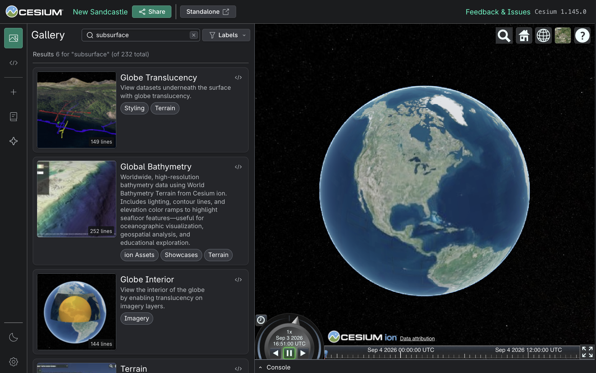

# Authoring Sandcastle Examples

This guide is for contributors who are adding or updating Sandcastle examples in the CesiumJS repository. For context on Sandcastle's role in CesiumJS development, see the [Sandcastle Guide](./README.md).

## Table of Contents

- [Contributing Example Code](#contributing-example-code)
- [Creating Sandcastle Examples](#creating-sandcastle-examples)
  - [Add a Sandcastle Example](#add-a-sandcastle-example)
- [Example Best Practices](#example-best-practices)
  - [Sample Data and Services](#sample-data-and-services)
  - [Gallery Metadata](#gallery-metadata)
    - [Gallery Labels](#gallery-labels)
    - [Development Examples](#development-examples)
  - [Write Copyable Example Code](#write-copyable-example-code)
  - [Make the Example Legible](#make-the-example-legible)
- [Further Reading](#further-reading)

## Contributing Example Code

Documentation and demo code are still code, and therefore go through the normal CesiumJS development processes.

- If you are new to contributing to CesiumJS, review [`CONTRIBUTING.md`](../../../CONTRIBUTING.md) for the pull request process, contributor license agreement, and review expectations.
- Follow the [Coding Guide](../CodingGuide/README.md), the [Documentation Guide](../DocumentationGuide/README.md), and the patterns in nearby Sandcastle examples.
- Maintainers may request changes to code style, API usage, performance, wording, data ownership, or the scope of the example.
- Pull requests take time. If the example supports a GTM, blog post, release, or other date-sensitive work, include review, revision, CI, and release timing in your timeline or estimate.

## Creating Sandcastle Examples

_**Before starting a new example, consider whether an existing Sandcastle can be updated instead**._ Sandcastle is easier to use when the gallery is well-curated. Add a new public example only when it demonstrates a distinct user-facing API, workflow, data type, or product capability. If the behavior is a small variation of an existing example, update the existing example instead.

If a new example is warranted, identify:

- The user-facing purpose of the example
- The CesiumJS API, workflow, or dataset it demonstrates
- Whether it depends on a new CesiumJS feature that must land in `main` first
- Whether it requires assets, ion access, third-party services, or credentials
- The target release date, if any

_**Avoid patterns we would not recommend users copy**._ If the example needs temporary workarounds or excessive details to explain an in-progress feature, make that status clear in the pull request and coordinate with maintainers before making it public.

_**Development examples**._ Use a development example when the Sandcastle is primarily for internal use or is waiting on data or workflow polish. Development examples should still be understandable and maintainable, but they are not shown in production builds. See [Development Examples](#development-examples).

### Add a Sandcastle Example

1. Create a branch for your work.

2. From the repository root, scaffold the example:

   ```bash
   npm run create-demo -- my-example-slug
   ```

   Use a short, lowercase, hyphen-separated slug. The command creates a directory in `packages/sandcastle/gallery`.

3. Edit the generated files:

   - **`main.js`** contains the JavaScript shown in Sandcastle's JS tab.
   - **`sandcastle.yaml`** contains the title, description, labels, and optional thumbnail. See [Gallery Metadata](#gallery-metadata).
   - **`index.html`** contains the HTML shown in Sandcastle's HTML tab. The Sandcastle build handles most page boilerplate. This file can be omitted if no custom HTML is needed.
   - **`thumbnail.jpg`** is optional but recommended for public examples. The standard thumbnail size is `225x150px`.

4. Add or request any required datasets. When a public example needs ion-hosted data, prefer sharing the dataset through the CesiumJS ion account so ownership and access are not tied to an individual contributor. Coordinate with a maintainer before adding data that is private, licensed, temporary, unusually large, or supplied by a partner. See [Sample Data and Services](#sample-data-and-services).

5. Run Sandcastle locally and test the example:

   ```bash
   npm start
   ```

   Open `http://localhost:8080/Apps/Sandcastle2/index.html`, find the example, and test both the gallery view and the standalone view.

6. Open a pull request against the CesiumJS repository. Include the purpose of the example, the datasets or services it uses, screenshots or a short screen recording when helpful, shareable Sandcastle links when available, and any release timing constraints.

## Example Best Practices

### Sample Data and Services

Public Sandcastle examples should use durable, reviewable data. Avoid personal accounts, temporary buckets, private URLs, localhost URLs, and time-limited services. If the example depends on a third-party service, make sure the dependency is central to the example and acceptable for public use.

_**Third-party data**._ When using third-party data, include attribution or a source comment where appropriate. If a dataset is partner-provided, licensed, private, unusually large, or not yet available to public CesiumJS users, discuss it with a maintainer before opening the pull request.

_**Static assets**._ If an asset is small, atomic, and self-contained—such as an image file—it can be committed directly to the repo. In most cases, copy the asset to `Apps/SampleData`. If the asset is also used for unit tests, copy the asset to `Specs/Data`.

_**Cesium ion hosting**._ Most datasets—such as 3D Tiles, glTF, CZML, GeoJSON, or KML—should be [uploaded and hosted in Cesium ion](https://cesium.com/learn/3d-tiling/tiler-data-formats/). Assets used in Sandcastle examples should be uploaded to the **CesiumJS** account in Cesium ion and referenced by their Cesium ion asset ID. Contact a CesiumJS maintainer if you do not have access to the CesiumJS account. Attribution should be provided by configuring the asset details so that it automatically displays in CesiumJS.

### Gallery Metadata


The values in `sandcastle.yaml` are used throughout the Sandcastle gallery. The title, description, thumbnail, and labels help users discover capabilities and understand what an example demonstrates before opening it.

```yml
title: 3D Native Vector Data
description: Load a vector 3D Tiles dataset along with a photogrammetry mesh of the Robert Street bridge in St. Paul, Minnesota. Shows cracks detected on the structure. Data courtesy of Collins Engineers, Inc.
labels:
  - Showcases
  - 3D Tiles
  - Vector Tiles
thumbnail: thumbnail.jpg
```


Search results highlight matching terms in titles, descriptions, labels, and code excerpts. This makes clear metadata and readable example code easier to discover.


Good metadata explains the value of the example in terms an end user would recognize, not only the exact CesiumJS API names used in the code. Sandcastle's semantic search helps map related concepts and vocabulary, so users can find relevant examples even when they search by workflow, outcome, or problem area. For example, searching for `subsurface` finds examples related to viewing data above, below, or inside the globe.



#### Gallery Labels

Labels in `sandcastle.yaml` help users discover relevant examples. Choose 2-5 labels to describe the primary use case, workflow, or audience for the example. Use title case. Prefer existing labels from similar examples when relevant.

_**Showcases**._ The `Showcases` label is curated for examples listed in the default gallery view when Sandcastle is first opened. Consider adding it for new, polished, or high-visibility examples, including examples that support a GTM or other communication effort. Older examples can be removed from `Showcases` when they are no longer among the most relevant or useful examples for the default view.


#### Development Examples

Development examples are available when developing locally and published in CI deployments, but are omitted from the production website.

```yml
development: true
```

Use a development example when the primary goal is testing and internal validation (e.g. [Billboard Instancing](../../../packages/sandcastle/gallery/billboards-instancing-dev)) or is waiting on final data or workflow polish. The code should still be understandable and maintainable.

### Write Copyable Example Code

Users will copy and paste from Sandcastle into their own code and may put that code into production. Therefore, make sure that code examples are usable, follow generally accepted best practices, and do not do anything that will cause an application to be insecure, inefficient, bloated, or inaccessible.

- Write code that users can copy into their own apps with minimal cleanup.
- Structure code to be as understandable as possible, even if that is not the most efficient way to write it.
- Prefer modern CesiumJS APIs and patterns; never use a deprecated API identifier.
- Use `Sandcastle.*` helpers only for example controls, Sandcastle UI, and highlighting. These helpers are not part of the CesiumJS API, so avoid making the core example logic depend on them.

### Make the Example Legible

The first run should reward the user's attention quickly. The example should load, show the important behavior, and make the next useful action obvious without requiring users to read every line of code first.

- Keep the example focused. Show one primary concept or workflow clearly before adding extra UI or unrelated options.
- Use concise, user-focused titles and descriptions. Explain what the example demonstrates, not internal project history.
- Add UI controls only when they help users explore the demonstrated behavior. Set useful defaults so the feature is visible without extra setup.
- Choose an initial camera view, clock speed, and styling that make the demonstrated behavior easy to see.
- Keep performance in mind. Examples should load reliably on typical developer machines and should not make unnecessary network requests.
- For thumbnails, use an image that clearly represents the example.
- Test the example from a clean browser session when it depends on authentication, browser storage, or external services.

## Further Reading

- [Microsoft Style Guide: Code examples](https://learn.microsoft.com/en-us/style-guide/developer-content/code-examples) - Style guide for writing code examples
- [MDN: Guidelines for writing code examples](https://developer.mozilla.org/en-US/docs/MDN/Writing_guidelines/Code_style_guide) - Style guide for writing code examples
- [Producing Open Source Software: Demos, Screenshots, Videos, and Example Output](https://producingoss.com/en/getting-started.html#examples-and-demos) - Advice for open source projects
