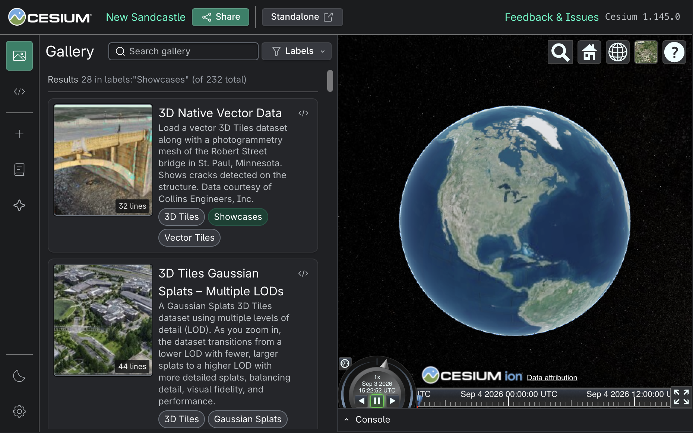
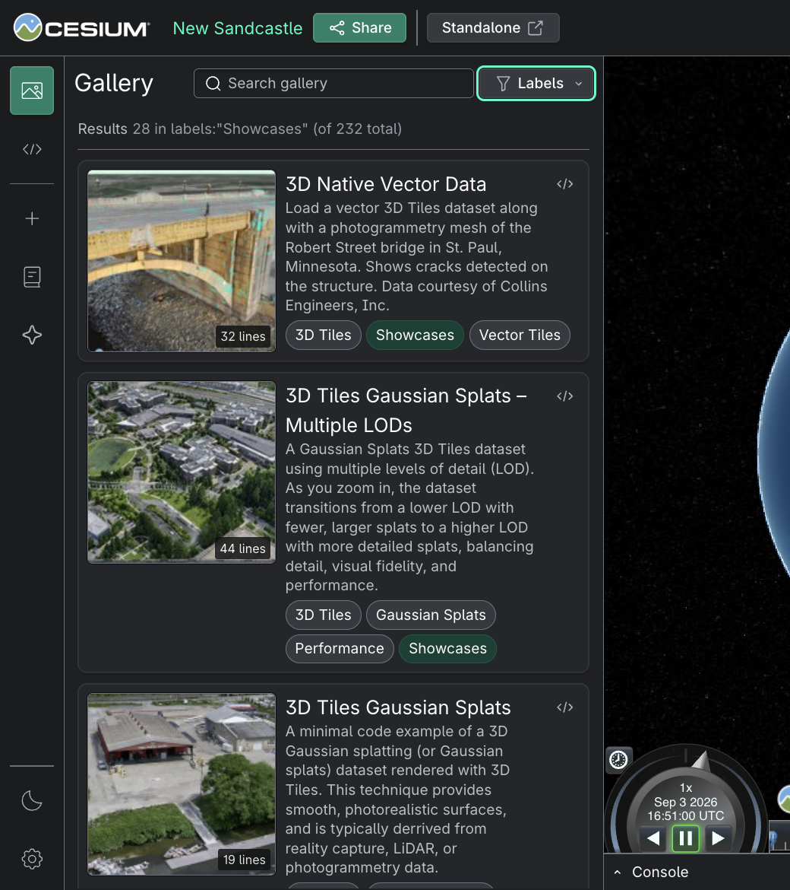
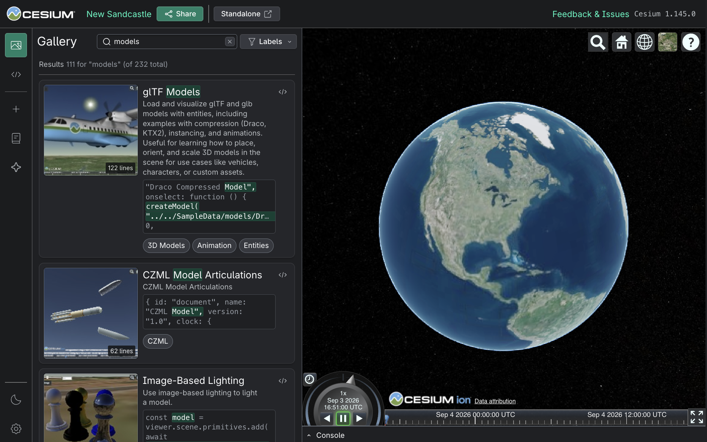
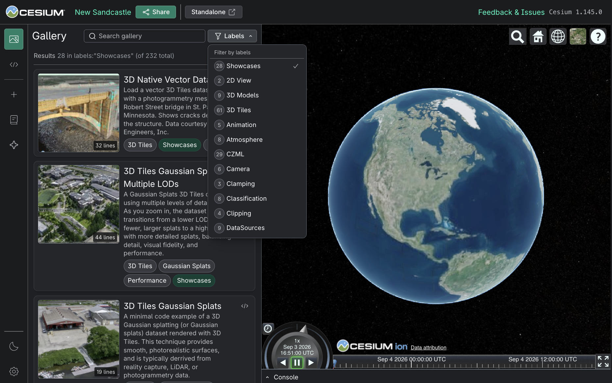

# Sandcastle Guide

[Sandcastle](https://sandcastle.cesium.com/) is an interactive code example gallery and sandbox for CesiumJS and related Cesium developer workflows. We use Sandcastle examples as part of CesiumJS library development: as user documentation, release-tested examples, and a development and support environment.

This is an overview of Sandcastle and how it fits into CesiumJS development. If you are adding or updating an example, see the [Authoring Guide](AuthoringGuide.md).

## Table of Contents

- [What Sandcastle Is](#what-sandcastle-is)
- [How We Use Sandcastle](#how-we-use-sandcastle)
- [Guiding Principles](#guiding-principles)
- [Release and Deployment](#release-and-deployment)
- [Additional Resources](#additional-resources)

## What is Sandcastle?

Sandcastle has two related but distinct parts:

- **The Sandcastle app**: The editor, gallery UI, sharing tools, standalone view, viewer iframe, search, and build/deployment support. This code lives in `packages/sandcastle`.
- **The gallery of examples**: The example source code, metadata, and thumbnails shown in Sandcastle. Gallery examples live in `packages/sandcastle/gallery`.

Sandcastle app-specific enhancements, feature requests, bug reports, and community feedback are tracked in [`cesium-sandcastle`](https://github.com/CesiumGS/cesium-sandcastle). Issues should be filed there when they relate primarily to the Sandcastle application, user experience, documentation, build process, or migration work.

Most CesiumJS contributors modify the gallery. A gallery example is production code: it is part of the CesiumJS repository, ships with CesiumJS releases, and is often the first implementation pattern a user sees. Just like other documentation, CesiumJS example code remains in this repository so examples can be updated alongside library changes.

## How is Sandcastle Used?

Sandcastle was designed as a live coding environment and a curated gallery. Examples should be easy to run, inspect, modify, and share. Over the years, the CesiumJS community has broadened the array of use cases. An example can be a documentation link, a forum answer, a bug reproduction, a screenshot in end-to-end regression tests, or a starting point for an application.

We use Sandcastle examples to:

- Help users discover working CesiumJS examples from documentation, forum answers, GitHub issues, release notes, and search
- Demonstrate APIs and workflows in realistic browser contexts
- _**Reproduction**._ Share [minimal reproducible examples](https://en.wikipedia.org/wiki/Minimal_reproducible_example) for bug reports and support community discussions
- Validate visual, interactive, and performance-sensitive behavior during development and release testing
- Support launches, GTMs, demos, blog posts, and other communication efforts

The gallery metadata, thumbnail, and labels make examples easier to discover and understand before opening them:

## Guiding Principles

Sandcastle examples are community infrastructure. A public example may be linked from documentation, forum answers, GitHub issues, release notes, and blog posts for years after it is added. Treat each example as a durable public reference: it should be easy to find, quick to understand, reliable to run, and useful when shared with someone debugging or learning the same workflow later.

Good Sandcastle examples are focused, durable, and understandable. They should show patterns we want users to copy, use data and services that will remain available, and explain enough context that a first-time reader can understand what they are seeing.

Treat each example as an invitation to keep going. The first run should reward the user's attention quickly: the example should load, show the important behavior, and make the next useful action obvious. A clear Sandcastle can lower the effort required for a user to become a contributor, whether they are reporting a bug, testing an API change, or opening a pull request.

Sandcastle is useful for manual validation and lightweight performance investigation, but it is not always the right tool for precise benchmarking because the application itself adds overhead. For formal performance testing, follow the [Performance Testing Guide](../PerformanceTestingGuide/README.md) and consider whether a minimal standalone page is more appropriate.

## Release and Deployment

The public Sandcastle site is [sandcastle.cesium.com](https://sandcastle.cesium.com/). It is updated as part of the CesiumJS release process, which normally follows a monthly cadence. Changes merged after a release cutoff will generally appear on the public site with the next CesiumJS release.

If an example supports a GTM, blog post, demo, or other date-sensitive communication, plan for the normal pull request process, maintainer review, CI, release timing, and any required data review. Sandcastle changes should not be treated as last-minute content-only updates.

## Additional Resources

- [Sandcastle Authoring Guide](AuthoringGuide.md) - How to create, review, and maintain Sandcastle examples
- [Sandcastle app documentation](../../../packages/sandcastle/README.md) - Sandcastle app architecture, local development commands, gallery file structure, metadata, thumbnails, and build modes
- [`cesium-sandcastle` issue tracker](https://github.com/CesiumGS/cesium-sandcastle/issues) - Sandcastle app-specific enhancements, feature requests, bug reports, and community feedback
- [CesiumJS Build Guide](../BuildGuide/README.md) - Local CesiumJS build commands, including Sandcastle builds
- [CesiumJS Testing Guide](../TestingGuide/README.md) - Testing expectations, including Sandcastle-related end-to-end updates.
