# Testing Guide

Our development culture is committed to testing.  Cesium is used in diverse use cases on a wide array of platforms so it is important for it to be well tested.

As of Cesium 1.35, Cesium has over 8,800 tests with 93% code coverage.  Cesium has as much test code (126K lines) as engine code (126K).  We are unaware of any other project of this size and lifetime and with this many contributors that has similar stats.

All new code should have 100% code coverage and should pass all tests.  Always run the tests before opening a pull request.

* [Running the Tests](#running-the-tests)
   * [Run All Tests](#run-all-tests)
      * [Run with WebGL validation](#run-with-webgl-validation)
      * [Run with WebGL stub](#run-with-webgl-stub)
   * [Select a Test to Run](#select-a-test-to-run)
   * [Run Only WebGL Tests](#run-only-webgl-tests)
   * [Run Only Non-WebGL Tests](#run-only-non-webgl-tests)
   * [Run All Tests against Combined File (Run All Tests against Combined File with Debug Code Removed)]()
   * [Run All Tests with Code Coverage (Build 'instrumentForCoverage' First)](#run-all-tests-against-combined-file-run-all-tests-against-combined-file-with-debug-code-removed)
   * [Running Tests on the Command Line with Karma](#running-tests-on-the-command-line-with-karma)
* [Testing Previous Versions of Cesium](#testing-previous-versions-of-cesium)
* [`testfailure` Label for Issues](#testfailure-label-for-issues)
* [Writing Tests](#writing-tests)
   * [Directory Organization](#directory-organization)
   * [Bottom-Up Unit Testing](#bottom-up-unit-testing)
   * [Test Code is Code](#test-code-is-code)
   * [Testing Basics](#testing-basics)
   * [Comparing Floating-Point Values](#comparing-floating-point-values)
   * [Testing Exceptions](#testing-exceptions)
   * [Before and After Tests and Suites](#before-and-after-tests-and-suites)
   * [Rendering Tests](#rendering-tests)
   * [GLSL](#glsl)
   * [Spies](#spies)
   * [Test Data and Services](#test-data-and-services)
   * [Promises](#promises)
   * [Mocks](#mocks)
   * [Categories](#categories)
* [Manual Testing](#manual-testing)
* [Pragmatic Advice](#pragmatic-advice)
   * [Start with a Similar (Small) Test](#start-with-a-similar-small-test)
   * [Debugger-Aided Incremental Improvements](#debugger-aided-incremental-improvements)
* [Testing in WebStorm](#testing-in-webstorm)
* [Resources](#resources)

## Running the Tests

The Cesium tests are written in JavaScript and use [Jasmine](http://jasmine.github.io/), a behavior-driven testing framework.  Jasmine calls an individual test, e.g., a function with one or more assertions, a **spec** (however, the Cesium team usually still say "test"), and a group of related tests, e.g., all the tests for `Cartesian3`, a **suite**.  Jasmine also calls an assertion, an **expectation**.

When running Cesium locally, browse to [http://localhost:8080/](http://localhost:8080/) and there are several test options:

### Run All Tests

Runs all the tests.  As of Cesium 1.15, on a decent laptop, they run in about a minute in Chrome.  It is important that the tests run quickly so we run them often.

When all the tests pass, the page looks like this:

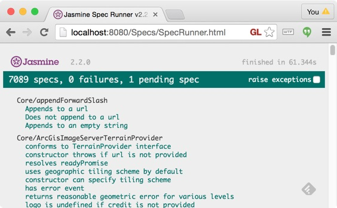

When one or more tests fail, the page looks like this:

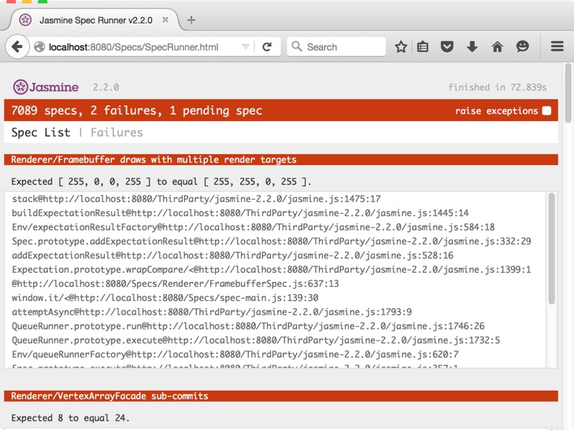

In this case, the number of failing tests is listed at the top, and details on each failure are listed below, including the expected and actual value of the failed expectation and the call stack.  The top several functions of the call stack are inside Jasmine and can be ignored.  Above, the file and line of interest for the first failing test starts with an `@`:
```
@http://localhost:8080/Specs/Renderer/FramebufferSpec.js:637:13
```
Click on the failed test to rerun just that test.  This is useful for saving time when fixing an issue as it avoids rerunning all the tests.  Always rerun _all_ the tests before opening a pull request.

#### Run with WebGL validation

The link to **Run with WebGL validation** passes a query parameter to the tests to enable extra low-level WebGL validation such as calling `gl.getError()` after each WebGL call.  We use this when doing the monthly Cesium release and when making changes to Cesium's renderer.

#### Run with WebGL stub

The **Run with WebGL stub** link passes a query parameter to the tests to use Cesium's WebGL stub.  This makes all WebGL calls a noop and ignores test expectations that rely on reading back from WebGL.  This allows running the tests on CI where a reasonable WebGL implementation is not available and still getting full code coverage albeit not all verification.

### Select a Test to Run

This option loads the test page without running any tests.

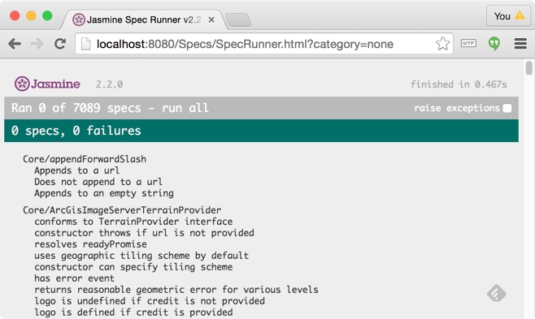

We can then use the browser's built-in search to find a test or suite and run only that.  For example, below just the tests for `Cartesian3` were run.

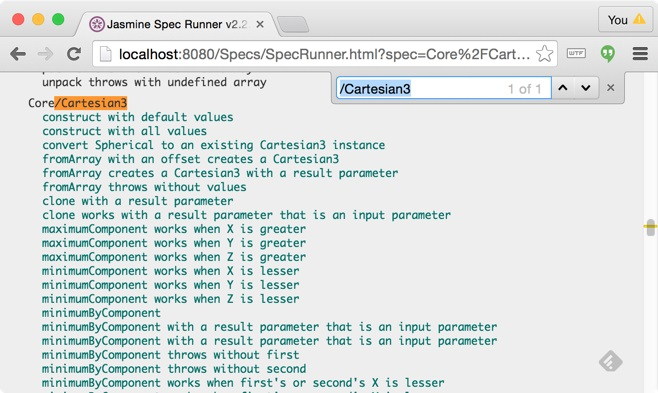

This uses a query parameter to select the test/suite to run so refreshing the page will run just that test/suite again.

Often when developing, it is useful to run only one suite to save time, instead of all the tests, and then run all the tests before opening a pull request.

### Run Only WebGL Tests

Suites can have a category associated with them.  This option runs all tests in the `WebGL` category, which includes all tests that use WebGL (basically anything that requires creating a `Viewer`, `CesiumWidget`, `Scene`, or `Context`).

### Run Only Non-WebGL Tests

Likewise, this option runs all tests not in the WebGL category.

Perhaps surprisingly, this is the bulk of Cesium tests, which include math and geometry tests, imagery provider tests, data source tests, etc.

These tests run quickly (for example, 15 seconds compared to 60) and are very reliable across systems since they do not rely on the underlying WebGL implementation, which can vary based on the browser, OS, driver, and GPU.

### Run All Tests against Combined File (Run All Tests against Combined File with Debug Code Removed)

Most test options load Cesium using the individual source files in the `Source` directory, which is great for debugging.

However, many users build apps using the built Cesium.js in `Build/Cesium` (which is created, for example, by running `npm run combine`).  This option runs the tests using this instead of individual Cesium source files.

The **Run All Tests against Combined File with Debug Code Removed** is the same except it is for use with the release version of the built Cesium.js (which is created, for example, by running `npm run combineRelease`).  The release version has `DeveloperError` exceptions optimized out so this test option makes `toThrowDeveloperError` always pass.

See the [Contributor's Guide](https://github.com/AnalyticalGraphicsInc/cesium/wiki/Contributor%27s-Guide) for all the Cesium build options.

### Run All Tests with Code Coverage (Build 'instrumentForCoverage' First)

[JSCoverage](http://siliconforks.com/jscoverage/) is used for code coverage.  It is especially important to have outstanding code coverage since JavaScript doesn't have a compiler and linker to catch early errors.

To run code coverage, first create a build of Cesium that is instrumented for coverage by running `npm run instrumentForCoverage`.  Currently, this is Windows only.

Then use this test option to run the tests with code coverage.  Click on the `Summary` tab to see the total code coverage and coverage for each individual source file.

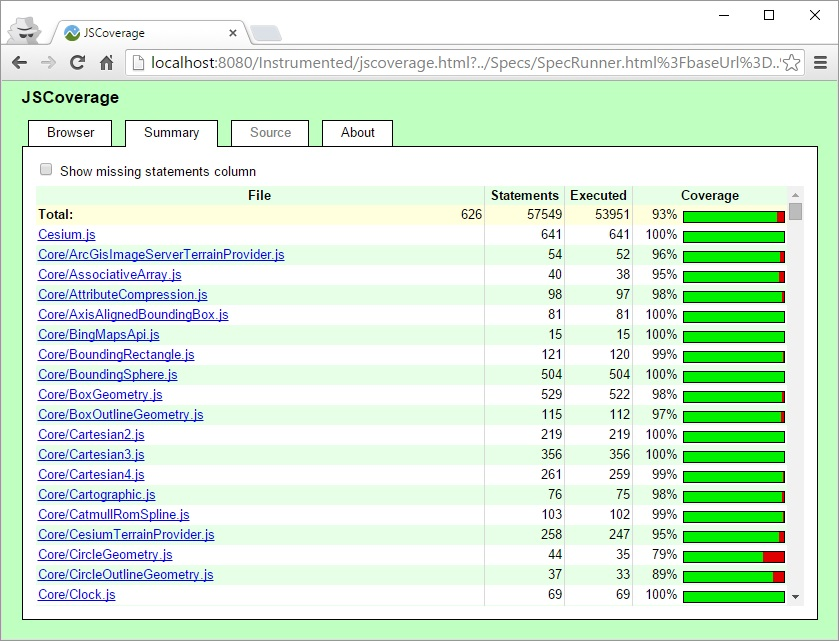

Click on a file to see line-by-line coverage for just that file.  For example, here is `AssociativeArray`:

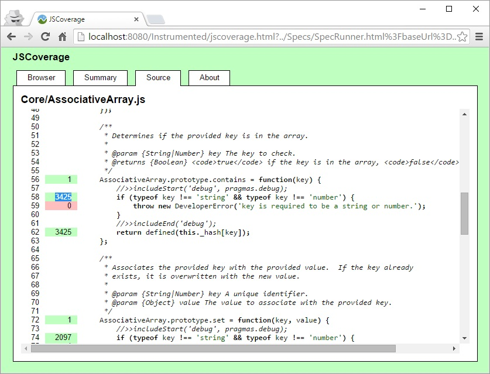

In the left margin, green indicates a line that was executed, and red indicates a line that was not.  Many lines, such as comments and semicolons, are not colored since they are not executable.

For the `contains` function above
   * `AssociativeArray.prototype.contains = function(key) {` is executed once when Cesium is loaded to assign the `contains` function to the `AssociativeArray`'s prototype.
   * The `if` statement and return statement are executed 3,425 times.
   * The `throw` statement is not executed, which indicates that test coverage should be improved here.  We strive to test _all_ error conditions.

When writing tests, do not confuse 100% code coverage with 100% tested.  For example, it is possible to have 100% code coverage without having any expectations.  Also consider the following code:

```javascript
if (a) {
    // Code block a.1
} else {
    // Code block a.2
}

if (b) {
    // Code block b.1
} else {
    // Code block b.2
}
```
It is possible to have 100% code coverage with two tests: one test where `a` and `b` are both `true`, and another where both are `false`; however, this only takes into account the case when `// Code block a.1` and `// Code block b.1` run together or when `// Code block a.2` and `// Code block b.2` run.  There could be an issue when, for example, `// Code block a.1` and `// Code block b.2` run together.

The number of linearly independent paths (four in this case) is called the **cyclomatic complexity**.  Be mindful of this when writing tests.  On one extreme, 100% code coverage is the least amount of testing, on the other extreme is covering the cyclomatic complexity, which quickly becomes unreasonable.  Use your knowledge of the implementation to devise the best strategy.

### Running Tests on the Command Line with Karma

[Karma](http://karma-runner.github.io/0.13/index.html) is a tool which spawns a browser window, runs tests against that browser, and displays the results on the command line.

To run all tests with Karma, run `npm run test`.

When all tests pass, output looks like this:

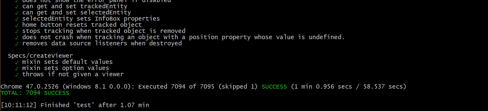

When one or more tests fail, output looks like this:

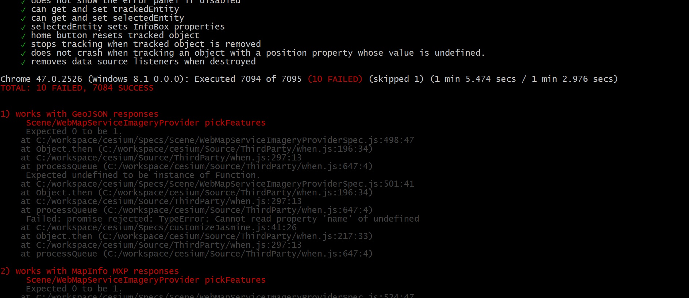

The failed tests will be listed by name, and details on each failure are listed below, including the expected and actual value of the failed expectation and the call stack.

It is also possible for Karma to run all tests against each browser installed on the current system. To do so, run `npm run test-all`. Currently included are launchers for Chrome, Firefox, Edge, IE, and Safari.

#### Run Tests with a Specific Browser or Browsers

`npm run test -- --browsers Firefox,Chrome,Edge`

#### Run All Tests with WebGL Validation

`npm run test-webgl-validation`

#### Run All Tests with WebGL Stub

`npm run test-webgl-stub`

#### Run Only WebGL Tests with Karma

`npm run test-webgl`

#### Run Only Non-WebGL Tests with Karma

 `npm run test-non-webgl`

#### Run All Tests Against the Minified Release Version of Cesium

 `npm run test-release`

#### Run a Single Test or Suite

Sometimes it is useful to run a single test or suite for easier debugging purposes.  To do this simply change the `it` function call for the desired test to `fit`, the `f` stands for `focused` in Jasmine speak.  Likewise, to run an entire suite, use `fdefineSuite` instead of `defineSuite`.

## Testing Previous Versions of Cesium

Sometimes it is useful to see if an issue exists in a previous version of Cesium.  The tests for all versions of Cesium back to b15 (April 2013) are hosted on the Cesium website via the [downloads page](http://cesiumjs.org/downloads.html).  Use the "Documentation, Sandcastle, tests, etc." links.

## `testfailure` Label for Issues

Despite our best efforts, sometimes tests fail.  This is often due to a new browser, OS, or driver bug that breaks a test that previously passed.  If this indicates a bug in Cesium, we strive to quickly fix it.  Likewise, if it indicates that Cesium needs to work around the issue (for example, as we [did for Safari 9](https://github.com/AnalyticalGraphicsInc/cesium/issues/2989)), we also strive to quickly fix it.

If a test failure is likely due to a browser, OS, or driver bug, or a poorly written test, and the failure does not impact actual Cesium apps, we sometimes submit an issue with the [testfailure](https://github.com/AnalyticalGraphicsInc/cesium/labels/test%20failure) label to fix it at a later time.  A great way to contribute to Cesium is to help fix these issues.

## Writing Tests

We _love_ to write tests.  We often write them as we write engine code (meaning Cesium itself). Or if the engine code is experimental, we make a second pass and write tests before opening a pull request.  Sometimes we do both: we write tests right away for the new code we expect to be stable, and we wait to write tests for the code in flux.

### Directory Organization

Tests are located in the [Specs](https://github.com/AnalyticalGraphicsInc/cesium/tree/master/Specs) directory (recall, Jasmine calls a test a "spec"), which has a directory structure that mirrors the [Source](https://github.com/AnalyticalGraphicsInc/cesium/tree/master/Source) directory.  For example, all the tests for files in `Source/Core` are in `Specs/Core`.  Likewise, all the tests for `Source/Core/Cartesian3.js` are in `Specs/Core/Cartesian3Spec.js`.  The filenames are the same except for the `Spec` suffix.  Each spec file corresponds to at least one suite (sometimes suites are nested inside).

### Bottom-Up Unit Testing

The Cesium tests are largely **unit tests** because they test individual units, e.g., functions or classes.  The simplest units are tested individually, and then units built upon other units are also tested.  This allows us to build Cesium on well-tested foundations and to quickly narrow down issues.

For example, a [`BoundingSphere`](https://github.com/AnalyticalGraphicsInc/cesium/blob/master/Source/Core/BoundingSphere.js) is composed of a `Cartesian3` that defines its center and a number that defines its radius.  Even though tests for `BoundingSphere` implicitly test parts of `Cartesian3`, there are separate tests that explicitly test `Cartesian3` as a unit so anything that relies on `Cartesian3` knows it is already tested.

Often, we also test private units individually for the same reason.  For example, [`ShaderCache`](https://github.com/AnalyticalGraphicsInc/cesium/blob/master/Source/Renderer/ShaderCache.js) is a private class in Cesium used by primitives, but it is still individually tested in [ShaderCacheSpec.js](https://github.com/AnalyticalGraphicsInc/cesium/blob/master/Specs/Renderer/ShaderCacheSpec.js).

Sometimes classes or functions are even designed with a separation specifically to enable more precise testing.  For example, see [`getStringFromTypedArray`](https://github.com/AnalyticalGraphicsInc/cesium/blob/master/Source/Core/getStringFromTypedArray.js) and [getStringFromTypedArraySpec.js](https://github.com/AnalyticalGraphicsInc/cesium/blob/master/Specs/Core/getStringFromTypedArraySpec.js).

### Test Code is Code

Tests are written in JavaScript using Jasmine.  It is important to realize that the tests themselves are code, just like Cesium.  As such, the test code is held to the same standards as the engine code: it should be well organized, cohesive, loosely coupled, fast, and go through peer review.

### Testing Basics

[Cartesian3Spec.js](https://github.com/AnalyticalGraphicsInc/cesium/blob/master/Specs/Core/Cartesian3Spec.js) contains the tests for [`Cartesian3`](https://github.com/AnalyticalGraphicsInc/cesium/blob/master/Source/Core/Cartesian3.js), which is a class representing a 3D point or vector with `x`, `y`, and `z` properties, and typical functions like adding two `Cartesian3` objects.

Here is a stripped down version of the tests:

```javascript
defineSuite([
        'Core/Cartesian3'
    ], function(
        Cartesian3) {
    'use strict';

    it('construct with default values', function() {
        var cartesian = new Cartesian3();
        expect(cartesian.x).toEqual(0.0);
        expect(cartesian.y).toEqual(0.0);
        expect(cartesian.z).toEqual(0.0);
    });
});
```

`defineSuite` identifies this file as a test suite and include modules the same way `define` is used in engine code.  The modules are listed in alphabetical order as usual _except_ that the module being tested is listed first.

Using Jasmine, each test is defined by calling `it` and passing a string that describes the test and a function that is the test.

This test constructs a default `Cartesian3` object and then expects that the `x`, `y`, and `z` properties are zero (their default) using Jasmine's `expect` and `toEqual` functions.

Tests should have at least one `expect` call, but they may also have several as long as the test is cohesive.  A test should test one behavior; if a test grows too complicated, it is hard to debug when it fails.  To test one function may only require one test with one `expect`, or it may require multiple tests, each with multiple `expect` statements.  It depends on context.  Experience, peer review, and the existing tests will help guide you.

The above test does not require creating a `Viewer` widget or even a WebGL context; the only part of Cesium it uses is `Cartesian3` and anything it depends on.

> To learn the ins and outs of Jasmine, take 15 minutes to go through their [examples](http://jasmine.github.io/2.2/introduction.html).  We will not cover all the details in this guide.

### Comparing Floating-Point Values

We often can't rely on an exact floating-point comparison.  In this case, use `toEqualEpsilon` instead of `toEqual` to compare within a tolerance.

```javascript
it('angleBetween works for acute angles', function() {
    var x = new Cartesian3(0.0, 1.0, 0.0);
    var y = new Cartesian3(1.0, 1.0, 0.0);
    expect(Cartesian3.angleBetween(x, y)).toEqualEpsilon(CesiumMath.PI_OVER_FOUR, CesiumMath.EPSILON14);
    expect(Cartesian3.angleBetween(y, x)).toEqualEpsilon(CesiumMath.PI_OVER_FOUR, CesiumMath.EPSILON14);
});
```

`toEqualEpsilon` is a custom Jasmine matcher that the Cesium tests add. See [Specs/addDefaultMatchers.js](https://github.com/AnalyticalGraphicsInc/cesium/blob/master/Specs/addDefaultMatchers.js) for all the custom matchers.  In general, all test utility functions are in files in the `Specs` root directory.

For more on comparing floating-point numbers, see [Comparing Floating Point Numbers, 2012 Edition](https://randomascii.wordpress.com/2012/02/25/comparing-floating-point-numbers-2012-edition/).

### Testing Exceptions

In addition to testing success cases, we also test all failure cases.  The custom matchers, `toThrowDeveloperError` and `toThrowRuntimeError`, can be used to expect an exception to be thrown.

```javascript
it('fromDegrees throws with no latitude', function() {
    expect(function() {
        Cartesian3.fromDegrees(0.0);
    }).toThrowDeveloperError();
});
```

Above, `Cartesian3.fromDegrees` is expected to throw a `DeveloperError` because it expects longitude and latitude arguments, and only longitude is provided.

Tips:
* When testing for exceptions, put only code that is expected to trigger the exception inside the function passed to `expect()`, in case setup code unintentionally throws an exception.
* To verify the right exception is thrown, it is often useful to comment out the `expect` call when first running the test, for example:

```javascript
it('fromDegrees throws with no latitude', function() {
//    expect(function() {
        Cartesian3.fromDegrees(0.0);
//    }).toThrowDeveloperError();
});
```

### Before and After Tests and Suites

The Jasmine functions `beforeAll` and `afterAll` are used to run a function before and after, respectively, all the tests in a suite.  Likewise, `beforeEach` and `afterEach` run a function before and after each test is run.  For example, here is a common pattern from [DebugModelMatrixPrimitiveSpec.js](https://github.com/AnalyticalGraphicsInc/cesium/blob/master/Specs/Scene/DebugModelMatrixPrimitiveSpec.js):

```javascript
var scene;

beforeAll(function() {
    scene = createScene();
});

afterAll(function() {
    scene.destroyForSpecs();
});

afterEach(function() {
    scene.primitives.removeAll();
});
```

Above, `scene` is scoped at the suite-level, so all tests in the file have access to it.  Before the suite is run, `beforeAll` is used to assign to `scene` (see below), and after the suite is run, `afterAll` is used to destroy the scene.  Using `afterEach`, after each test is run, all the primitives are removed from the scene.  `scene` is typically used in a test like this:

```javascript
it('renders', function() {
    var p = scene.primitives.add(new DebugModelMatrixPrimitive());
    expect(scene).notToRender([0, 0, 0, 255]);
});
```

The test knows `scene` will be defined and does not need to worry about cleaning up the `scene` because `afterEach` and `afterAll` take care of it.

We strive to write isolated isolated tests so that a test can be run individually and produce the same results as when running the suite containing the test or all Cesium tests.  Therefore, a test should not depend, for example, on a previous test setting global state.

The tests in the `'WebGL'` category do not strictly follow this pattern.  Creating a WebGL context (which is implicit, for example, in `createScene`) is slow. Because it creates a lot of contexts, e.g., one per test, it is not well supported in browsers.  So the tests use the pattern in the code example below where a `scene` (or `viewer` or `context`) has the lifetime of the suite using `beforeAll` and `afterAll`.

### Rendering Tests

Unlike the `Cartesian3` tests we first saw, many tests need to construct the main Cesium `Viewer` widget or one of its major components.  Low-level renderer tests construct just `Context` (which, itself, has a canvas and WebGL context), and primitive tests construct a `Scene` (which contains a `Context`).

As shown above, these tests use Cesium test utility functions: `createViewer`, `createScene`, or `createContext`.  These functions honor query parameters passed to the tests (e.g., enabling WebGL validation or the WebGL stub) and add a few utility functions to the returned object.  For example, `createScene` creates a 1x1 pixel canvas with a Cesium Scene and adds `renderForSpecs` (to initialize and render a frame) and `destroyForSpecs` to the returned `Scene` object.

> Most Cesium apps do not render the scene directly; instead, the `Viewer` object's default render loop renders the scene implicit to the user.  The tests are an exception; most tests explicitly render the scene.

Cesium adds several custom Jasmine matchers to make the rendering tests more concise and to support running tests with the WebGL stub.  When using the WebGL stub, the WebGL implementation is a noop, and test expectations that rely on reading back from WebGL are ignored.  The rendering custom matchers are:

* `toRender`
* `notToRender`
* `toRenderAndCall`
* `toPickPrimitive`
* `notToPick`
* `toPickAndCall`
* `toDrillPickAndCall`
* `toReadPixels`
* `notToReadPixels`
* `contextToRender`
* `notContextToRender`

`toRender` and `notToRender` clear a 1x1 viewport to black, renders the scene into it, and verifies the RGBA value of the pixel, e.g.:

```javascript
it('renders', function() {
    var p = scene.primitives.add(new DebugModelMatrixPrimitive());
    expect(scene).notToRender([0, 0, 0, 255]);
});

it('does not render when show is false', function() {
    scene.primitives.add(new DebugModelMatrixPrimitive({
        show : false
    }));
    expect(scene).toRender([0, 0, 0, 255]);
});
```

Like most rendering tests, the first example uses a coarse-grained expectation to check that the pixel is not the default value of black.  Although an expectation this coarse-grained may not catch all subtle errors, it is reliable across platforms, and we rarely have bugs a more fine-grained test would have caught, especially with some manual testing (see below).

The second test verifies that the pixel value is the same as the default background color since the primitive's `show` property is `false`.

`toRender` and `notToRender` can also render the scene at a given Cesium simulation time, e.g.,:

```javascript
expect({
    scene : scene,
    time : t
}).toRender([0, 0, 0, 255]);
```

For more complicated expectations, which will still be ignored with the WebGL stub, `toRenderAndCall` takes a callback function:

```javascript
expect(scene).toRenderAndCall(function(rgba) {
    expect(rgba[0]).not.toEqual(0);
    expect(rgba[1]).toBeGreaterThanOrEqualTo(0);
    expect(rgba[2]).toBeGreaterThanOrEqualTo(0);
    expect(rgba[3]).toEqual(255);
});
```

For reliability across WebGL implementations, use complex expectations in `toRenderAndCall` sparingly.

Similar custom matchers are used for picking tests:

```javascript
var b = billboards.add(/* ... */);
expect(scene).toPickPrimitive(b);  // Can also use toPickAndCall() and toDrillPickAndCall()

b.show = false;
expect(scene).notToPick();
```

For tests that render the scene themselves, `toReadPixels` and `notToReadPixels` are used to verify the RGBA value.  In the simplest case, pass an RGBA array, e.g.:

```javascript
expect(context).toReadPixels([0, 0, 0, 255]);

expect(context).notToReadPixels([0, 0, 0, 255]);
```

`toReadPixels` can also read from a given framebuffer and use an epsilon for the RGBA comparison test, e.g.:

```javascript
expect({
    context : context,
    framebuffer : framebuffer,
    epsilon : 1
}).toReadPixels([0, 0, 0, 255]);
```

Low-level Cesium renderer tests use just a `Context` without a Cesium `Scene`, and use the `contextToRender` and `notContextToRender` custom matchers to render a WebGL point primitive to the context's 1x1 viewport and verify the RGBA value, e.g.:

```javascript
expect({
    context : context,
    shaderProgram : sp,
}).contextToRender(expected);

expect(/* ... */).notContextToRender();
```

Uniforms, the model matrix, and various depth options can be provided.  In addition, instead of providing a full shader program, just the fragment shader's source can be provided, e.g.,

```javascript
it('can declare automatic uniforms', function() {
    var fs =
        'void main() { ' +
        '  gl_FragColor = vec4((czm_viewport.x == 0.0) && (czm_viewport.y == 0.0) && (czm_viewport.z == 1.0) && (czm_viewport.w == 1.0)); ' +
        '}';
    expect({
        context : context,
        fragmentShader : fs
    }).contextToRender();
});
```

### GLSL

GLSL is the shading language used by WebGL to run small graphics programs in parallel on the GPU.  Under-the-hood, Cesium contains a library of GLSL identifiers and functions.  These are unit tested by writing a simple fragment shader that outputs white if the test passes.  For example, here is an excerpt from [BuiltinFunctionsSpec.js](https://github.com/AnalyticalGraphicsInc/cesium/blob/master/Specs/Renderer/BuiltinFunctionsSpec.js);

```javascript
var context;

beforeAll(function() {
    context = createContext();
});

afterAll(function() {
    context.destroyForSpecs();
});

it('has czm_transpose (2x2)', function() {
    var fs =
        'void main() { ' +
        '  mat2 m = mat2(1.0, 2.0, 3.0, 4.0); ' +
        '  mat2 mt = mat2(1.0, 3.0, 2.0, 4.0); ' +
        '  gl_FragColor = vec4(czm_transpose(m) == mt); ' +
        '}';

    context.verifyDrawForSpecs(fs);
});
```

`createContext` returns a `Context` object with a test function, `verifyDrawForSpecs`, that renders a point to the 1x1 canvas and verifies the pixel value is white, e.g.,
```javascript
expect(context.readPixels()).toEqual([255, 255, 255, 255]);
```
In the test above, the expectation is implicit in the GLSL string for the fragment shader, `fs`, which assigns white to `gl_FragColor` if `czm_transpose` correctly transposes the matrix.

### Spies

It can be useful to expect if a function was called and inspect information about the function call such as the arguments passed to it.  Jasmine spies are used for this.

Here is an excerpt from [TweenCollectionSpec.js](https://github.com/AnalyticalGraphicsInc/cesium/blob/master/Specs/Scene/TweenCollectionSpec.js):

```javascript
it('add() adds with a duration of zero', function() {
    var complete = jasmine.createSpy('complete');

    var tweens = new TweenCollection();
    tweens.add({
        startObject : {},
        stopObject : {},
        duration : 0.0,
        complete : complete
    });

    expect(tweens.length).toEqual(0);
    expect(complete).toHaveBeenCalled();
});
```
Tweens are used for animation.  This test creates a spy with `jasmine.createSpy` to verify that a tween calls the provided `complete` function when a tween finishes animating using `toHaveBeenCalled()`, which is immediately in this case given `duration` is `0.0`.

Spies can also provide more information about the function call (or calls).  Here is an excerpt from [GeocoderViewModelSpec.js](https://github.com/AnalyticalGraphicsInc/cesium/blob/master/Specs/Widgets/Geocoder/GeocoderViewModelSpec.js):

```javascript
it('Zooms to longitude, latitude, height', function() {
    var viewModel = new GeocoderViewModel({
        scene : scene
    });

    spyOn(Camera.prototype, 'flyTo');

    viewModel.searchText = ' 1.0, 2.0, 3.0 ';
    viewModel.search();
    expect(Camera.prototype.flyTo).toHaveBeenCalled();
    expect(Camera.prototype.flyTo.calls.mostRecent().args[0].destination).toEqual(Cartesian3.fromDegrees(1.0, 2.0, 3.0));

    viewModel.searchText = '1.0   2.0   3.0';
    viewModel.search();
    expect(Camera.prototype.flyTo.calls.mostRecent().args[0].destination).toEqual(Cartesian3.fromDegrees(1.0, 2.0, 3.0));
});
```
Here, `spyOn` is used to replace `Camera.flyTo` (prototype function on instances) with a spy.  When the Geocoder is used to search for a location, the test expects that `Camera.flyTo` was called with the right arguments.

Spies can also be used on non-prototype functions.  Here is an excerpt from [ModelSpec.js](https://github.com/AnalyticalGraphicsInc/cesium/blob/master/Specs/Scene/ModelSpec.js):

```javascript
it('Applies the right render state', function() {
    spyOn(RenderState, 'fromCache').and.callThrough();

    return loadModelJson(texturedBoxModel.gltf).then(function(model) {
        var rs = {
            frontFace : WebGLConstants.CCW,
            cull : {
                enabled : true,
                face : WebGLConstants.BACK
            },
            // ...
        };

        expect(RenderState.fromCache).toHaveBeenCalledWith(rs);
        primitives.remove(model);
    });
});
```
This test verifies that a glTF model uses the expected render state.  First, a spy is added to `RenderState.fromCache`.  Since we want the spy to collect information but still call the original function, `and.callThrough()` is used.  Once the model is loaded, `toHaveBeenCalledWith` is used to expect that `RenderState.fromCache` was called with the expected arguments.

For more examples of what you can do with spies, see the [Jasmine examples](http://jasmine.github.io/2.2/introduction.html).

Beware of too tightly coupling a test with an implementation; it makes engine code hard to refactor and results in specific narrow tests.  Given that we are usually **white box** testing (where we know the implementation details, as opposed to **black box** testing), we need to resist the urge to let too many implementation details leak into a test.  In particular, reach into private members (whose names start with `_`) sparingly.

### Test Data and Services

Sometimes, a test requires sample data, like a CZML file or glTF model, or a service.  When possible, we try to procedurally create data or mock a response in the test instead of reading a local file or making an external request.  For example, [loadArrayBufferSpec.js](https://github.com/AnalyticalGraphicsInc/cesium/blob/master/Specs/Core/loadArrayBufferSpec.js) uses a spy to simulate an XHR response.

When external data can't be avoided, prefer storing a small file in a subdirectory of [Specs/Data](https://github.com/AnalyticalGraphicsInc/cesium/tree/master/Specs/Data).  Avoid bloating the repo with an unnecessarily large file.  Update [LICENSE.md](https://github.com/AnalyticalGraphicsInc/cesium/blob/master/LICENSE.md) if the data requires a license or attribution.  Include a README file when useful, for example, see [Specs/Data/Models/Box-Textured-Custom](https://github.com/AnalyticalGraphicsInc/cesium/tree/master/Specs/Data/Models/Box-Textured-Custom).

Make external requests that assume the tests are being used with an Internet connection very sparingly.  We anticipate being able to run the tests offline.

### Promises

(For an introduction to promises, see [JavaScript Promises - There and back again](http://www.html5rocks.com/en/tutorials/es6/promises/)).

For asynchronous testing, Jasmine's `it` function uses a `done` callback.  For better integration with Cesium's asynchronous patterns, Cesium replaces `it` with a function that can return promises.

Here is an excerpt from [ModelSpec.js](https://github.com/AnalyticalGraphicsInc/cesium/blob/master/Specs/Scene/ModelSpec.js):

```javascript
var texturedBoxUrl = './Data/Models/Box-Textured/CesiumTexturedBoxTest.gltf';
var texturedBoxModel;

var cesiumAirUrl = './Data/Models/CesiumAir/Cesium_Air.gltf';
var cesiumAirModel;

beforeAll(function() {
    var modelPromises = [];
    modelPromises.push(loadModel(texturedBoxUrl).then(function(model) {
        texturedBoxModel = model;
    }));
    modelPromises.push(loadModel(cesiumAirUrl).then(function(model) {
        cesiumAirModel = model;
    }));

    return when.all(modelPromises);
});
```
Given a model's url, `loadModel` (detailed below) returns a promise that resolves when a model is loaded.  Here, `beforeAll` is used to ensure that two models, stored in suite-scoped variables, `texturedBoxModel` and `cesiumAirModel`, are loaded before any tests are run.

Here is an implementation of `loadModel`:

```javascript
function loadModelJson(gltf) {
    var model = primitives.add(new Model());

    return pollToPromise(function() {
        // Render scene to progressively load the model
        scene.renderForSpecs();
        return model.ready;
    }, { timeout: 10000 }).then(function() {
        return model;
    });
}
```

Since loading a model requires asynchronous requests and creating WebGL resources that may be spread over several frames, Cesium's `pollToPromise` is used to return a promise that resolves when the model is ready, which occurs by rendering the scene in an implicit loop (hence the name "poll") until `model.ready` is `true` or the `timeout` is reached.

`pollToPromise` is used in many places where a test needs to wait for an asynchronous event before testing its expectations.  Here is an excerpt from [BillboardCollectionSpec.js](https://github.com/AnalyticalGraphicsInc/cesium/blob/master/Specs/Scene/BillboardCollectionSpec.js):

```javascript
it('can create a billboard using a URL', function() {
    var b = billboards.add({
        image : './Data/Images/Green.png'
    });
    expect(b.ready).toEqual(false);

    return pollToPromise(function() {
        return b.ready;
    }).then(function() {
        expect(scene).toRender([0, 255, 0, 255]);
    });
});
```

Here a billboard is loaded using a url to image.  Internally, `Billboard` makes an asynchronous request for the image and then sets its `ready` property to `true`.  The function passed to `pollToPromise` just returns the value of `ready`; it does not need to render the scene to progressively complete the request like `Model`.  Finally, the resolve function (passed to `then`) verifies that the billboard is green.

To test if a promises rejects, we call `fail` in the resolve function and put the expectation in the reject function.  Here is an excerpt from [ArcGisMapServerImageryProviderSpec.js](https://github.com/AnalyticalGraphicsInc/cesium/blob/master/Specs/Scene/ArcGisMapServerImageryProviderSpec.js):

```javascript
it('rejects readyPromise on error', function() {
    var baseUrl = '//tiledArcGisMapServer.invalid';

    var provider = new ArcGisMapServerImageryProvider({
        url : baseUrl
    });

    return provider.readyPromise.then(function () {
        fail('should not resolve');
    }).otherwise(function (e) {
        expect(e.message).toContain(baseUrl);
        expect(provider.ready).toBe(false);
    });
});
```

### Mocks

To isolate testing, mock objects can be used to simulate real objects.  Here is an excerpt from [SceneSpec.js](https://github.com/AnalyticalGraphicsInc/cesium/blob/master/Specs/Scene/SceneSpec.js);

```javascript
function MockPrimitive(command) {
    this.update = function(frameState) {
        frameState.commandList.push(command);
    };
    this.destroy = function() {
    };
}

it('debugCommandFilter filters commands', function() {
    var c = new DrawCommand({
        pass : Pass.OPAQUE
    });
    c.execute = function() {};
    spyOn(c, 'execute');

    scene.primitives.add(new MockPrimitive(c));

    scene.debugCommandFilter = function(command) {
        return command !== c;   // Do not execute command
    };

    scene.renderForSpecs();
    expect(c.execute).not.toHaveBeenCalled();
});
```

This test verifies that `debugCommandFilter` can be used to filter the commands executed when the scene is rendered.  Here, the function passed to `debugCommandFilter` explicitly filters out the command `c`.  In order to ask the scene to execute the command in the first place, a mock object, `MockPrimitive`, is used to return the command when the scene is rendered.

This test is more cohesive and easier to debug than if it were written using a _real_ primitive, which brings along all of its extra behavior and does not provide direct access to its commands.

### Categories

As mentioned above, some tests are in the `'WebGL'` category.  To  assign a category to a suite, pass the category to `defineSuite`.

```javascript
defineSuite([
        'Scene/DebugModelMatrixPrimitive',
        'Specs/createScene'
    ], function(
        DebugModelMatrixPrimitive,
        createScene) {
    'use strict';

    var scene;

    beforeAll(function() {
        scene = createScene();
    });

    afterAll(function() {
        scene.destroyForSpecs();
    });

    // ...

}, 'WebGL');
```

`defineSuite` is a custom Cesium function that wraps Jasmine define calls and provides the category capability.

## Manual Testing

Sometimes running the unit tests is all that is needed to verify new code.  However, we often also manually run Cesium to see the effects of new code.  Sometimes it is as simple as running Cesium Viewer before opening a pull request, perhaps because we just added a new function to `Cartesian3`.  Other times, it is as involved as going through each example in Sandcastle and testing the different options because, for example, we refactored the renderer for WebGL 2.  Most often, there is a middle ground, for example, we added a new feature to `Model` so we ran the Sandcastle examples that create 3D Models.

## Pragmatic Advice

Advice from [@pjcozzi](https://github.com/pjcozzi):

### Start with a Similar (Small) Test

> Since I wrote the very first Cesium test, I have not written a suite - or even individual test - from scratch.  I suspect no one does.

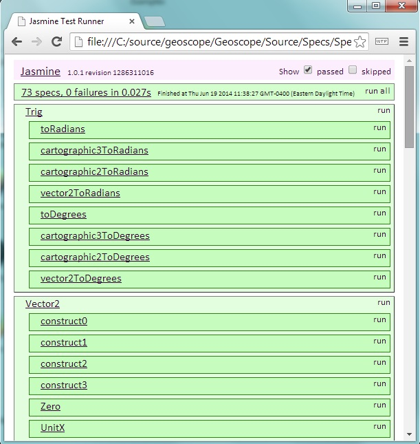

The first 73 Cesium tests from March 2011.

> Instead, start with a similar suite or test, copy it, strip it down to the minimum you need, and then start adding your specific code.  For example, if you are adding a new math type, start with Cartesian3Spec.js or Matrix4Spec.js.  If you are adding a new primitive, start with DebugModelMatrixPrimitiveSpec.js.

### Debugger-Aided Incremental Improvements

> Two decades ago, I didn't know what unit tests and code coverage were.  I wrote _a little bit of code_, put breakpoints in all the new code paths, and then ran the app in the debugger.  When a breakpoint hit, I stepped through the code, looked at the variable values, and verified that the code was doing what I intended.  I did this until everything worked and all the breakpoints were hit.  Then, I repeated: I added a bit more new code, new breakpoints, and incrementally tested.

> Even today, with modern tools and experience, I never code for hours straight without testing, and I rarely write new code without seeing it execute in the debugger.  Debuggers are not a reactive tool for when a bug is found, they are a proactive tool for gaining insight and avoiding surprises.

> Try this approach for yourself!

## Testing in WebStorm

When you load the Cesium WebStorm project, there will already be a predefined run configuration for executing the unit tests.  It will be in the upper-right corner and look something like the below:

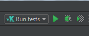

You can run or debug the tests by using the first two buttons.  The third button is for coverage, which is currently not supported.  It will pop up the WebStorm test runner:

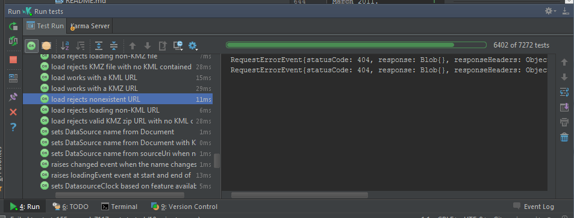

This runner has lots of options, such as only showing failing tests or automatically re-running the tests on a test interval (great for development when combined with `fdefineSuite`!).  You can hover over each of the buttons to see what they do.

Instead of using Chrome or Firefox, the WebStorm configuration uses [Electron](https://github.com/atom/electron) as the browser, which runs V8 (Chrome) inside of a node process. We have configured it to run headless so that no browser window pops up while testing.  If you ever have a need to run a specific browser from within WebStorm, simply click the `Run tests` combo box and select `edit configuration`.  From there it's self-explanatory.'

To make jumping between the source and spec files easier download the  [Cesium WebStorm plugin](https://github.com/AnalyticalGraphicsInc/cesium-webstorm-plugin).

## Resources

See Section 4.4 of [Getting Serious with JavaScript](http://webglinsights.github.io/downloads/WebGL-Insights-Chapter-4.pdf) by Cesium contributors Matthew Amato and Kevin Ring in _WebGL Insights_ for a deeper but less broad presentation of Cesium testing.
