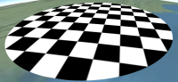
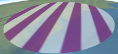
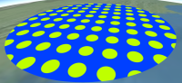
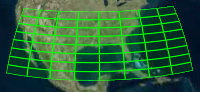
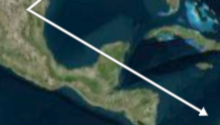
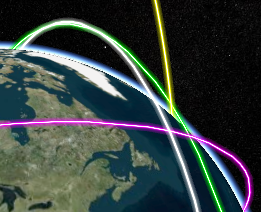
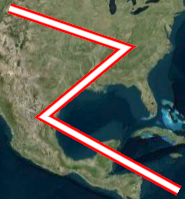
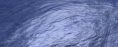
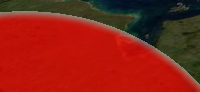

<!-- markdownlint-disable-file MD033 -->

# Fabric Guide

## Contents

- [Fabric Guide](#fabric-guide)
  - [Contents](#contents)
  - [Introduction](#introduction)
  - [Built-In Materials](#built-in-materials)
    - [Procedural Textures](#procedural-textures)
    - [Base Materials](#base-materials)
  - [Polyline Materials](#polyline-materials)
    - [Misc Materials](#misc-materials)
    - [Common Uniforms](#common-uniforms)
  - [Creating New Materials](#creating-new-materials)
    - [Components](#components)
    - [Source](#source)
    - [Input](#input)
    - [Combining Materials](#combining-materials)
  - [Fabric Schema](#fabric-schema)
  - [Materials in the Rendering Pipeline](#materials-in-the-rendering-pipeline)

## Introduction

Fabric is a JSON schema for describing materials in Cesium. Materials represent the appearance of an object such as polygons, polylines, ellipsoids, and sensors.

_Note: For details about applying custom materials to 3D models or 3D Tiles, use the [Custom Shader Guide](../CustomShaderGuide/README.md) instead._

Materials can be as simple as draping an image over an object, or applying a pattern such as stripes or a checkerboard. Using Fabric and GLSL, new materials can be scripted from scratch or created by combining existing materials in a hierarchy; for example, wet crumbling bricks can be created with a combination of procedural brick, bump map, and specular map materials.



<br />

Objects that support materials have a `material` property. Currently, these objects are polygons, polylines, ellipsoids, and sensors. Materials are applied by assigning to the object's `material` property.

```javascript
polygon.material = Material.fromType("Color");
```

Above, `Color` is a built-in material which represents a single color, including alpha. `Material.fromType` is shorthand; the entire Fabric JSON can also be provided.

```javascript
polygon.material = new Material({
  fabric: {
    type: "Color",
  },
});
```

Each material has zero or more uniforms, which are input parameters that can be specified when creating the material and modified after. For example, `Color` has a `color` uniform with `red`, `green`, `blue`, and `alpha` components.

```javascript
polygon.material = new Material({
  fabric: {
    type: "Color",
    uniforms: {
      color: new Color(1.0, 0.0, 0.0, 0.5),
    },
  },
});

// Change from translucent red to opaque white
polygon.material.uniforms.color = Color.WHITE;
```

## Built-In Materials

Cesium has several built-in materials. Two widely used ones are:

| Name    | Screenshot                                      | Description                                                                                                                  |
| :------ | :---------------------------------------------- | :--------------------------------------------------------------------------------------------------------------------------- |
| `Color` |  | A single color, including alpha for translucency.                                                                            |
| `Image` |  | An image with or without an alpha channel such as .png or .jpg; a combination of diffuse, `rgb`, and alpha, `a`, components. |

All built-in materials can be created similar to how we used `Color` above. For example:

```javascript
polygon.material = Material.fromType("Image");
polygon.material.uniforms.image = "image.png";
```

or

```javascript
polygon.material = new Material({
  fabric: {
    type: "Image",
    uniforms: {
      image: "image.png",
    },
  },
});
```

### Procedural Textures

Procedural texture materials procedurally compute patterns on the GPU so they do not rely on external image files. They represent both diffuse and alpha components.

| Name           | Screenshot                                             | Description                                               |
| :------------- | :----------------------------------------------------- | :-------------------------------------------------------- |
| `Checkerboard` |  | Checkerboard with alternating light and dark colors.      |
| `Stripe`       |        | Alternating light and dark horizontal or vertical stripes |
| `Dot`          |           | A pattern of dots organized by row and column.            |
| `Grid`         |          | A grid of lines, useful for displaying 3D volumes.        |

### Base Materials

Base materials represent fine-grain fundamental material characteristics, such as how much incoming light is reflected in a single direction, i.e., the _specular intensity_, or how much light is emitted, i.e., the _emission_. These materials can be used as is, but are more commonly [combined](#CombiningMaterials) using Fabric to create a more complex material.

| Name          | Screenshot                                            | Description                                                                                                                                                                                                        |
| :------------ | :---------------------------------------------------- | :----------------------------------------------------------------------------------------------------------------------------------------------------------------------------------------------------------------- |
| `DiffuseMap`  |   | An image with `vec3` components defining incoming light that scatters evenly in all directions.                                                                                                                    |
| `SpecularMap` |  | An image with a scalar component defining the intensity of incoming light reflecting in a single direction. This is used to make parts of the surface shiny, e.g., water vs. land.                                 |
| `AlphaMap`    |     | An image with a scalar component defining the opacity of the material. This is used to make parts of the surface translucent or transparent, e.g., a fence.                                                        |
| `NormalMap`   |    | An image with `vec3` components defining the surface's normal in tangent coordinates. Normal mapping is used to add surface detail without adding geometry.                                                        |
| `BumpMap`     |      | An image with a scalar component defining heights. Like normal mapping, bump mapping is used to add surface detail without adding geometry by perturbing the normal based on differences in adjacent image pixels. |
| `EmissionMap` |  | An image with `vec3` components defining light emitted by the material equally in all directions, e.g., lights in a long hallway.                                                                                  |

## Polyline Materials

Polyline materials are materials that can only be added to lines.

| Name              | Screenshot                        | Description                                      |
| :---------------- | :-------------------------------- | :----------------------------------------------- |
| `PolylineArrow`   |    | Places an arrow head at the end point of a line. |
| `PolylineGlow`    |     | Makes glowing lines.                             |
| `PolylineOutline` |  | Line outline.                                    |

### Misc Materials

There are a few materials that do not fit into any other category.

| Name          | Screenshot                                            | Description                             |
| :------------ | :---------------------------------------------------- | :-------------------------------------- |
| `Water`       |        | Animating water with waves and ripples. |
| `RimLighting` |  | Highlights the rim or silhouette.       |

For more materials, see the [Cesium Materials Plugin](https://github.com/CesiumGS/cesium-materials-pack).

### Common Uniforms

Many materials have a `image` uniform, which is an image URL or data URI.

```javascript
polygon.material.uniforms.image = "image.png";
polygon.material.uniforms.image =
  "data:image/png;base64,iVBORw0KGgoAAAANSUhEUgAAABAAAAAQCAYAAAAf8/9hAAAAAXNSR0IArs4c6QAAAARnQU1BAACxjwv8YQUAAAAJcEhZcwAADsMAAA7DAcdvqGQAAAC/SURBVDhPrZPRDYQgEEQpjVKuFEvhw0IoxU6QgQwMK+vdx5FsooT3GHdjCM4qZnnnHvvkYoxFi/uvIhwiRCClXFC6v5UQ1uQAsbrkHCLsbaPjFgIzQQc1yUOwu33ePGE3BQUaee2BpjhbP5YUmkAlbNzsAURfBDqJnMIyyv4JjsCCgCnIR32uZUfcJuGBOwEk6bOKhoAADh31EIq3MgFg1mgkE1BA2AoUZoo2iZ3gyqGgmMDC/xWwkfb3/eUd7A1v3kxjNW9taQAAAABJRU5ErkJggg==";
```

Some materials, such as `Diffuse` and `NormalMap` require images with three components per pixel; other materials, such as `Specular` and `Alpha`, require one component. We can specify what channels (and in what order) these components are pulled from when creating a material using the `channels` or `channel` string uniform. For example, by default in the `Specular` material, the specular component is taken from the `r` channel. However, we can change that:

```javascript
polygon.material = new Material({
  fabric: {
    type: "SpecularMap",
    uniforms: {
      image: "specular.png",
      channel: "a",
    },
  },
});
```

This allows packing data for multiple materials into the same image, e.g., storing diffuse components as `rgb` and specular components as `a` in the same image. Under the hood, the image will also be loaded once.

Materials that use images often have a `repeat` uniform that controls the number of times the image repeats horizontally and vertically. This can be useful for tiling images across a surface.

```javascript
polygon.material = new Material({
  fabric: {
    type: "DiffuseMap",
    uniforms: {
      image: "diffuse.png",
      repeat: {
        x: 10,
        y: 2,
      },
    },
  },
});
```

## Creating New Materials

New materials are created using Fabric, a bit of GLSL, and potentially other materials.

If a material is not going to be reused, it can be created without a `type`.

```javascript
const fabric = {
  // no type
  // ...rest of fabric JSON
};
polygon.material = new Material({
  fabric: fabric,
});
```

When a non-existing `type` is used, the material is cached during the first call to `new Material`, and later calls to `new Material` or `Material.fromType` can reference the material as if it were a built-in material, i.e., they don't need to provide the full Fabric, just the `type` and any `uniforms` they want to set.

```javascript
const fabric = {
  type: "MyNewMaterial",
  // ...rest of fabric JSON
};
polygon.material = new Material({
  fabric: fabric,
});
// ... later calls just use the type.
anotherPolygon.material = Material.fromType("MyNewMaterial");
```

### Components

Perhaps the simplest interesting material is one that reflects white in all directions:

```javascript
const fabric = {
  components: {
    diffuse: "vec3(1.0)",
  },
};
```

A slightly more complicated example adds a specular component so that the material's reflected light is most intense when viewed straight down, and becomes less intense as viewed edge-on.

```javascript
{
  components : {
    diffuse : 'vec3(0.5)',
    specular : '0.1'
  }
}
```

The `components` property contains sub-properties that define the appearance of the material. The value of each sub-property is a GLSL code snippet, hence the `vec3(0.5)` above, which creates a 3D vector with each component set to `0.5`. These have access to all GLSL functions like `mix`, `cos`, `texture2D`, etc. There are five sub-properties.

| Name        | Default       | Description                                                                                                                                                                                                              |
| :---------- | :------------ | :----------------------------------------------------------------------------------------------------------------------------------------------------------------------------------------------------------------------- |
| `diffuse`   | `'vec3(0.0)'` | The diffuse component of this material. The diffuse component is a `vec3` defining incoming light that scatters evenly in all directions.                                                                                |
| `specular`  | `0.0`         | The specular component of this material. The specular component is a float defining the intensity of incoming light reflecting in a single direction.                                                                    |
| `shininess` | `1.0`         | The sharpness of the specular reflection. Higher values create a smaller, more focused specular highlight.                                                                                                               |
| `normal`    |               | The normal component of this material. The normal component is a `vec3` defining the surface's normal in eye coordinates. It is used for effects such as normal mapping. The default is the surface's unmodified normal. |
| `emission`  | `'vec3(0.0)'` | The emission component of this material. The emission component is a `vec3` defining light emitted by the material equally in all directions. The default is `vec3(0.0)`, which emits no light.                          |
| `alpha`     | `1.0`         | The alpha component of this material. The alpha component is a float defining the opacity of this material. `0.0` is completely transparent; `1.0` is completely opaque.                                                 |

Together, these sub-properties, or _components_ define the characteristics of the material. They are the output of the material, and the input to the lighting system.

### Source

An alternative to the `components` property that provides more flexibility is to provide complete GLSL source for a function, `czm_getMaterial`, that returns the material's components. The signature is:

```glsl
struct czm_materialInput
{
  float s;
  vec2 st;
  vec3 str;
  mat3 tangentToEyeMatrix;
  vec3 positionToEyeEC;
  vec3 normalEC;
};

struct czm_material
{
  vec3 diffuse;
  float specular;
  float shininess;
  vec3 normal;
  vec3 emission;
  float alpha;
};

czm_material czm_getMaterial(czm_materialInput materialInput);
```

The simplest possible implementation is to return the default for each component.

```glsl
czm_material czm_getMaterial(czm_materialInput materialInput)
{
    return czm_getDefaultMaterial(materialInput);
}
```

The Fabric looks like:

```javascript
{
  source: "czm_material czm_getMaterial(czm_materialInput materialInput) { return czm_getDefaultMaterial(materialInput); }";
}
```

Our example material above that sets `diffuse` and `specular` components can be implemented as:

```glsl
czm_material czm_getMaterial(czm_materialInput materialInput)
{
    czm_material m = czm_getDefaultMaterial(materialInput);
    m.diffuse = vec3(0.5);
    m.specular = 0.5;
    return m;
}
```

Using `source` instead of `components` is more verbose, but provides more flexibility, including the ability to share common computations for different components and to make utility functions. A rule of thumb is to use the `components` property unless the flexibility of explicitly implementing `czm_getMaterial` is needed. Under the hood, the `components` sub-properties are used to implement `czm_getMaterial`. In both cases, we have access to GLSL built-in functions and Cesium provided built-in GLSL [functions, uniforms, and constants](https://github.com/CesiumGS/cesium/blob/master/Source/Renderer/AutomaticUniforms.js).

### Input

The `materialInput` variable is available in both `source` and `components`. It has the following fields that can be used to compute material components.

| Name                 | Type    | Description                                                                                                                                                                                                                                                                                                                            |
| :------------------- | :------ | :------------------------------------------------------------------------------------------------------------------------------------------------------------------------------------------------------------------------------------------------------------------------------------------------------------------------------------- |
| `s`                  | `float` | A 1D texture coordinate.                                                                                                                                                                                                                                                                                                               |
| `st`                 | `vec2`  | 2D texture coordinates.                                                                                                                                                                                                                                                                                                                |
| `str`                | `vec3`  | 3D texture coordinates. The 1D, 2D, and 3D texture coordinates are not necessarily proper subsets of each other, e.g., `str.st == st` and `st.s == s` are not guaranteed. For example, for an ellipsoid, `s` might go from bottom to top; `st` might be longitude and latitude; and `str` might be along the axes of the bounding box. |
| `tangentToEyeMatrix` | `mat3`  | A transformation matrix from the fragment's tangent space to eye coordinates, for normal mapping, bump mapping, etc.                                                                                                                                                                                                                   |
| `positionToEyeEC`    | `vec3`  | A vector from the fragment to the eye in eye coordinates, for reflection, refraction, etc. The magnitude is the distance in meters from the fragment to the eye.                                                                                                                                                                       |
| `normalEC`           | `vec3`  | The fragment's normal (normalized) in eye coordinates, for bump mapping, reflection, refraction, etc.                                                                                                                                                                                                                                  |

A simple material that visualizes the `st` texture coordinates is:

```javascript
{
  components: {
    diffuse: "vec3(materialInput.st, 0.0)";
  }
}
```

Similarly, we can visualize the normal in eye coordinates by setting `diffuse` to `materialInput.normalEC`.

In addition to `materialInput`, materials have access to uniforms, both Cesium provided built-in [uniforms](https://github.com/CesiumGS/cesium/blob/master/Source/Renderer/AutomaticUniforms.js) and uniforms specific to the material. For example, we can implement our own `Color` material by setting the `diffuse` and `alpha` components based on a color uniform.

```javascript
{
  type : 'OurColor',
  uniforms : {
    color : new Color(1.0, 0.0, 0.0, 1.0)
  },
  components : {
    diffuse : 'color.rgb',
    alpha : 'color.a'
  }
}
```

In Fabric, the `uniform` property's sub-properties are the names of the uniforms in GLSL and the JavaScript object returned from `new Material` and `Material.fromType`. The sub-properties's values (for scalars) or sub-properties (for vectors) are the value of the uniform.

We can implement our own `DiffuseMap` material by using an image uniform:

```javascript
{
  type : 'OurDiffuseMap',
  uniforms : {
    image : 'czm_defaultImage'
  },
  components : {
    diffuse : 'texture2D(image, materialInput.st).rgb'
  }
}
```

Above, `'czm_defaultImage'` is a placeholder 1x1 image. As discussed earlier, this can also be an image URL or data URI. For example, a user would create an `OurDiffuseMap` like:

```javascript
polygon.material = Material.fromType("OurDiffuseMap");
polygon.material.uniforms.image = "diffuse.png";
```

There is also a cube-map placeholder, `czm_defaultCubeMap`. The standard GLSL uniform types, `float`, `vec3`, `mat4`, etc. are supported. Uniform arrays are not supported yet, but are on the [roadmap](#Roadmap).

### Combining Materials

So far, we can use the [built-in](#BuiltInMaterials) materials, or create our own by using Fabric to specify the material's [components](#Components) or full GLSL [source](#Source). We can also build materials from existing materials (recursively) forming a hierarchy of materials.

Fabric has a `materials` property where the value of each sub-property is Fabric, i.e., a material. These materials can be referenced in the `components` and `source` properties so they can be built upon. For example, a material representing plastic can be implemented with a `DiffuseMap` and `SpecularMap`.

```javascript
{
  type : 'OurMappedPlastic',
  materials : {
    diffuseMaterial : {
      type : 'DiffuseMap'
    },
    specularMaterial : {
      type : 'SpecularMap'
    }
  },
  components : {
      diffuse : 'diffuseMaterial.diffuse',
      specular : 'specularMaterial.specular'
  }
};
```

This material has `diffuse` and `specular` components that pull values from materials in the `materials` property. The sub-materials are named `diffuseMaterial` and `specularMaterial` (created from types `DiffuseMap` and `SpecularMap`; do not confuse the name - the instance - and the type - the class so to speak). In the `components` and `source` properties, sub-materials are accessed by name as if they were an `czm_material` structure, hence the `.diffuse` and `.specular` field accesses above.

Given this Fabric, our material can be used like other materials.

```javascript
const m = Material.fromType("OurMappedPlastic");
polygon.material = m;

m.materials.diffuseMaterial.uniforms.image = "diffuseMap.png";
m.materials.specularMaterial.uniforms.image = "specularMap.png";
```

For more details about the Material API, refer to the [CesiumJS documentation](https://cesium.com/learn/cesiumjs/ref-doc/Material.html?classFilter=material). For more examples of usage of the Material API, refer to this [Sandcastle](https://sandcastle.cesium.com/?src=Materials.html&label=Geometries).

## Fabric Schema

A [JSON Schema](https://json-schema.org/) for Fabric [is in the Cesium repo](https://github.com/CesiumGS/cesium/tree/master/Documentation/Schemas/Fabric). This details all Fabric properties and sub-properties, including `type`, `materials`, `uniforms`, `components`, and `source`. There are several JSON examples showing the schema, but not necessarily interesting visuals.

In addition to more rigorous Fabric documentation, the schema can be used to validate Fabric using a tool like [JSV](https://github.com/garycourt/JSV).

## Materials in the Rendering Pipeline

Objects like _Polygon_, _PolylineCollection_, _Ellipsoid_, _CustomSensorVolume_, etc. integrate with the material system to support materials. Most users will simply assign to their `material` property and be done. However, users writing custom rendering code may also want to integrate with materials. Doing so is straightforward.

From the rendering perspective, a material is a GLSL function, `czm_getMaterial`, and uniforms. The fragment shader needs to construct an `czm_MaterialInput`, call `czm_getMaterial`, and then pass the resulting `czm_material` to the lighting function to compute the fragment's color.

In JavaScript, the object should have a public `material` property. When this property changes, the `update` function should prepend the material's GLSL source to the object's fragment shader's source, and combine the uniforms of the object and the material.

```javascript
const fsSource = this.material.shaderSource + ourFragmentShaderSource;

this._drawUniforms = combine([this._uniforms, this.material._uniforms]);
```
