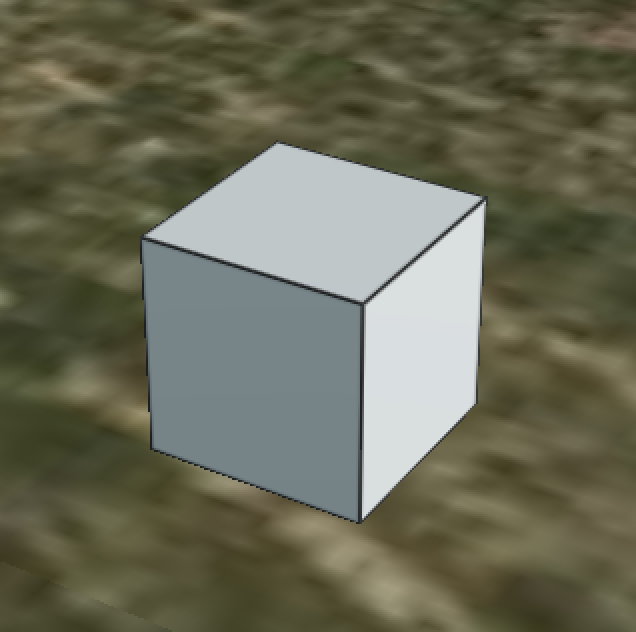

# Box Textured with `CESIUM_primitive_outline`

This is a variation on BoxTextured that adds `CESIUM_primitive_outline` to outline the edges of the box.

## Screenshot



## License Information

This model is licensed under a [Creative Commons Attribution 4.0 International License](http://creativecommons.org/licenses/by/4.0/).

## Outline Generation Code

The outline edge indices buffer was generated by the following Python 3 script. There are no dependencies.

In the `glTF` subdirectory:

```bash
python3 make_primitive_outlines.py
```

will generate `outlines.bin`.
