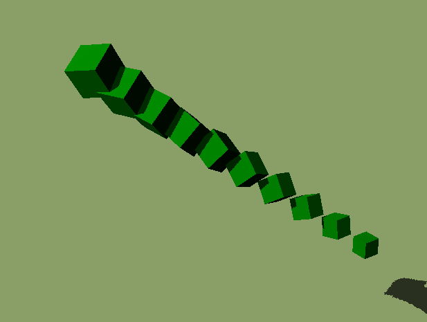

# Instanced Model With Normalized Rotation

This model uses the `EXT_mesh_gpu_instancing` extension to instance a box several times with different translation, rotation and scale properties. The rotations are normalized as `UNSIGNED_SHORT` values to test that the values are dequantized correctly.

## Screenshot

## License

[CC0](https://creativecommons.org/share-your-work/public-domain/cc0/)
