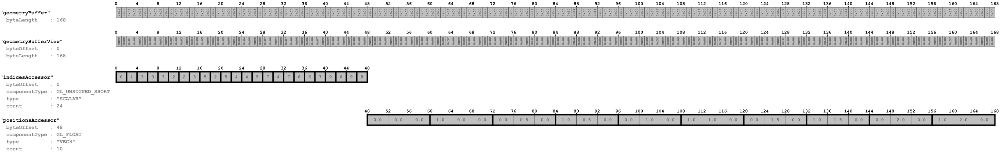
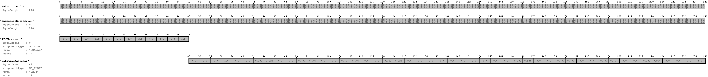
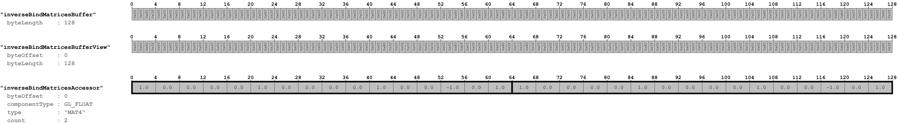
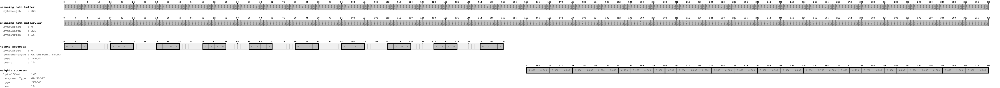

# SimpleSkin

A simple example for vertex skinning in glTF 2.0.

Details about skinning using this particular model are explained in the
[skinning section of the glTF tutorial](https://github.com/javagl/glTF-Tutorials/blob/master/gltfTutorial/gltfTutorial_019_SimpleSkin.md).

## Screenshot

## License Information

Public domain ([CC0](https://creativecommons.org/publicdomain/zero/1.0/))

## Data layout

The following images show the data layout of this sample:

