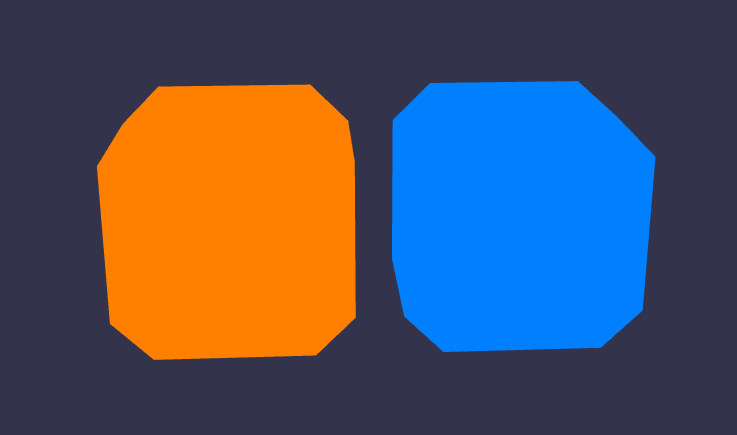
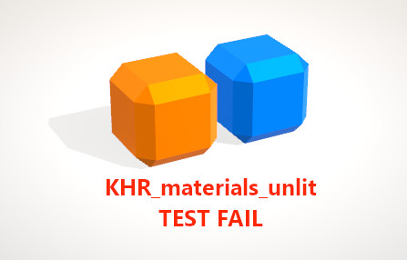

# Unlit Test

## Screenshot



## Description

This model tests the [`KHR_materials_unlit`](https://github.com/KhronosGroup/glTF/tree/master/extensions/2.0/Khronos/KHR_materials_unlit) extension. There are two objects, one orange-ish (`#FF7F00` in sRGB space) and one blue-ish (`#007FFF` in sRGB space). The visible surface of these two objects should appear as a uniform color, so much so that the 3D effect is intentionally lost.

## Problem: Lighting applied to un-lit model



The above screenshot shows a case where normal lighting calculations have been applied to an un-lit material. While the shadows on the ground are permissible, the various panels and edges visible on the orange and blue objects are not.

## `ExtensionsUsed` vs. `ExtensionsRequired`

This model lists the unlit extension in both lists, like this:

```json
    "extensionsUsed": [
        "KHR_materials_unlit"
    ],
    "extensionsRequired": [
        "KHR_materials_unlit"
    ]
```

The first list includes all extensions used by the current model, so there's no doubt that `KHR_materials_unlit` belongs there in this case. The second list is a subset of the first list, naming all the extensions that a given glTF viewer is _required_ to support in order for this model to be loaded and displayed correctly. In this case, the sample model is a showcase for the visual appearance of the un-lit material, and any visible lighting effects are being declared as errors in the glTF viewer implementation.

For this reason, I decided to include `KHR_materials_unlit` in the `extensionsRequired` list in this case. A conforming glTF implementation that does not support the `KHR_materials_unlit` extension should find an unknown value in the `extensionsRequired` list, and report an error rather than loading or displaying the model without the unlit material.

In your own models, if you consider using a lit material to be a reasonable fallback behavior for implementations that don't support this extension, you should omit `KHR_materials_unlit` from the `extensionsRequired` list.

## License Information

Copyright 2019 Analytical Graphics, Inc.
CC-BY 4.0 https://creativecommons.org/licenses/by/4.0/
Model by Ed Mackey.
