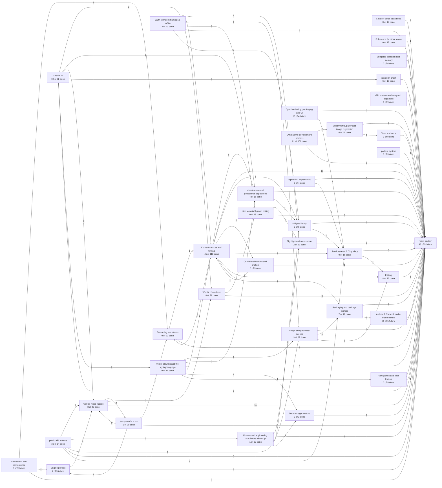

<!-- Generated by `hitld work views`. Never edit by hand. -->

# Project dependencies

```mermaid
graph LR
  CS_8["Engine profiles<br/>7 of 24 done"]
  CS_9["WebGL 2 renderer<br/>8 of 21 done"]
  CS_10["Cesium IR<br/>32 of 62 done"]
  CS_11["Live MaterialX graph editing<br/>0 of 18 done"]
  CS_12["job system's ports<br/>1 of 20 done"]
  CS_13["worker-mode façade<br/>3 of 22 done"]
  CS_14["Level-of-detail transitions<br/>0 of 14 done"]
  CS_15["Refinement and convergence<br/>0 of 13 done"]
  CS_16["Streaming robustness<br/>0 of 23 done"]
  CS_17["transform graph<br/>6 of 19 done"]
  CS_18["work tracker<br/>43 of 52 done"]
  CS_19["Follow-ups for other teams<br/>0 of 12 done"]
  CS_188["Earth to Moon (frames 5c to 5h)<br/>3 of 43 done"]
  CS_189["Frames and engineering coordinates follow-ups<br/>1 of 22 done"]
  CS_190["Vector drawing and the styling language<br/>0 of 14 done"]
  CS_191["Content sources and formats<br/>45 of 113 done"]
  CS_192["Sky, light and atmosphere<br/>2 of 22 done"]
  CS_193["B-reps and geometry queries<br/>3 of 22 done"]
  CS_194["Budgeted selection and memory<br/>0 of 6 done"]
  CS_195["Benchmarks, parity and image regression<br/>6 of 41 done"]
  CS_196["Infrastructure and geoscience capabilities<br/>4 of 16 done"]
  CS_197["Ray queries and path tracing<br/>0 of 9 done"]
  CS_198["GPU-driven rendering and capacities<br/>0 of 9 done"]
  CS_199["Dyno hardening, packaging and CI<br/>10 of 40 done"]
  CS_389["Dyno as the development harness<br/>61 of 100 done"]
  CS_437["public API reviews<br/>36 of 64 done"]
  CS_579["Editing<br/>8 of 22 done"]
  CS_584["widgets library<br/>0 of 9 done"]
  CS_596["Trust and evals<br/>0 of 9 done"]
  CS_609["A clean 2.0 branch and a modern build<br/>36 of 52 done"]
  CS_615["Packaging and package names<br/>7 of 12 done"]
  CS_622["agent-first migration kit<br/>0 of 4 done"]
  CS_628["Sandcastle as 2.0's gallery<br/>0 of 16 done"]
  CS_637["particle system<br/>0 of 3 done"]
  CS_642["Geometry generators<br/>0 of 2 done"]
  CS_647["Conditional content and motion<br/>0 of 5 done"]
  CS_12 -->|1| CS_8
  CS_10 -->|3| CS_9
  CS_10 -->|2| CS_11
  CS_9 -->|1| CS_11
  CS_13 -->|2| CS_12
  CS_437 -->|5| CS_13
  CS_10 -->|3| CS_13
  CS_8 -->|1| CS_13
  CS_12 -->|1| CS_13
  CS_191 -->|7| CS_16
  CS_15 -->|1| CS_16
  CS_10 -->|1| CS_17
  CS_437 -->|1| CS_189
  CS_10 -->|2| CS_190
  CS_16 -->|1| CS_191
  CS_188 -->|1| CS_191
  CS_189 -->|2| CS_192
  CS_11 -->|1| CS_192
  CS_188 -->|4| CS_192
  CS_437 -->|1| CS_193
  CS_188 -->|1| CS_193
  CS_190 -->|1| CS_193
  CS_389 -->|2| CS_195
  CS_190 -->|2| CS_196
  CS_188 -->|2| CS_196
  CS_191 -->|1| CS_196
  CS_15 -->|1| CS_8
  CS_13 -->|1| CS_9
  CS_12 -->|1| CS_16
  CS_9 -->|3| CS_18
  CS_191 -->|17| CS_18
  CS_16 -->|3| CS_18
  CS_8 -->|5| CS_18
  CS_199 -->|2| CS_18
  CS_615 -->|2| CS_18
  CS_628 -->|3| CS_18
  CS_596 -->|3| CS_18
  CS_389 -->|8| CS_18
  CS_437 -->|9| CS_18
  CS_190 -->|4| CS_18
  CS_193 -->|5| CS_18
  CS_579 -->|1| CS_18
  CS_609 -->|2| CS_18
  CS_10 -->|5| CS_18
  CS_196 -->|4| CS_18
  CS_13 -->|11| CS_18
  CS_12 -->|9| CS_18
  CS_188 -->|6| CS_18
  CS_189 -->|4| CS_18
  CS_192 -->|3| CS_18
  CS_17 -->|3| CS_18
  CS_11 -->|3| CS_18
  CS_15 -->|2| CS_18
  CS_584 -->|1| CS_18
  CS_637 -->|1| CS_18
  CS_642 -->|1| CS_18
  CS_647 -->|1| CS_18
  CS_19 -->|1| CS_18
  CS_14 -->|3| CS_18
  CS_194 -->|3| CS_18
  CS_195 -->|7| CS_18
  CS_198 -->|2| CS_18
  CS_622 -->|1| CS_18
  CS_197 -->|1| CS_18
  CS_190 -->|2| CS_191
  CS_191 -->|1| CS_584
  CS_189 -->|1| CS_584
  CS_188 -->|1| CS_584
  CS_196 -->|1| CS_584
  CS_195 -->|1| CS_596
  CS_193 -->|1| CS_615
  CS_199 -->|1| CS_628
  CS_622 -->|1| CS_628
  CS_190 -->|1| CS_642
  CS_189 -->|1| CS_642
  CS_191 -->|1| CS_647
  CS_647 -->|1| CS_191
  CS_190 -->|1| CS_197
  CS_191 -->|7| CS_628
  CS_584 -->|1| CS_628
  CS_437 -->|3| CS_628
  CS_191 -->|5| CS_579
  CS_628 -->|1| CS_579
  CS_193 -->|1| CS_579
  CS_191 -->|1| CS_615
  CS_615 -->|1| CS_609
```
